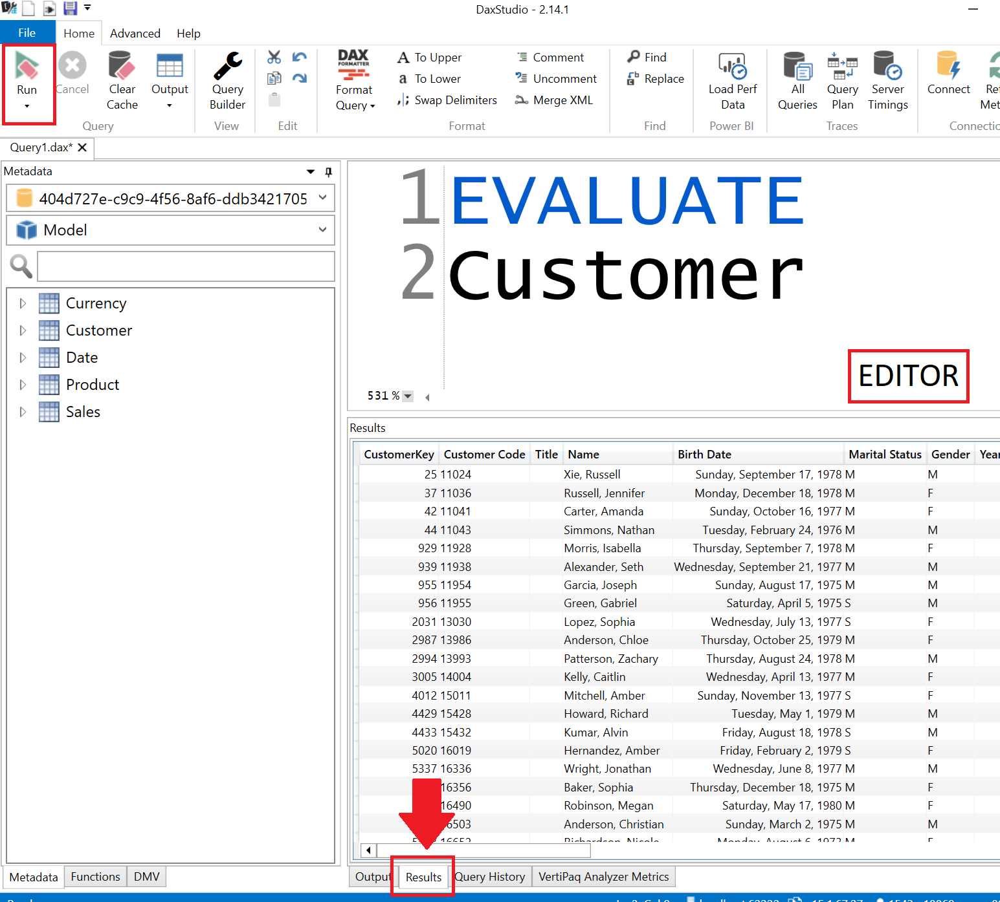
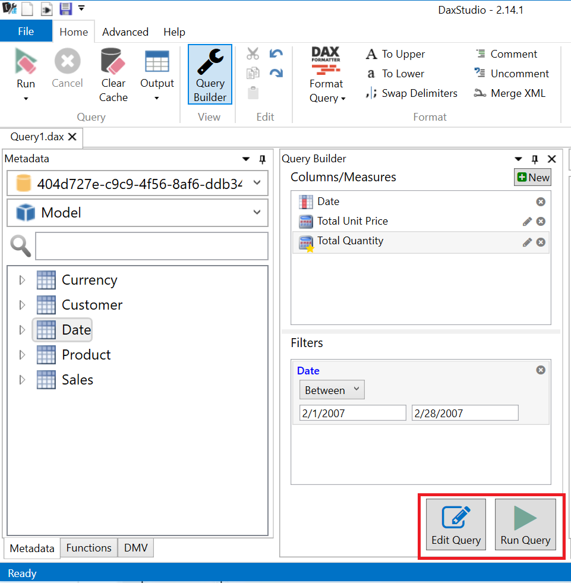

# DAX Studio In An Hour 

### About:
DAX Studio is a tool to write, execute, and analyze DAX queries in Power BI Designer, Power Pivot for Excel, and Analysis Services Tabular. It includes an Object Browser, query editing and execution, formula and measure editing, syntax highlighting and formatting, integrated tracing and query execution breakdowns.

Website: https://daxstudio.org/
___

**Follow Along:**
- [Download and install DAX Studio](https://daxstudio.org/)
- [Download and open the Sales Demo PBIX File](https://github.com/microsoft/pbiworkshops/raw/main/Tabular%20Editor%20In%20An%20Hour/Sales%20Demo.pbix)

___

# Table of Contents
- [Setup](#setup)
- [Query Language](#query-language)
  - [SELECT Statement](#select-statement)
  - [WHERE Clause](#where-clause)
- [Scalar Value](#scalar-value)
- [Formula Language](#formula-language)
- [Query Builder](#query-builder)
- [Server Timings](#server-timings)
- [VertiPaq Analyzer](#vertipaq-analyzer)

___

# Setup

## Instructions
### [Optional: Guided Video](https://www.youtube.com/watch?v=pFX20PPxXjs&list=PLKW7XPyNDgRCOiC69kZWfRQdOxcnQy2yA&index=2)

### Power BI Desktop
1. Ensure the Power BI preview feature [Store datasets using enhanced metadata format](https://docs.microsoft.com/en-us/power-bi/connect-data/desktop-enhanced-dataset-metadata) is enabled.

### DAX Studio
1. Open **DAX Studio**.
2. Navigate to the File menu and select Options
3. Within the **Standard** tab, in the **Defaults** group, enable the setting: **Set 'Clear Cache and Run' as the default**
3. Within the **Advanced** tab, in the **Preview Features** group, enable the settings: **Show External Tools**, **Show Query Builder Button**, and **Show Benchmark Button**.
4. Close **DAX Studio**


**Important Note:** For performance testing utilizing **'Clear Cache and Run'** will ensure that you are executing queries against uncached data.

___

# Data Analysis Expressions (DAX)
**Source:** Microsoft Docs

Data Analysis Expressions (DAX) is the native **formula** and **query** language for Tabular models in Analysis Services (SSAS/AAS), Power BI, and Power Pivot in Excel. DAX includes some of the functions that are used in Excel formulas with additional functions that are designed to work with relational data and perform dynamic aggregation.

[Learn More About DAX](https://docs.microsoft.com/en-us/dax/dax-overview) 

___

# Query Language

With DAX queries, you can query and return data defined by a table expression. Reporting clients construct DAX queries whenever a field is placed on a report surface, or a whenever a filter or calculation is applied. DAX queries can also be created and run in SQL Server Management Studio (SSMS) and open-source tools like DAX Studio. DAX queries run in SSMS and DAX Studio return results as a table.

[Learn More About DAX Queries](https://docs.microsoft.com/en-us/dax/dax-queries)

### Objective: Return tables, single column table (list) and scalar values.

## Instructions
### [Optional: Guided Video]()
### Power BI Desktop
1. Open the Sales Demo (PBIX) file, navigate to the **External Tools** ribbon in Power BI Desktop and select **DAX Studio**.

### DAX Studio
In the query Editor section enter the below queries and review their output in the **Results** section (as displayed below), after pressing the **Run** button.

**⭐ Pro Tip:** F5

#### SELECT Statement

**DAX Query**
```
EVALUATE
Customers
```
**SQL Equivalent**

```
-- Select all from the customers table
SELECT * 
FROM Customers;
```



___

#### WHERE Clause

**DAX Query**
```
EVALUATE
FILTER ( Customers, Customers[StateProvinceCode] = "IL" )
```
**SQL Equivalent**
```
-- Select all from the Customers table where the StateProvinceCode equals IL
SELECT * 
FROM Customers 
WHERE StateProvinceCode = 'IL';
```
___

# Scalar Value

**DAX Query**
```
EVALUATE
COUNTROWS( Customers )
```
**SQL Equivalent**
```
-- Count all from the Customers table.
SELECT COUNT(*)
FROM Customers;
```
- Review the following error in the **Output**.


- Update the above expression to store the returned results in a single column table (list) using curly brackets.
```
EVALUATE
{ COUNTROWS( Customers ) }
```
___

# Formula Language

DAX formulas are used in measures, calculated columns, calculated tables, and row-level security. Measures are dynamic calculation formulas where the results change depending on context. Measures are used in reporting that support combining and filtering model data by using multiple attributes.

[Learn More About DAX Formulas](https://docs.microsoft.com/en-us/dax/dax-overview)

### Objective: Aggregate data by writing DAX formulas and the graphical user interface of Query Builder.

## Instructions
### [Optional: Guided Video]()

### DAX Studio
In the query Editor section enter the below queries and review their output in the **Results** section, after pressing the **Run** button.

**Description:** Enter the below expression to return the average unit price from the Sales Order Lines table:
```
EVALUATE
{ AVERAGE ( 'Sales Order Lines'[Unit Price] ) }
```
- Update the statement to provide a column name for the returned value.
```
EVALUATE
ROW ("Average Unit Price", AVERAGE ( 'Sales Order Lines'[Unit Price] ) )
```

**Description:** Enter the below expression to return the count of orders by CustomerID 841.

```
EVALUATE
{ CALCULATE ( COUNTROWS ( Orders[OrderID] ), Customers[CustomerID] = 841 ) }
```
🏆 **Challenge:** Update the above statement to improve performance.

[Learn More About Using COUNTROWS instead of COUNT](https://docs.microsoft.com/en-us/power-bi/guidance/dax-countrows)

- The CALCULATE function has both an expression and filter.
CALCULATE(«Expression»,«Filter»)

**Description:** Enter the below query to return the Total Unit Price from the Sales Order Lines table for each row in the Calendar table's Date column where the Total Unit Price is greater than zero:

```
EVALUATE
FILTER (
    ADDCOLUMNS (
        'Calendar',
        "Total Unit Price", SUM ( 'Sales Order Lines'[Unit Price] )
    ),
    [Total Unit Price] > 0
)
```
🏆 **Challenge:** Update the above statement to provide the correct results based on the calendar tables current row __context__.

[Learn More About Extension Columns](https://www.sqlbi.com/articles/best-practices-using-summarize-and-addcolumns/)
___

# Query Builder

1. From the **Home** tab select **Query Builder**.
2. Expand the following tables and drag the fields/measures into the **Columns/Measures** group in the **Builder**.


| Table | Object |
| :------------- | :---------- |
| Calendar | Date |
| Sales Order Lines   | Total Unit Price |


3. Expand the following tables and drag the fields/measures into the **Filters** group in the **Builder**.


| Table | Object | Comparison Operator | Value  |
| :------------- | :---------- | :---------- | :---------- |
| Calendar | Date | >= | 1/1/2016 |

4. Select the **➕New** button and enter the measure name **Total Quantity**, the below measure and press **OK** when complete.

```
SUM ( 'Sales Order Lines'[Quantity] )
```

5. Press **Run Query**.



6. Press **Edit Query** to view the generated query.
7. Update the query by adding a **Filter** where the **[Total Quantity] > 16000** as displayed below.

```
 1 // START QUERY BUILDER
 2 DEFINE
 3 MEASURE 'Calendar'[Total Quantity] = SUM ( 'Sales Order Lines'[Quantity] )
 4 EVALUATE
 5 FILTER(
 6 SUMMARIZECOLUMNS(
 7     'Calendar'[Date],
 8     FILTER(KEEPFILTERS(VALUES( 'Calendar'[Date] )), 'Calendar'[Date] >= DATE(2016,1,1)),
 9     "Total Unit Price", [Total Unit Price],
10     "Total Quantity", [Total Quantity]
11 ), [Total Quantity] > 16000)
12 // END QUERY BUILDER
```
8. Press the **Format Query** option.

___

# Server Timings

## In-memory tabular query monitoring
Before considering how to monitor query performance for in-memory tabular models, it is important to first understand the query architecture for in-memory tabular models. Analysis Services processes queries for this model type by following these steps:

1. The Analysis Services query parser first evaluates whether the incoming request is a valid DAX or MDX query. (Tools like Excel or SQL Server Reporting Services (SSRS) can send MDX requests to a tabular model.)

2. If the query is an MDX query, Analysis Services invokes the MDX formula engine, which then sends a DAX request for measure calculations to the DAX formula engine. The MDX formula engine can request a measure embedded in the tabular model or request a calculation defined in the WITH clause of the MDX query. It can also request dimension from the VertiPaq storage engine. The MDX formula engine caches measures unless the MDX query contains a WITH clause.

3. The DAX formula engine receives either a DAX query request from the parser or a DAX request for measure calculations from the MDX formula engine. Either way, the DAX formula engine generates a query plan that it sends to the VertiPaq storage engine.

4. The VertiPaq storage engine processes the query plan received from the DAX formula engine. The storage engine is multi-threaded and scales well on multiple cores. It can scan large tables very efficiently and quickly. It can also evaluate simple mathematical operations, but pushes more complex operations back to the formula engine. If a calculation is too complex, it sends a callback to the formula engine.

5. The storage engine returns its results to the formula engine which compiles the data and returns the query results to the client application. It maintains a short-term VertiPaq cache to benefit multiple requests for the same data in the same query. An ancillary benefit is the availability of this data for subsequent queries for a period of time.


The above excerpt is from [Exam Ref 70-768 Developing SQL Data Models](https://www.microsoftpressstore.com/store/exam-ref-70-768-developing-sql-data-models-9781509305155) authored by [Stacia Varga](http://blog.datainspirations.com/)

### Objective: 

## Instructions
### [Optional: Guided Video]()

### DAX Studio
1. From the **Home** tab select **Server Timings**.
- Optional: Select **Query Plan**

2. In the query Editor section enter the below query and review the output in the **Server Timings** section, after pressing the **Run** button.

```
EVALUATE
FILTER ( Customers, NOT ISEMPTY ( RELATEDTABLE ( 'Customer Transactions' ) ) )
```
3. Select the bolded Query to review the xmSQL statement. The highlighted term **CallbackDataID** is returned if the expression is too complex, meaning a call back to formula engine during the VertiPaq scan.

4. In the query Editor section enter the below query and review the output in the **Server Timings** section, after pressing the **Run** button.

```
EVALUATE
CALCULATETABLE ( Customers, 'Customer Transactions' )
```

___

# VertiPaq Analyzer


___

# Continue Your Journey

### An indepth walk through of DAX Studio
[PowerBI.Tips - Introduction to DAX Studio Playlist](https://www.youtube.com/watch?v=jpZnCHRauPU&list=PLn1m_aBmgsbGDZb7ydd8_LS1AfosdRndQ)

Includes:
- Introduction to DAX Studio (1:00:44)
- Model Performance Tuning in DAX Studio (1:09:02)
- DAX Studio Full Features Review (1:23:11)
- DAX Studio Query Performance Tuning - Marco Russo; SQLBI (1:00:59)
- DAX Studio Release 2.11.1 (51:32)
