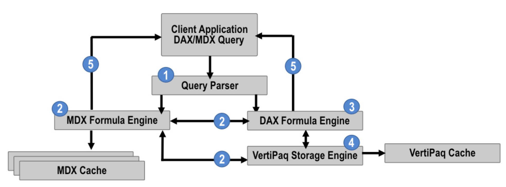
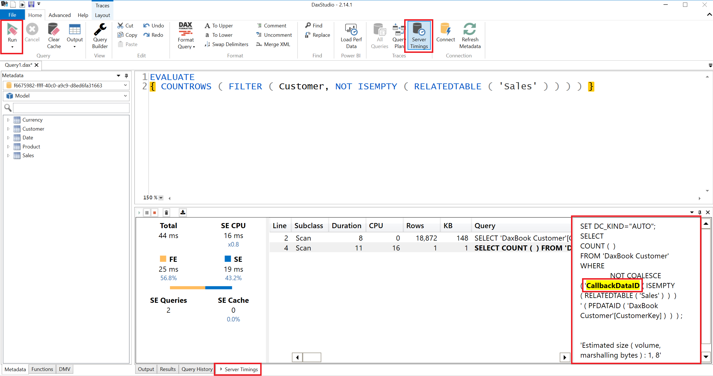
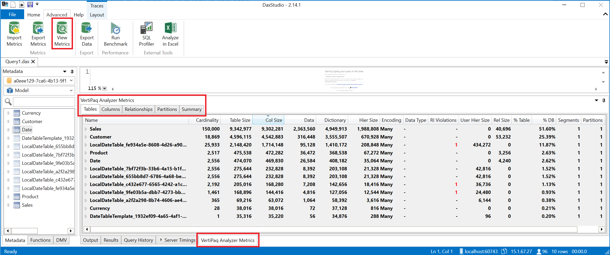

# DAX Studio In An Hour 

### About:
DAX Studio is a tool to write, execute, and analyze DAX queries in Power BI Designer, Power Pivot for Excel, and Analysis Services Tabular. It includes an Object Browser, query editing and execution, formula and measure editing, syntax highlighting and formatting, integrated tracing and query execution breakdowns.

Website: https://daxstudio.org/
___

**Follow Along:**
- [Download and install DAX Studio](https://daxstudio.org/)
- [Download and open the Contoso PBIX File](https://github.com/microsoft/pbiworkshops/raw/main/Tabular%20Editor%20In%20An%20Hour/Contoso.pbix)

___

# Table of Contents
- [Setup](#setup)
- [Query Language](#query-language)
  - [SELECT Statement](#select-statement)
  - [WHERE Clause](#where-clause)
- [Scalar Value](#scalar-value)
- [Formula Language](#formula-language)
- [Query Builder](#query-builder)
- [Server Timings](#server-timings)
- [VertiPaq Analyzer](#vertipaq-analyzer)

___

# Setup

## Instructions

### Power BI Desktop [Only applicable to July and August 2020 Versions]
1. Ensure the Power BI preview feature [Store datasets using enhanced metadata format](https://docs.microsoft.com/en-us/power-bi/connect-data/desktop-enhanced-dataset-metadata) is enabled.
2. Navigate to the **File** menu and select Options and Settings and then **Options**.
3. Navigate to **Preview features** and enable **Store datasets using enhanced metadata format**.

### DAX Studio [Optional]
1. Open **DAX Studio**.
2. Navigate to the **File** menu and select **Options**
3. Within the **Standard** tab, in the **Defaults** group, enable the setting: **Set 'Clear Cache and Run' as the default**
4. Close **DAX Studio**


**Important Note:** For performance testing utilizing **'Clear Cache and Run'** will ensure that you are executing queries against uncached data.

___

# Data Analysis Expressions (DAX)
**Source:** Microsoft Docs

Data Analysis Expressions (DAX) is the native **formula** and **query** language for Tabular models in Analysis Services (SSAS/AAS), Power BI, and Power Pivot in Excel. DAX includes some of the functions that are used in Excel formulas with additional functions that are designed to work with relational data and perform dynamic aggregation.

[Learn More About DAX](https://docs.microsoft.com/en-us/dax/dax-overview) 

___

# Query Language

With DAX queries, you can query and return data defined by a table expression. Reporting clients construct DAX queries whenever a field is placed on a report surface, or a whenever a filter or calculation is applied. DAX queries can also be created and run in SQL Server Management Studio (SSMS) and open-source tools like DAX Studio. DAX queries run in SSMS and DAX Studio return results as a table.

[Learn More About DAX Queries](https://docs.microsoft.com/en-us/dax/dax-queries)

### Objective: Return tables, single column table (list) and scalar values.

## Instructions
### Power BI Desktop
1. Open the Contoso (PBIX) file, navigate to the **External Tools** ribbon in Power BI Desktop and select **DAX Studio**.

### DAX.do [Optional]
1. Navigate to the website [DAX.do](https://dax.do).

### DAX Studio
In the query Editor section enter the below DAX queries and review the output in the **Results** section (as displayed below), after pressing the **Run** button.

**⭐ Pro Tip:** F5

#### SELECT Statement

**DAX Query**
```
EVALUATE
Customer
```
**SQL Equivalent**

```
-- Select all from the customer table
SELECT * 
FROM Customer;
```


___

#### WHERE Clause

**DAX Query**
```
EVALUATE
FILTER( Customer, Customer[State] = "Washington" )
```
**SQL Equivalent**
```
-- Select all from the Customers table where the State equals Washington
SELECT * 
FROM Customer 
WHERE State = 'Washington';
```

### 🏆 DAX Challenge

**Description:** Update the below statement to return only the names that are not blank.

**DAX Query**
```
SELECTCOLUMNS (
        Customer,
        "Name", Customer[Company Name],
        "Code", Customer[Customer Code]
    )
```

**SQL Equivalent**
```
-- Select and alias the Company Name and Customer Code from the Customer table where the Name is not null
SELECT 
CompanyName As "Name",
CustomerCode As "Code"
FROM Customer 
WHERE CompanyName IS NOT NULL;
```

___

# Scalar Value

**DAX Query**
```
EVALUATE
COUNTROWS( Customer )
```

**SQL Equivalent**
```
-- Count all from the Customers table.
SELECT COUNT(*)
FROM Customer;
```

Review the following error in the **Output**


Update the above expression to store the returned results in a single column table (list) using curly brackets

```
EVALUATE
{ COUNTROWS( Customer ) }
```
___

# Formula Language

DAX formulas are used in measures, calculated columns, calculated tables, and row-level security. Measures are dynamic calculation formulas where the results change depending on context. Measures are used in reporting that support combining and filtering model data by using multiple attributes.

[Learn More About DAX Formulas](https://docs.microsoft.com/en-us/dax/dax-overview)

### Objective: Aggregate data by writing DAX formulas and by using graphical user interface of Query Builder.

## Instructions

### DAX Studio

In the query Editor section enter the below DAX queries and review their output in the **Results** section, after pressing the **Run** button.
</br>

**Description:** Enter the below expression to return the average unit price from the Sales Order Lines table:
```
EVALUATE
{ AVERAGE ( Sales[Unit Price] ) }
```

Update the statement to provide a column name for the returned value.
```
EVALUATE
ROW ("Average Unit Price", AVERAGE ( Sales[Unit Price] ) )
```

### 🏆 DAX Challenge

**Description:** Update the below statement to improve performance.

```
EVALUATE
{ CALCULATE ( COUNT ( Sales[StoreKey] ), Sales[StoreKey] = 199 ) }
```
[Learn More About Using COUNTROWS instead of COUNT](https://docs.microsoft.com/en-us/power-bi/guidance/dax-countrows)

### 🏆 DAX Challenge

**Description:** Return a table with all the StoreKey equal to 199 from the Sales table.
___
</br>

**Description:** Using variables, debug the total count of Sales by StoreKey in 306 and 307.

**Important Note:** For commenting within DAX:
</br>

| Comment | Characters |
| :------------- | :---------- |
| Multi line | /* */ |
| Singe line | -- |
| Singe line | // |
</br>

```
EVALUATE
VAR _StoreKeys = {306, 307}
VAR _NorthEastSales = CALCULATETABLE( Sales , Sales[StoreKey] IN _StoreKeys )
VAR _CountOfSales = ROW( "Total Northeast Sales" , COUNTROWS ( _NorthEastSales ) )
RETURN
-- _StoreKeys
-- _NorthEastSales
-- _CountOfSales
```
___

### 🤚 Most Important DAX function: **CALCULATE** 🤚

Evaluates an expression in a modified filter context.

CALCULATE(«Expression»,«Filter»)

[Microsoft Docs - CALCULATE](https://docs.microsoft.com/en-us/dax/calculate-function-dax)

"The CALCULATE function in DAX is the magic key..." - Marco Russo

[SQLBI - How Calculate works in DAX](https://www.sqlbi.com/blog/marco/2010/01/03/how-calculate-works-in-dax/)

### Power BI Desktop
1. Within the Contoso (PBIX) file in Power BI Desktop and navigate to the Sales table, add a **New Measure** from the example below, leveraging the CALCULATE function to return the [# Quantity] by StoreKey in 306, 307.

```
Northeast # Quantity = 
VAR _StoreKey = {306, 307}
VAR _Result = CALCULATE( [# Quantity], Sales[StoreKey] IN _StoreKey )
RETURN
_Result
```

2. Create a **Table** visual on the Power BI report page and include the fields Company Name, Northeast # Quantity and # Quantity.

### 🏆 DAX Challenge

**Description:** Return the Total Unit Price from the Sales table for each row in the Date table's Date column where the Total Unit Price is greater than zero based on the current row **context**.

```
EVALUATE
FILTER (
    ADDCOLUMNS (
        VALUES ( 'Date'[Date] ),
        "Total Unit Price", SUM ( Sales[Unit Price] )
    ),
    [Total Unit Price] > 0
)
```

[Learn More About Extension Columns](https://www.sqlbi.com/articles/best-practices-using-summarize-and-addcolumns/)
</br>

___

# Query Builder

The query builder provides a drag and drop interface for building queries against your data model.

[Learn More](https://daxstudio.org/documentation/features/query-builder/)

### Objective: Leverage the Query Builder inteface to return a summarized table between the selected time frame.

## Instructions
### DAX Studio
1. From the **Home** tab select **Query Builder**.
2. Expand the following tables and drag the fields/measures into the **Columns/Measures** group in the **Builder**.


    | Table | Object |
    | :------------- | :---------- |
    | Date | Date |
    | Sales   | Total Unit Price |
</br>

3. Expand the following tables and drag the fields/measures into the **Filters** group in the **Builder**.

    | Table | Object | Comparison Operator | Start  | End |
    | :------------- | :---------- | :---------- | :---------- | :---------- |
    | Date | Date | Between | 2/1/2007 | 2/28/2007 |
</br>

4. Select the **➕New** button and enter the measure name **Total Quantity**, the below measure and press **OK** when complete.


```
SUM ( 'Sales Order Lines'[Quantity] )
```

5. Press **Run Query**.


6. Press **Edit Query** to view the generated query.
7. Press the **Format Query** option.

### 🏆 DAX Challenge

1. Update the query by adding a **Filter** where the **[Total Quantity] > 1300**.

Result displayed below.

```
/* START QUERY BUILDER */
DEFINE
    MEASURE Sales[Total Unit Price] =
        SUM ( Sales[Unit Price] )
EVALUATE
SUMMARIZECOLUMNS (
    'Date'[Date],
    KEEPFILTERS (
        FILTER (
            ALL ( 'Date'[Date] ),
            'Date'[Date] >= DATE ( 2007, 2, 1 )
                && 'Date'[Date] <= DATE ( 2007, 2, 28 )
        )
    ),
    "Total Unit Price", [Total Unit Price],
    "# Quantity", [# Quantity]
)
/* END QUERY BUILDER */
```

___

# Server Timings

## In-memory tabular query monitoring
Before considering how to monitor query performance for in-memory tabular models, it is important to first understand the query architecture for in-memory tabular models. Analysis Services processes queries for this model type by following these steps:

1. The Analysis Services query parser first evaluates whether the incoming request is a valid DAX or MDX query. (Tools like Excel or SQL Server Reporting Services (SSRS) can send MDX requests to a tabular model.)

2. If the query is an MDX query, Analysis Services invokes the MDX formula engine, which then sends a DAX request for measure calculations to the DAX formula engine. The MDX formula engine can request a measure embedded in the tabular model or request a calculation defined in the WITH clause of the MDX query. It can also request dimension from the VertiPaq storage engine. The MDX formula engine caches measures unless the MDX query contains a WITH clause.

3. The DAX formula engine receives either a DAX query request from the parser or a DAX request for measure calculations from the MDX formula engine. Either way, the DAX formula engine generates a query plan that it sends to the VertiPaq storage engine.

4. The VertiPaq storage engine processes the query plan received from the DAX formula engine. The storage engine is multi-threaded and scales well on multiple cores. It can scan large tables very efficiently and quickly. It can also evaluate simple mathematical operations, but pushes more complex operations back to the formula engine. If a calculation is **too complex**, it sends a **callback** to the formula engine.

5. The storage engine returns its results to the formula engine which compiles the data and returns the query results to the client application. It maintains a short-term VertiPaq cache to benefit multiple requests for the same data in the same query. An ancillary benefit is the availability of this data for subsequent queries for a period of time.



The above excerpt is from [Exam Ref 70-768 Developing SQL Data Models](https://www.microsoftpressstore.com/store/exam-ref-70-768-developing-sql-data-models-9781509305155) authored by [Stacia Varga](http://blog.datainspirations.com/)

</br>

### Objective: Optimize the current DAX statement to remove the CallbackDataID and run performance benchmarks.

## Instructions

### DAX Studio
1. From the **Home** tab select **Server Timings**.

    - Optional: Select **Query Plan**

2. In the query Editor section enter the below query and review the output in the **Server Timings** section, after pressing the **Run** button.

```
EVALUATE
{ COUNTROWS ( FILTER ( Customer, NOT ISEMPTY ( RELATEDTABLE ( Sales ) ) ) ) }
```



3. Select the bolded Query to review the **xmSQL** statement to the right. The highlighted term **CallbackDataID** is returned if the expression is too complex, meaning a call back to the formula engine during the VertiPaq scan occurred.

4. In the query Editor section enter the below query and review the output in the **Server Timings** section, after pressing the **Run** button.

```
EVALUATE
{ COUNTROWS ( CALCULATETABLE ( Customer, Sales ) ) }
```

5. Navigate to the **Advanced** tab and with your query highlighted press the **Run Benchmark** button to test the performance of your query multiple times. Review the benchmark outputs of the query performance in both a cold and warm cache state.


[Learn More About Server Timings](https://daxstudio.org/documentation/features/server-timings-trace/)

[Learn more about Query Benchmark](https://darren.gosbell.com/2020/06/dax-studio-2-11-0-released/)

___

# VertiPaq Analyzer

VertiPaq Analyzer is useful to analyze VertiPaq storage structures for a data model in Power BI and Analysis Services Tabular.

[Learn More about VertiPaq Analyzer](https://www.sqlbi.com/tools/vertipaq-analyzer/)

### Objective: Review the VertiPaq Analyzer Metrics to reduce the overall size of the model

### DAX Studio

1. Navigate to the **Advanced** tab and select the **View Metrics** option.
2. Within the VertiPaq Analzyzer Metrics **Tables** tab review the column table object **Name** and their associated **% DB**
3. Navigate to the **Summary** tab and review the **Total Size**



### Power BI Desktop
1. Within the Contoso (PBIX) file navigate to **File**, **Options and Settings**, **Options**, the **CURRENT FILE** sections **Data Load** properties and disable **Auto date/time**

**⭐ Pro Tip:** Navigate to **File**, **Options and Settings**, **Options**, the **GLOBAL** sections **Data Load** properties and disable **Auto date/time** for all future files.

[Learn more about Automatic time intelligence in Power BI](https://www.sqlbi.com/articles/automatic-time-intelligence-in-power-bi/#:~:text=Power%20BI%20offers%20the%20Auto%20Date/Time%20feature,%20which,by%20simply%20dropping%20the%20date%20into%20a%20matrix:) - Source: SQLBI

### DAX Studio

1. Navigate to the **Advanced** tab and select the **View Metrics** option again.
2. Within the VertiPaq Analyzer Metrics navigate to the following tabs:
    1. Within the **Tables** tab determine the table with the largest **% DB** impact.
        1. Expand the **Sales** table and determine the column names with the highest cardinality.
    3. Within the **Relationships** tab determine if these columns are used in any relationships.


### Power BI Desktop
1. Within the Contoso (PBIX) file navigate to the **Sales** table and delete the columns **Order Number** and **OnlineSalesKey**.

### DAX Studio

1. Navigate to the **Advanced** tab and select the **View Metrics** option again.
2. Navigate to the **Summary** tab and review the **Total Size**


[Learn More about data reduction techniques for Import modeling](https://docs.microsoft.com/en-us/power-bi/guidance/import-modeling-data-reduction)

___

# Continue Your Journey

### How to learn DAX

Whether you are starting from scratch or have already learned the basics of DAX, this guide will show you all the steps to follow in order to master the Power BI and Analysis Services query language.

Source: [SQLBI](https://www.sqlbi.com/guides/dax/)

### An indepth walk through of DAX Studio
Source: [PowerBI.Tips - Introduction to DAX Studio Playlist](https://www.youtube.com/watch?v=jpZnCHRauPU&list=PLn1m_aBmgsbGDZb7ydd8_LS1AfosdRndQ)

Includes:
- Introduction to DAX Studio (1:00:44)
- Model Performance Tuning in DAX Studio (1:09:02)
- DAX Studio Full Features Review (1:23:11)
- DAX Studio Query Performance Tuning - Marco Russo; SQLBI (1:00:59)
- DAX Studio Release 2.11.1 (51:32)
 
### Use DAX in Power BI Desktop
This learning path introduces Data Analysis Expressions (DAX) and provides you with foundational skills required to enhance data models with calculations.

Source: [Microsoft Learn](https://docs.microsoft.com/en-us/learn/paths/dax-power-bi/)

Includes:
- Describe Power BI Desktop models
- Write DAX formulas
- Add calculated tables and columns
- Add measures
- Use DAX iterator functions
- Modify DAX filter context
- Use DAX time intelligence functions

### Power BI Guidance

Power BI guidance documentation provides best practice information from the team that builds Power BI and the folks that work with our enterprise customers. Here you’ll find learnings to improve performance and success with Power BI. We’ll update and add to them as new information is available.

Source: https://aka.ms/pbiguidance