# Data pipeline

In this lab, we will guide you through the process of creating a comprehensive data ingestion solution using data pipelines in Microsoft Fabric. We will start by setting up the copy activity to transfer data from a sample source to a dynamic destination within a lakehouse. This includes using the expression builder to create a dynamic folder structure based on the current date of execution.

Throughout the lab, you will validate and run the pipeline, ensuring that the data ingestion process is successful and that the data is organized correctly in the lakehouse. By the end of this lab, you will have a solid understanding of how to efficiently manage a data ingestion workflow.

### Create a data pipeline

1. Continuing from the [Getting started](GettingStarted.md) tutorial where we built a lakehouse and a sample data pipeline, we will now proceed to select and add a **New item** from the **High-volume data ingest** task.

    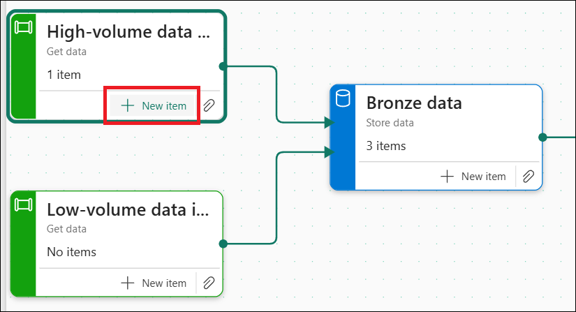

1. Within the Create an item window, the available options within Microsoft Fabric have been filtered down to **Recommended items** only again. Select the **Data pipeline** item.

    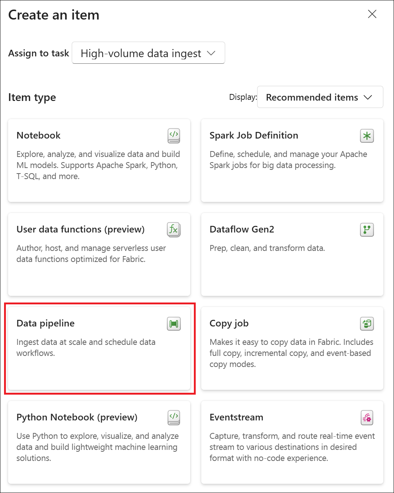

1. In the New pipeline window, set the data pipeline name to "**getContosoSample**" and then select **Create**.

    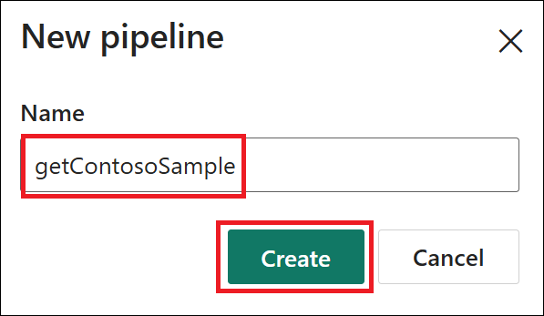

### Creating a data connection

1. From the new and empty data pipeline, select the **Pipeline activity** watermark option and then choose **Copy data** to add this activity to the authoring canvas.

    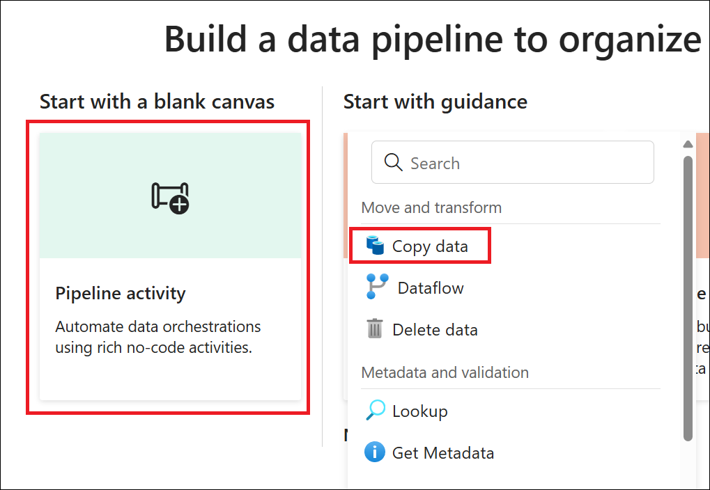

1. With the **Copy data** activity selected, navigate to the **Source** tab. Within the **Connection** drop-down menu, select the **More** option to launch the Get data navigator. This navigator provides a comprehensive interface for connecting to various data sources, ensuring that you can easily integrate different data streams into your pipeline.

    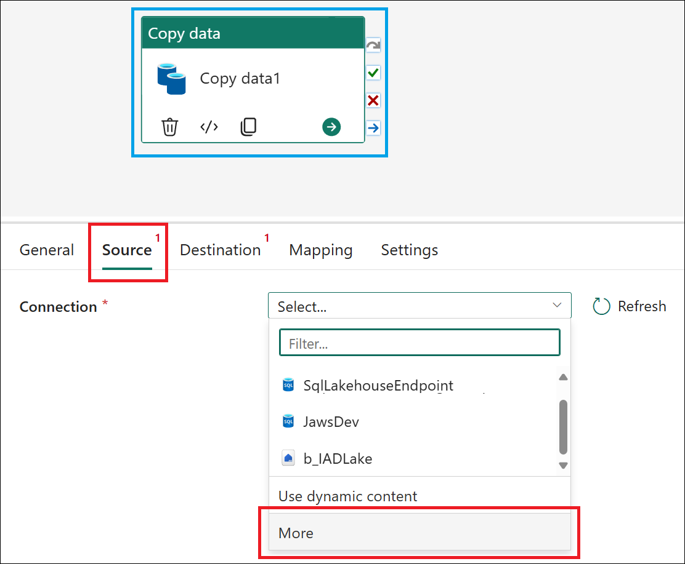

1. From the Get data navigator, select **Add** from the left side-rail and then choose the **Http** connector. The Http connector allows you to connect to web-based data sources, providing flexibility in accessing data from various online resources.

    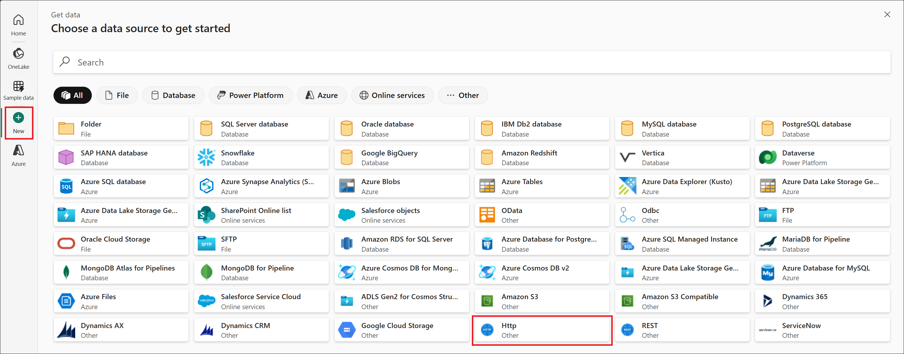

1. Paste the following sample Zip file address from GitHub into the **Url** path. Optionally, you can also set the **Connection name** property to something more discoverable for future use, such as "ContosoSample." Naming your connections helps in easily identifying and managing different data sources within your project. Once complete, select **Connect** to establish the connection.

    ```text
    https://github.com/microsoft/pbiworkshops/raw/main/Day%20After%20Dashboard%20in%20a%20Day/Source_Files/ContosoSales.zip
    ```

    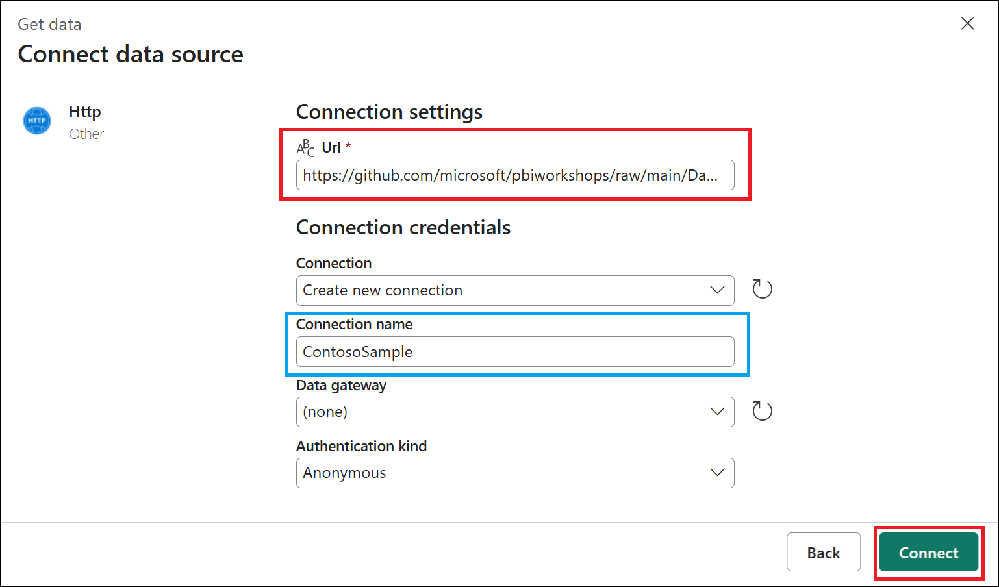

### Copy activity settings

1. With the **Copy data** activity selected and the **Source** tab displayed, select the **Settings** option next to the File format field. Within the **Compression type** setting, choose **ZipDeflate (.zip)** and select **OK** to complete.

    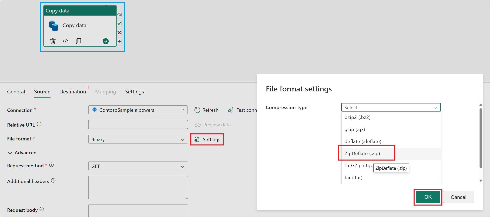

1. Next, with the Copy data activity still selected and the Source tab displayed, expand the **Advanced** section. Deselect the option to **Preserve zip file name as folder**. This allows you to customize the folder name for your zip contents, providing more flexibility in organizing your data.

    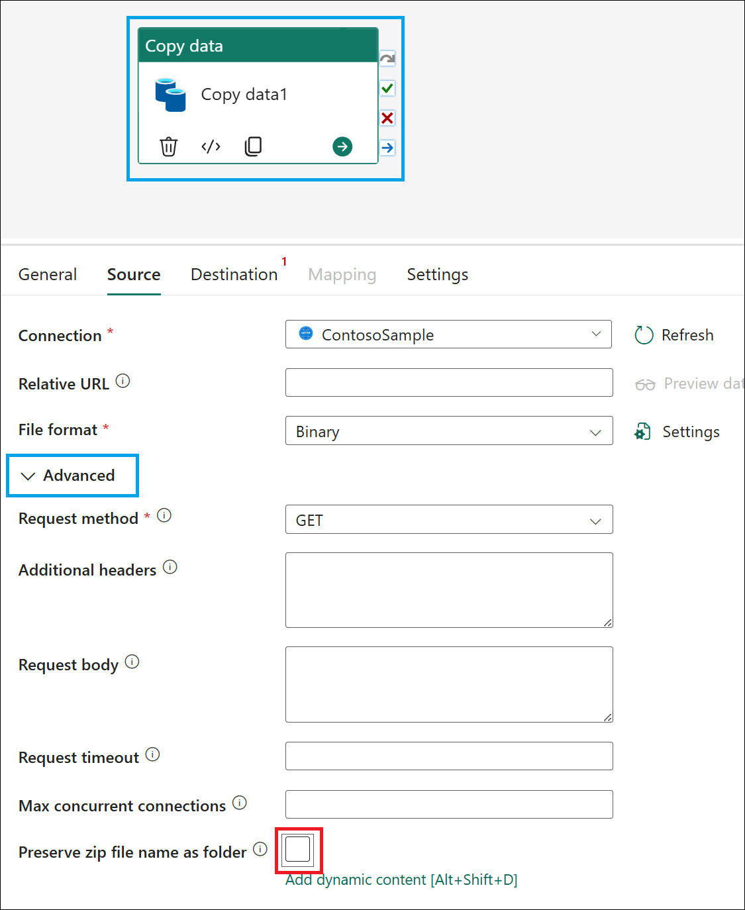

1. With the Copy data activity still selected, navigate to the **Destination** tab. From the list of connections, select the previously configured lakehouse **b_IADLake**. This step ensures that the data is being copied to the correct destination, which is essential for maintaining data integrity and organization.

    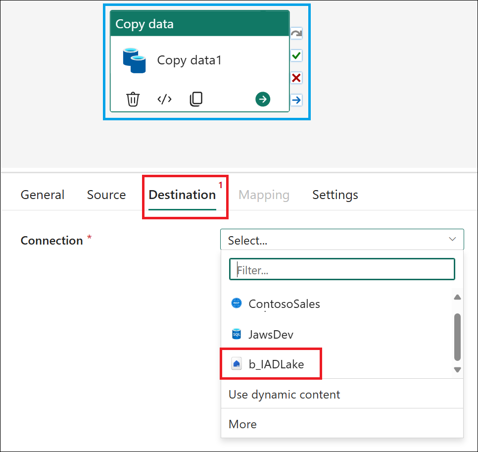

1. Within the Destination settings, select the **Files** option and then the **Directory** file path text input box. This will display the **Add dynamic content [Alt+Shift+D]** property. Select this text to open the pipeline expression builder. The expression builder allows us to create dynamic file paths, which can be customized based on various dynamic parameters such as date and time or static text values.

    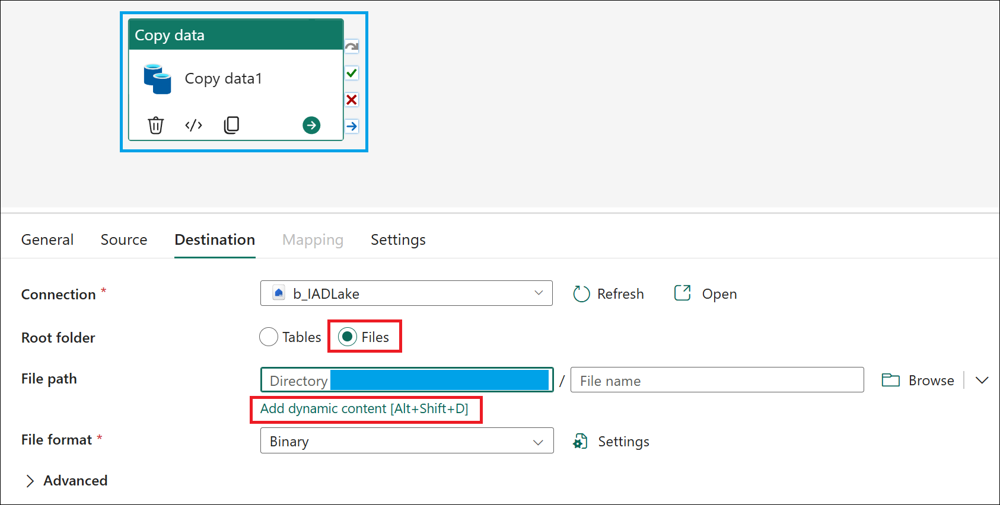

1. In the Pipeline expression builder window, select the **Functions** tab. Here, you can explore various functions that exist within the expression library, in this example we'll use both date and string functions to create a dynamic folder path. When you're ready, copy and paste the code block below into the expression input box. Press **Ok** when complete.

    ```text
    @concat(
        formatDateTime(
            convertFromUtc(
                utcnow(), 'Central Standard Time'
            ),
            'yyyy/MM/dd'
        ),
        '/ContosoSales'
    )
    ```

    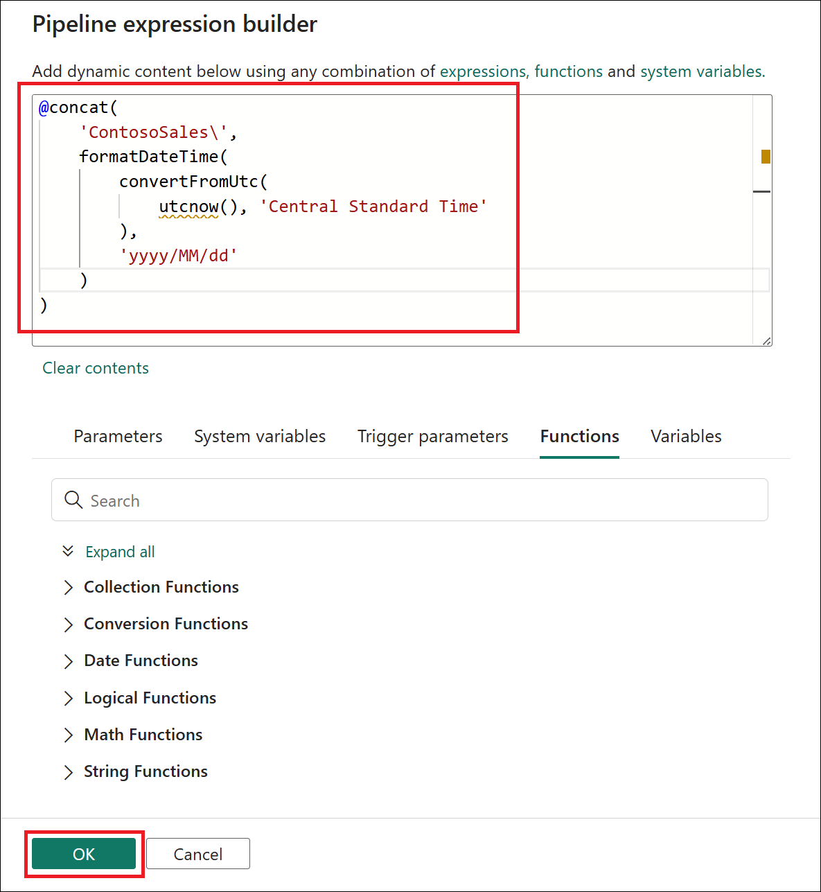

1. With the Copy data activity and Destination settings still selected, select the drop-down for the **Copy behavior** and then choose the **Preserve hierarchy** option. This option maintains the original file names as they are within the zip file, ensuring that the file structure is preserved during the copy process.

    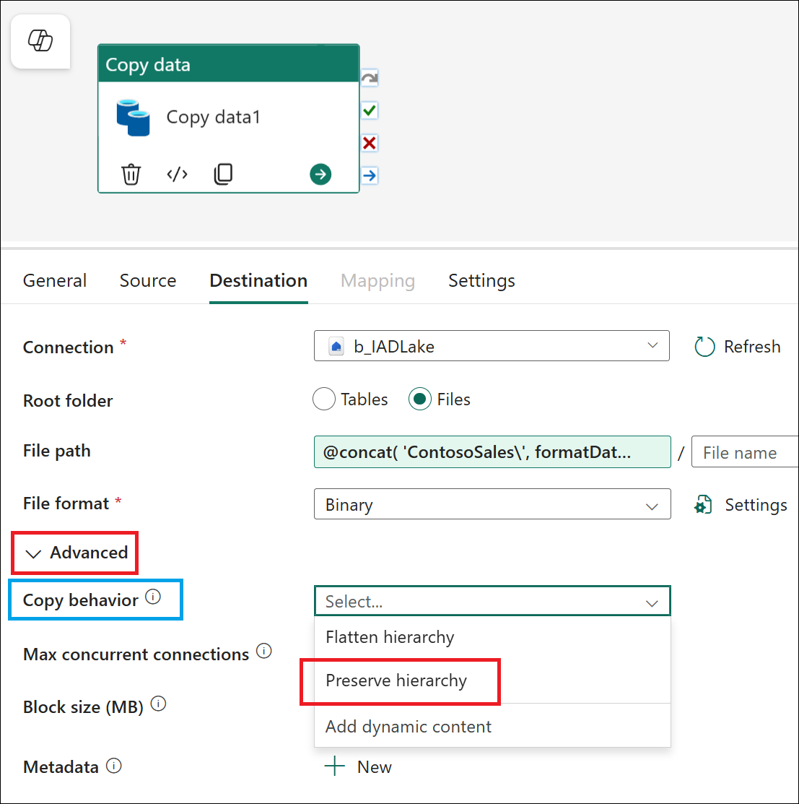

1. Navigate to the General tab with the Copy data activity selected. Update the **Name** and **Description** fields with the appropriate text. This step helps in identifying and managing the activity within your pipeline, making it easier to understand its purpose and functionality.

    | Property | Text |
    | :-- | :-- |
    | Name | Get and Unzip files |
    | Description | Copies sample data from GitHub and stores raw content in lakehouse files |

    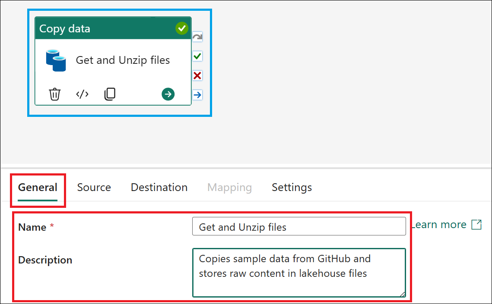

1. From the **Home** tab, select the **Validate** option to first confirm that there are no issues with your pipeline. This validation step helps in identifying any errors to be fixed before running the pipeline. Once validated, select the **Save** option and then **Run** to start the ingestion from the data pipeline. Running the pipeline initiates the data transfer, allowing you to see the results of your configuration in action within the output window.

    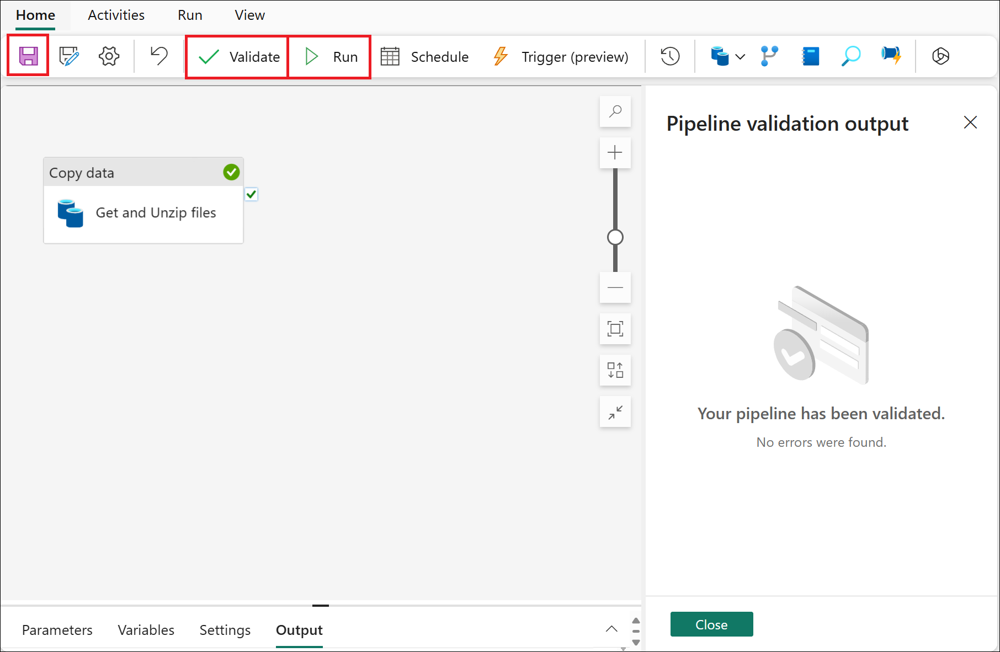

1. Deselect any previously selected activities within the authoring canvas. This action will make the global properties and **Output** view visible. After starting the run of your pipeline, both the Pipeline status and any individual Activity statuses should show a **Succeeded** status. This indicates that everything ran as intended, confirming that your data ingestion process was successful.

    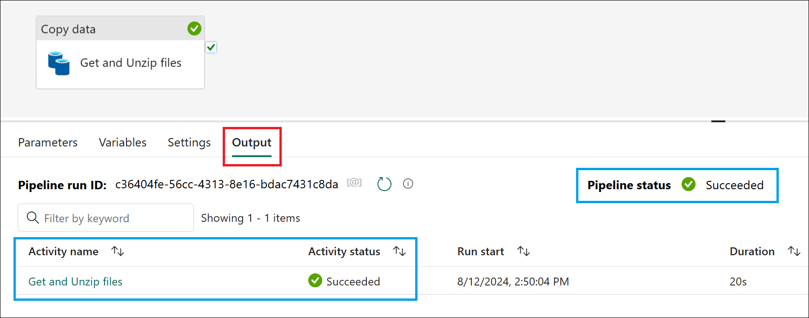

1. If we return to our previously created **b_IADLake** lakehouse item (either by selecting it on the left side rail if still open or by returning to the workspace item list to open), we can confirm that the zip file's content has now been added to the Files section. The files should be organized with a nested folder structure based on the year, month, date, and data source title for the pipeline run.

    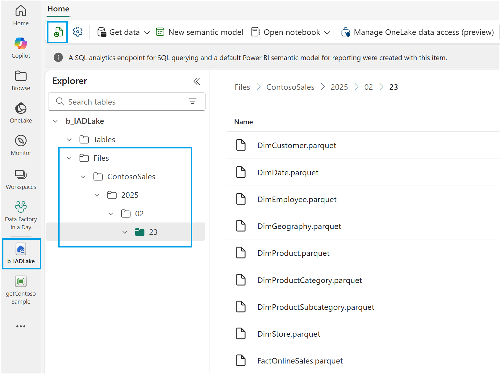