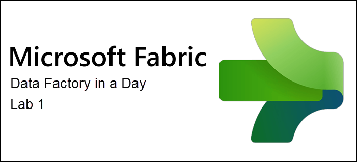

# **Microsoft Fabric - Data Factory in a Day - Lab 1**



## Contents
- Introduction
- Task 1: Getting Started with Microsoft Fabric: Activate Trial and Set Up a Workspace
    - Task 1.1: Medallion task flow
    - Task 1.2: Copy activity
- Task 2: Authoring canvas 
    - Task 2.1: Pipeline expression builder
- Summary

## Introduction
In this lab, you will learn how to create a project task flow and understand the basics of Data Factory experiences. This workshop is designed to provide you with hands-on experience in building and managing your solution using Microsoft Fabric. By the end of this lab, you will have a foundational understanding of key concepts and tools that are essential for efficient data management and transformation.

1. First, you will learn how to create a medallion architecture [task flow](https://learn.microsoft.com/fabric/get-started/task-flow-overview) within a workspace. The medallion architecture is a design pattern that organizes data into different layers, such as bronze, silver, and gold, to improve data quality and accessibility. This task flow will help you understand how to structure and manage your data effectively.

1. Next, you will create a [lakehouse](https://learn.microsoft.com/fabric/data-engineering/lakehouse-overview) item for data storage. A lakehouse combines the best features of data lakes and data warehouses, providing a unified platform for storing and analyzing large volumes of data. This step is crucial for setting up a scalable and efficient data solution that supports various data processing and analytics tasks.

1. Finally, you will create a data pipeline to ingest sample data using the [copy activity](https://learn.microsoft.com/fabric/data-factory/copy-data-activity) within a data pipeline. Data pipelines are essential for automating the movement and transformation of data from various sources to destinations. The copy activity is a powerful tool that allows you to efficiently transfer data between different storage systems, ensuring that your data is always up-to-date and ready for analysis.

## Task 1: Getting Started with Microsoft Fabric: Activate Trial and Set Up a Workspace

1. In the top-right corner of Power BI, click the **User icon**, then select **Free trial** from the menu.

    .png)

1. On Activate your 60-day free Fabric trial capacity dialog opens. Select **Activate**.

    .png)

1. Successfully upgraded to Microsoft Fabric dialog opens. Select **Fabric Home Page**.

    .png)

1. You will be navigated to the **Microsoft** **Fabric Home page**.

    .png)

1. Now let's create a workspace with a Fabric license. Select **Workspaces** **(1)** from the left navigation bar. A dialog opens.

2. Click **+ New workspace** **(2)** found at the bottom of the pop-out menu.

    .png)

3. **Create a workspace** dialog opens on the right side of the browser.

4. In the **Name** field enter **Data Factory in a Day_<inject key="Deployment ID" enableCopy="false"/>**

    >**Note:** The workspace name must be unique. Make sure a green check mark with "This name is available" is displayed below the Name field.

5. If you choose, you can enter a Description for the workspace. This is an optional field.

6. Click on **Advanced** to expand the section.

   .png)

7. Under **License mode**, make sure **Trial** is selected. (It should be selected by default.)

8. Select **Apply** to create a new workspace.

    .png)

## Task 1.1: Medallion task flow

1. To begin, from the empty workspace, select the option **Select a predefined task flow** to choose one of Microsoft's task flows. These predesigned task flows provide a structured approach to managing data projects.

    .png)

1. In the **Select a predefined task flow** window, choose the **Medallion** option, which is described as "Organize and improve data progressively as it moves through each layer." Then, click **Select** to proceed.

    .png)

1. A task flow has now been created within your workspace. Select **+ New item** option on the **Bronze data** task to start adding items to your task flow.

    .png)

1. Within the Create an item window, the available options within Microsoft Fabric have been filtered down to **Recommended items** only. Select the **Lakehouse** item for your data storage.

    .png)

1. In the New lakehouse window, set the lakehouse name to **b_IADLake** (shorthand for bronze in a day) and then select **Create**.

    .png)

1. A new lakehouse will be created. For now, return to the **Data Factory in a Day_<inject key="Deployment ID" enableCopy="false"/>** workspace by selecting the workspace name on the left side-rail.

    .png)

1. Within the workspace, you will notice that three items have now been created and are associated with your lakehouse. These items include the lakehouse (storage), SQL analytics endpoint, and a default Semantic model.

    To proceed, click **+ New item** under the **High-volume data ingest** task. This step sets up the process for efficiently handling large volumes of data, ensuring your ingestion pipeline is both scalable and reliable.

    .png)

1. Within the Create an item window, the available options within Microsoft Fabric have been filtered down to **Recommended items** only again. Select **Data pipeline**, which is a key component for streamlining the movement and transformation of data across various sources and destinations.

    .png)

1. In the New pipeline window, set the data pipeline name to **samplePipeline** and then select **Create**.

    .png)

## Task 1.2: Copy activity

1. From the new and empty data pipeline, select the **Copy data assistant** watermark option to walk through a guided configuration.

    .png)

1. The first step within the copy data assistant is to choose a data source. Start by selecting the **Sample data** tab and then the **Public Holidays** option from the available options.

    .png)

1. A preview of the data source will now be displayed. This preview helps you verify that you have selected the correct data source and understand the structure of the data. Once you have reviewed the preview, select **Next** to proceed.

    .png)

1. Choose the **b_IADLakehouse** lakehouse item for the data destination from the **OneLake catalog** list of items. This step determines where your data will be stored.

    .png)

1. Within the data destination configuration, select the **Files (1)** option and set the File name to **Holidays.csv (2)**. Set the Copy behavior to **Merge files (3)** before selecting **Next (4)**.

    .png)

1. Set the Compression type to **None**. This setting is important for determining how your data will be stored and accessed. In this case, no compression is applied, which can be useful for maintaining the original data format.

    .png)

1. Set the File format to **DelimitedText** and then select **Next**. This format is commonly used for storing tabular data, making it easy to import and export data between different systems.

    .png)

1. Within the Review + save window, **disable the Start data transfer immediately** option and then select **OK** to review your configured copy activity within the data pipeline canvas.

    .png)

## Task 2: Authoring canvas

1. Within the authoring canvas, select the **Copy data** activity. Below, you will find the properties section where you can review the Source, Destination, Settings, and more. This allows you to edit their configurations directly, ensuring that your data copy activity is set up correctly and tailored to your specific needs.

    .png)

1. From the **Home (1)** tab, click **Validate (2)** to check your pipeline for errors. If everything is set up correctly, you'll see the message: *"Your pipeline has been validated. No errors were found."* This step helps catch any issues before running the pipeline.

    Select the **Run (3)** option to start the pipeline and begin your data ingestion process. Running the pipeline initiates the data transfer from the source to the destination.

    .png)

    >**Note:** A new window will prompt you as unsaved changes have been detected. Select **Save and run** to continue.

    .png)

1. Deselect any previously selected activities within the authoring canvas. The global properties and **Output** view will then become visible. After starting the run of your pipeline, both the **Pipeline status** and the **Activity status** should show a **Succeeded** status. This indicates that everything ran as intended, confirming that your data ingestion process was successful.

    .png)

1. If we return to our previously created **b_IADLake (1)** lakehouse item (either by selecting it on the left side rail if still open or by returning to the workspace item list to open), we can confirm that the **Holidays.csv (3)** file has been added to the **Files (2)** section. Selecting the file will allow you to get a preview of the data, ensuring that the data has been ingested correctly.

    >**Note:** If the contents are not yet visible, navigate to the Home tab and select the Refresh icon to start the metadata sync process and update the lakehouse viewer content.

    .png)

## Task 2.1: Pipeline expression builder

1. We want to make the output of our file from the pipeline dynamic to a new folder location based on the current date of execution. To start, delete the existing **Holidays.csv** file from our lakehouse by selecting the **ellipses** (**...**) and then the **Delete** option. This step ensures that we have a clean slate for our new dynamic file output.

    .png)

1. A confirmation window will be displayed. Select **Delete** to confirm the removal of the file.

    .png)

1. Return to our previously created **samplePipeline** data pipeline item. You can do this either by selecting it on the left side rail if it is still open or by returning to the workspace item list to open it.

    .png)

1. Select the **Copy data (1)** activity and then go to the **Destination (2)** tab. Select the text box input for the **File path**, where after selection you will see the text **Add dynamic content [Alt+Shift+D] (4)**. Select this text to open the pipeline expression builder.

    .png)

1. Within the Pipeline expression builder window, select the **Functions** tab. Here, you can explore various functions that exist within the expression library. When you're ready, copy and paste the code block below into the expression input box. Press **Ok** when complete.

    >**Note:** This expression will be used to create a folder structure within your pipeline that writes the file to nested folders based on the current year, the current month, and the current date of the run time. The forward slash "**/**" character is how the folder structure is defined. This dynamic folder structure helps in organizing your data based on the date, making it easier to manage and retrieve.

    ```text
    @formatDateTime(
        convertFromUtc(
            utcnow(), 'Central Standard Time'
        ),
        'yyyy/MM/dd'
    )
    ```

    .png)

1. From the **Home** tab on the ribbon, select the **Validate** option once again.

    Select the **Run** option to start the pipeline and begin your data ingestion process. Running the pipeline initiates the data transfer from the source to the updated destination folder path.

    .png)

    >**Note:** A new window will prompt you as unsaved changes have been detected. Select **Save and run** to continue.

    .png)

1. Deselect any previously selected activities within the authoring canvas. The global properties and **Output** view will then become visible. After starting the run of your pipeline, both the **Pipeline status** and the **Activity status** should show a **Succeeded** status. This indicates that everything ran as intended, confirming that your data ingestion process was successful.

    .png)

1. If we return to our previously created **b_IADLake** lakehouse item (either by selecting it on the left side rail if still open or by returning to the workspace item list to open), we can confirm that the **Holidays.csv** file has now been added to the Files section with a nested folder structure based on the year, month, and date of the run.

    >**Note:** If the contents are not yet visible, navigate to the Home tab and select the Refresh icon to start the metadata sync process and update the lakehouse viewer content.

    .png)

1. Click the **ellipses (...)** next to the main year folder, then choose **Delete** to remove the sample data used in this lab. 

    .png)

1. A confirmation window will appear, select **Delete** to proceed with removing the contents.

    .png)

## Summary

In this lab, you learned how to create a task flow, build a data pipeline, use the copy activity, and work with the expression builder. These steps gave you hands-on experience in setting up a data ingestion solution using Microsoft Fabric.

Now, click on **Next** from the lower right corner to move on to the next page.
 

