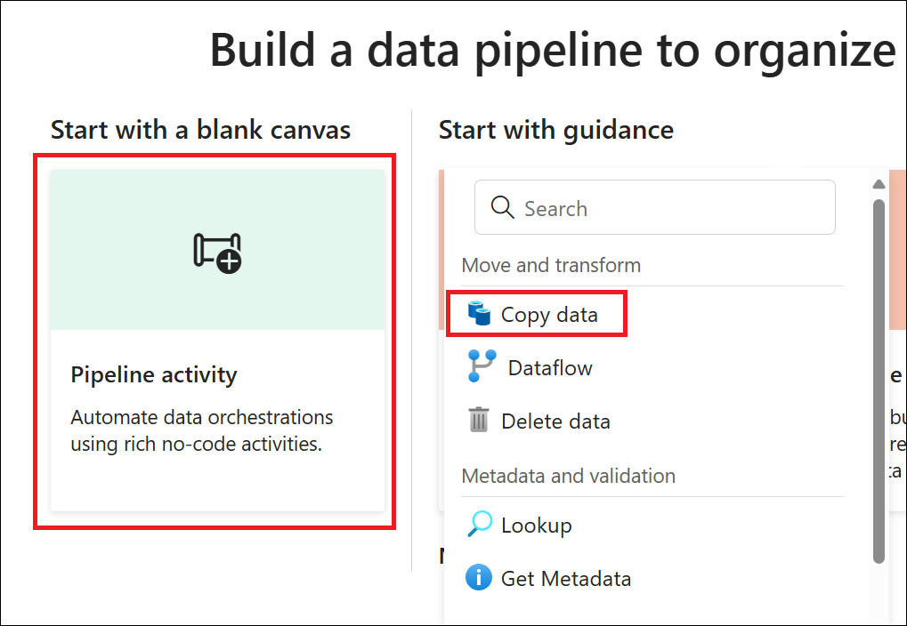
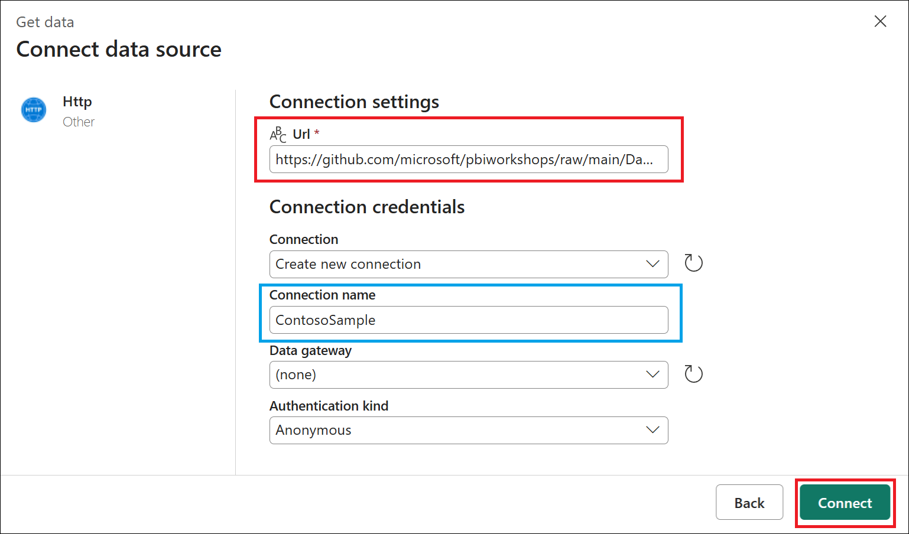
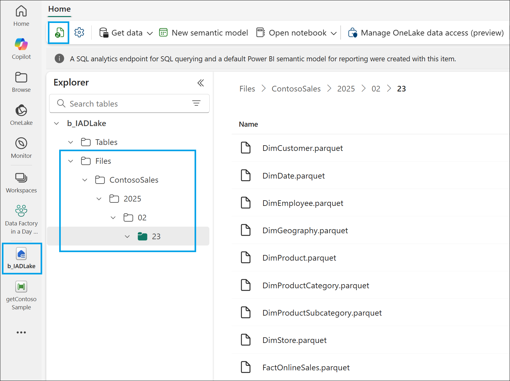
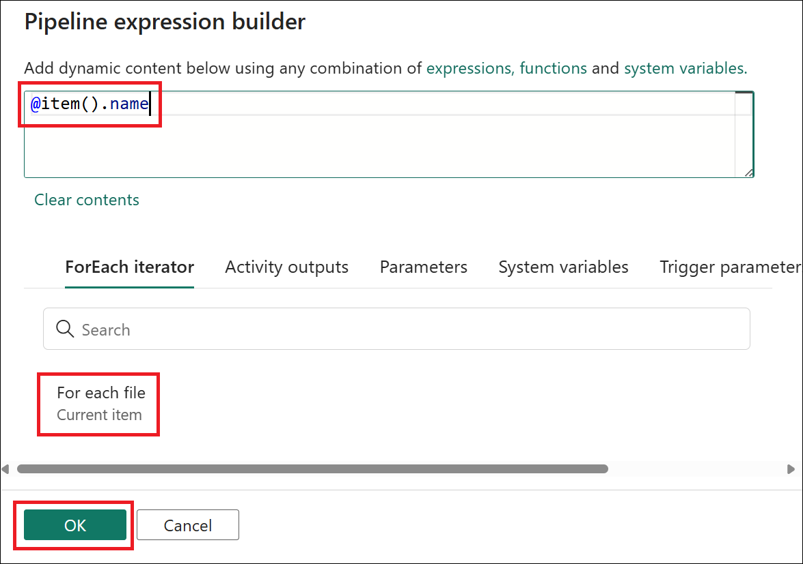

# **Microsoft Fabric - Data Factory in a Day - Lab 2**


## Contents
- Introduction
- Task 1: Create a Data Pipeline and Set Up Data Copy from Web to Lakehouse
    - Task 1.1: Create a data pipeline
    - Task 1.2: Creating a data connection
    - Task 1.3: Copy activity settings
- Task 2: Enriching raw data
    - Task 2.1: Creating and using variables
    - Task 2.2: ForEach loop and conditional branches
- Task 3: Attach data pipeline to task flow
- Summary

## Introduction
In this lab, we will guide you through the process of creating a comprehensive data ingestion solution using data pipelines in Microsoft Fabric. We will start by setting up the copy activity to transfer data from a sample source to a dynamic destination within a lakehouse. This includes using the expression builder to create a dynamic folder structure based on the current date of execution.

Throughout the lab, you will validate and run the pipeline, ensuring that the data ingestion process is successful and that the data is organized correctly in the lakehouse. By the end of this lab, you will have a solid understanding of how to efficiently manage a data ingestion workflow.

# Task 1: Create a Data Pipeline and Set Up Data Copy from Web to Lakehouse

## Task 1.1: Create a data pipeline

1. In the Fabric portal, open the previously created workspace named **Data Factory in a Day_<inject key="Deployment ID" enableCopy="false"/>**.

2. Next, go to the **High-volume data ingest** task and select **+ New item** to continue.

    

1. Within the Create an item window, the available options within Microsoft Fabric have been filtered down to **Recommended items** only again. Select the **Data pipeline** item.

    

1. In the New pipeline window, set the data pipeline name to **getContosoSample** and then select **Create**.

    

## Task 1.2: Creating a data connection

1. From the new and empty data pipeline, select the **Pipeline activity** watermark option and then choose **Copy data** to add this activity to the authoring canvas.

    

1. With the **Copy data** activity selected, navigate to the **Source** tab. Within the **Connection** drop-down menu, select the **More** option to launch the Get data navigator.

    

1. From the Get data navigator, select **+ New** from the left side-rail and then choose the **Http** connector. The `Http` connector allows you to connect to web-based data sources, providing flexibility in accessing data from various online resources.

    

1. Paste the sample ZIP file URL from GitHub into the **URL** field, set the **Connection name** to **ContosoSample**, and select **Connect** to establish the connection.

    ```text
    https://github.com/microsoft/pbiworkshops/raw/main/Day%20After%20Dashboard%20in%20a%20Day/Source_Files/ContosoSales.zip
    ```

    

## Task 1.3: Copy activity settings

1. With the **Copy data** activity selected and the **Source** tab displayed, select the **Settings** option next to the File format field. Within the **Compression type** setting, choose **ZipDeflate (.zip)** and select **OK** to complete.

    

1. Next, with the Copy data activity still selected and the Source tab displayed, expand the **Advanced** section. **Deselect** the option to **Preserve zip file name as folder**. This allows you to customize the folder name for your zip contents, providing more flexibility in organizing your data.

    .png)

1. With the Copy data activity still selected, navigate to the **Destination** tab. From the list of connections, select the previously configured lakehouse **b_IADLake**.

    

1. Within the Destination settings, select the **Files** option and then the **Directory** file path text input box. This will display the **Add dynamic content [Alt+Shift+D]** property. Select this text to open the pipeline expression builder. The expression builder allows us to create dynamic file paths, which can be customized based on various dynamic parameters such as date and time or static text values.

    

1. In the Pipeline expression builder window, select the **Functions** tab. Here, you can explore various functions that exist within the expression library. In this example, we'll use both date and string functions to create a dynamic folder path. When you're ready, copy and paste the code block below into the expression input box. Press **OK** when complete.

    ```text
    @concat(
        'ContosoSales\',
        formatDateTime(
            convertFromUtc(
                utcnow(), 'Central Standard Time'
            ),
            'yyyy/MM/dd'
        )
    )
    ```

    

1. With the Copy data activity and Destination settings still selected, expand the **Advanced** section, select the drop-down for the **Copy behavior** and then choose the **Preserve hierarchy** option. This option maintains the original file names as they are within the zip file, ensuring that the file structure is preserved during the copy process.

    

1. Navigate to the **General** tab with the Copy data activity selected. Update the **Name** and **Description** fields with the appropriate text.

    | Property | Text |
    | :-- | :-- |
    | Name | Get and Unzip files |
    | Description | Copies sample data from GitHub and stores raw content in lakehouse files |

    .png)

1. From the **Home** tab, select the **Validate** option to first confirm that there are no issues with your pipeline. This validation step helps in identifying any errors to be fixed before running the pipeline. Once validated, select the **Save** option and then **Run** to start the ingestion from the data pipeline. Running the pipeline initiates the data transfer, allowing you to see the results of your configuration in action within the output window.

    

1. Deselect any previously selected activities within the authoring canvas. This action will make the global properties and **Output** view visible. After starting the run of your pipeline, both the Pipeline status and any individual Activity statuses should show a **Succeeded** status. This indicates that everything ran as intended, confirming that your data ingestion process was successful.

    

1. If we return to our previously created **b_IADLake** lakehouse item (either by selecting it on the left side rail if still open or by returning to the workspace item list to open), we can confirm that the zip file's content has now been added to the Files section. The files should be organized with a nested folder structure based on the data source title, year, month, and date of the pipeline run.

    >**Note:** If the contents are not yet visible, navigate to the Home tab and select the Refresh icon to start the metadata sync process and update the lakehouse viewer content.

    

# Task 2: Enriching raw data

## Task 2.1: Creating and using variables

1. Navigate to previously created workspace named **Data Factory in a Day_<inject key="Deployment ID" enableCopy="false"/>**. Select the **+ New item** option on the **Silver data** from your task flow to add another storage item to your project. Within the **Item type** selection, select **Lakehouse**.

    .png)

1. In the New lakehouse window, set the lakehouse name to **s_IADLake** (shorthand for silver in a day) and then select **Create**.

    

1. Within the lakehouse item from the **Home** tab select **Get data -> New data pipeline**.

    

1. In the New pipeline window, set the data pipeline name to **createContosoTables** and then select **Create**.

    

1. Select the **Activities** tab and then the **Set variable** activity to add this to your canvas. The Set variable activity allows you to define and assign values to variables that can be used throughout your pipeline.

    

1. With the **Set variable** activity selected, navigate to the **Settings** tab. Next to the **Name** property, select **+ New**. This step allows you to create a new variable that will be used in your pipeline.

    

1. Within the Add new variable window, set the **Name** value to **fileDirectory** and ensure the Type remains as a **String** before selecting **Confirm**.

    

1. Select the **Value** text input box. This will display the **Add dynamic content [Alt+Shift+D]** property. Select this text to open the pipeline expression builder.

    In the Pipeline expression builder window, copy and paste the code block below into the expression input box. Press **OK** when complete.

    ```text
    @concat(
        'ContosoSales/',
        formatDateTime(
            convertFromUtc(
                utcnow(), 'Central Standard Time'
            ),
            'yyyy/MM/dd'
        )
    )
    ```

    

1. Navigate to the General tab with the Set variable activity selected. Update the **Name** field with the text **Set file directory**.

    

1. Navigate to the **Activities** tab and select the **Get metadata** activity to add it to your canvas.

    Next, within the **Settings** options, set the **Connection** to **b_IADLake** from the available connection options.

    Choose the **Files** option and then click on the **Directory** file path text input box. This will display the **Add dynamic content [Alt+Shift+D]** property. Click on this text to open the pipeline expression builder.

    

1. In the Pipeline expression builder window, select the **Variables** option. Within the available variable list, select **fileDirectory** and then **OK**.

    

1. With the Get metadata activity still selected, navigate to the **Settings** tab. From the **Field list** select **+ New**. Within the drop-downs, configure the value as **Child items**. This ensures that the metadata activity retrieves information about the child items and their names within the specified directory.

    

1. Next, navigate to the **General** tab with the Get metadata activity selected. Update the **Name** field with the text **Get items in folder**

    

1. Create a conditional path by dragging and dropping the **On completion** option between the **Set file directory** activity and the **Get items in folder** activity. This step establishes a logical flow in your pipeline, ensuring that the metadata retrieval occurs only after the file directory has been set. 

    Once complete, select **Validate** on the **Home** tab to ensure there are no errors within the pipeline. After validation, select **Run** to start the pipeline.

    A new window will prompt you as unsaved changes have been detected. Select **Save and run** to continue. 

    

1. Deselect any previously selected activities within the authoring canvas and navigate to the **Output** view. This view allows you to monitor the current status of your pipeline both during and after its run. In this example, both the Pipeline status and the Activity status should show a **Succeeded** status. This indicates that everything ran as intended, confirming that your data ingestion process was successful.

    From the **Get items in folder** activity, select the last column called **Output** to review the contents of the activity. This step allows you to verify that the filenames from your directory have been correctly retrieved and included in the output.

    

## Task 2.2: ForEach loop and conditional branches

1. Select the **Activities** tab and then the **ForEach** activity to add this to your canvas. This activity allows you to iterate over a collection of items, performing a set of actions for each item in the collection.

    With the **ForEach** activity selected, navigate to the **General** tab and update the **Name** field with the text **For each file**.

    Next, create a conditional path by dragging and dropping the **On success** option between the **Get items in folder activity** and the **For each file activity**. This step establishes a logical flow in your pipeline, ensuring that the ForEach retrieval occurs only after the file directory has been successfully created.

    

1. With the For each file activity still active, navigate to the **Settings** tab. Select the **Items** text input box. This will display the **Add dynamic content [Alt+Shift+D]** property. Select this text to open the pipeline expression builder.

    .png)

1. Within the Pipeline expression builder window, select the **Activity outputs** section. Then, choose the **Get items in folder** output of **childItems**. The full option title is **Get items in folder childItems** and select **OK**.

    

1. Select **+ option** on the For each activity and then select **Copy data**. This step will allow us to repeatedly execute the copy data activity for each item in the array.

    

1. Select the **Edit** option on the For each activity to drill into the nested authoring canvas.

    

1. Navigate to the **General** tab with the Copy data activity selected. Update the **Name** field with the text **Copy tables**.

    

1. With the **Copy data** activity still selected, configure the following options in the **Source** tab. Once complete, select the **Directory** text input box. This will display the **Add dynamic content [Alt+Shift+D]** property. Select this text to open the pipeline expression builder :

    | Property | Value |
    | :-- | :-- |
    | Connection | Select the previously configured **b_IADLake** lakehouse. |
    | Root folder | Files |
    | File path | Select Add dynamic content [Alt+Shift+D] |
    | File format | Parquet |

    

1. Select the variable **fileDirectory** within the expression builder's Variables section and **OK** to continue.

    

1. Select the **File name** text input box. This will display the **Add dynamic content [Alt+Shift+D]** property. Select this text to open the pipeline expression builder.

    

1. Select the item **For each file** within the expression builder's ForEach iterator section. Within the expression builder, add the suffix **.name** to access the name property of the current items array and then **OK** to continue once complete.

    Copy and paste the code block below into the expression input box.

    ```text
    @item().name
    ```

    

1. With the **Copy data** activity selected, configure the following options in the **Destination** tab. Once complete, select the **Table** text input box. This will display the **Add dynamic content [Alt+Shift+D]** property. Select this text to open the pipeline expression builder.

    | Property | Value |
    | :-- | :-- |
    | Connection | Select the previously configured **s_IADLake** lakehouse. |
    | Root folder | Tables |

    

1. Within the expression builder, we'll use the split function from the string functions group to split each item name based on the period delimiter "**.**" and then select the first item from the created array. Once complete, select **OK** to continue.

    Copy and paste the code block below into the expression input box.

    ```text
    @split(item().name, '.')[0]
    ```

    As an example, DimCustomer.parquet would become ['DimCustomer','Parquet'] with two items in the returned array. To select the first item, we use a zero-based index to select the value DimCustomer.

    

1. Next, with the Copy data activity still selected and the Source tab displayed,hover above either of the **Table action** values to display the **Add dynamic content [Alt+Shift+D]** property. Select this text to open the pipeline expression builder.

    

1. Within the expression builder, we'll use the if condition from the logical functions group and the starts with function from the string functions group to determine if the string starts with the prefix of **Dim** for our dimension tables. If true, we'll set the value to **Overwrite**, if false, **Append**. Once complete, select **OK** to continue.

    Copy and paste the code block below into the expression input box.

    ```text
    @if(
        startswith(item().name, 'Dim'),
        'Overwrite',
        'Append'
    )
    ```

    

1. Select the **Main canvas** option from the breadcrumb trail to return to the top level of your pipeline.

    

1. From the **Home** tab, select the **Validate** option to first confirm that there are no issues with your pipeline. This validation step helps in identifying any errors to be fixed before running the pipeline.

    Once validated, select the **Save** option and then **Run** to start the ingestion from the data pipeline. If a save window is prompted, confirm by selecting **Save and run**. Running the pipeline initiates the data transfer, allowing you to see the results of your configuration in action within the output window.

    

1. Deselect any previously selected activities within the authoring canvas. The global properties and **Output** view will then become visible. After starting the run of your pipeline, both the **Pipeline status** and the **Activity status** should show a **Succeeded** status.

    

# Task 3: Attach data pipeline to task flow

1. Return to the **Data Factory in a Day_<inject key="Deployment ID" enableCopy="false"/>** workspace by selecting the workspace name on the left side-rail.

    .png)

1. From the task flow select the **Initial process** task and the paper clip to assign a previously created item.

    

1. Select the **createContosoTables** item and then press **Select**.

    

## Summary

In this lab, you explored how to build dynamic data pipelines using Microsoft Fabric. You configured key activities like **Set Variable**, **Get Metadata**, **ForEach**, and **Switch** to handle various scenarios. You also validated and ran the pipeline to ensure successful data ingestion into the lakehouse.

By moving data through the **Bronze** and **Silver** layers, you learned how to manage and optimize data workflows. The **Silver layer** utilized **v-Order optimized Delta Parquet tables**, enhancing performance, scalability, and analytical efficiency—enabling better, faster decision-making.

Now, click on **Next** from the lower right corner to move on to the next page.
 

