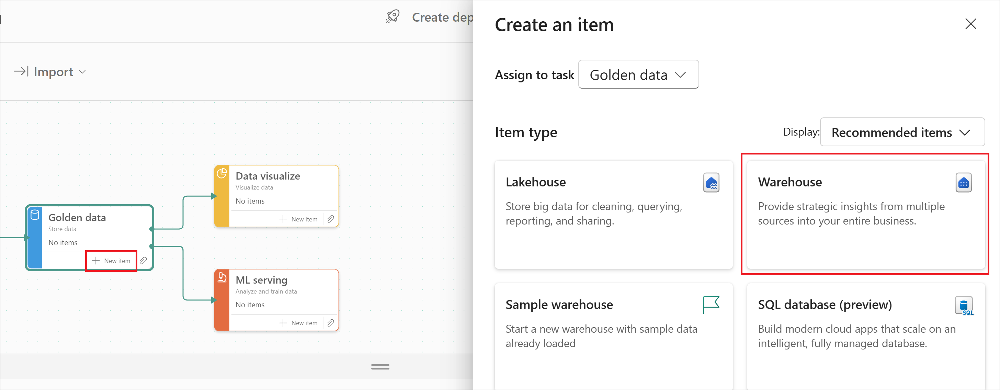
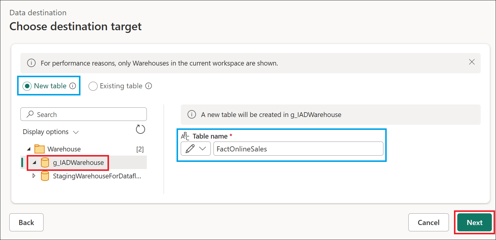
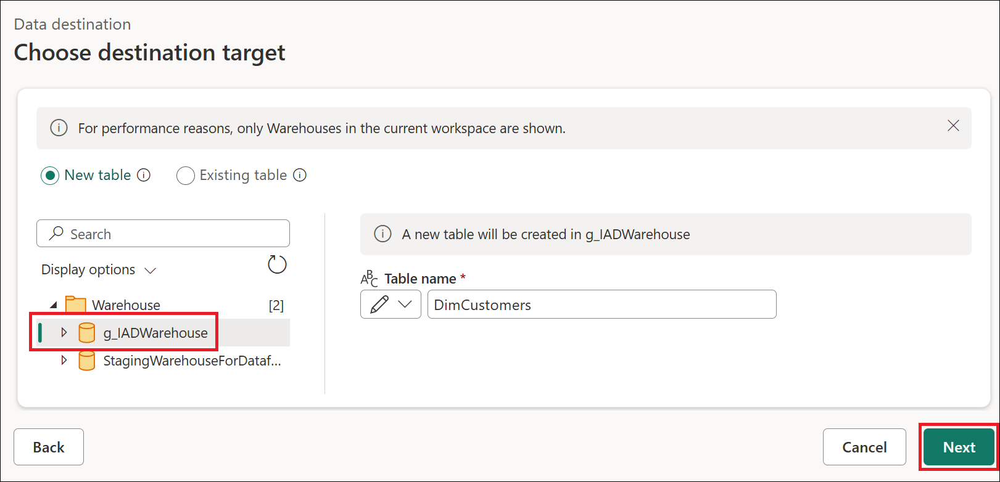
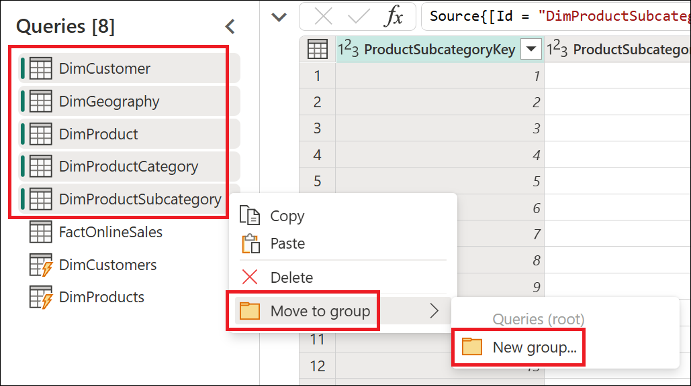
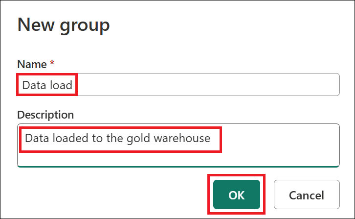
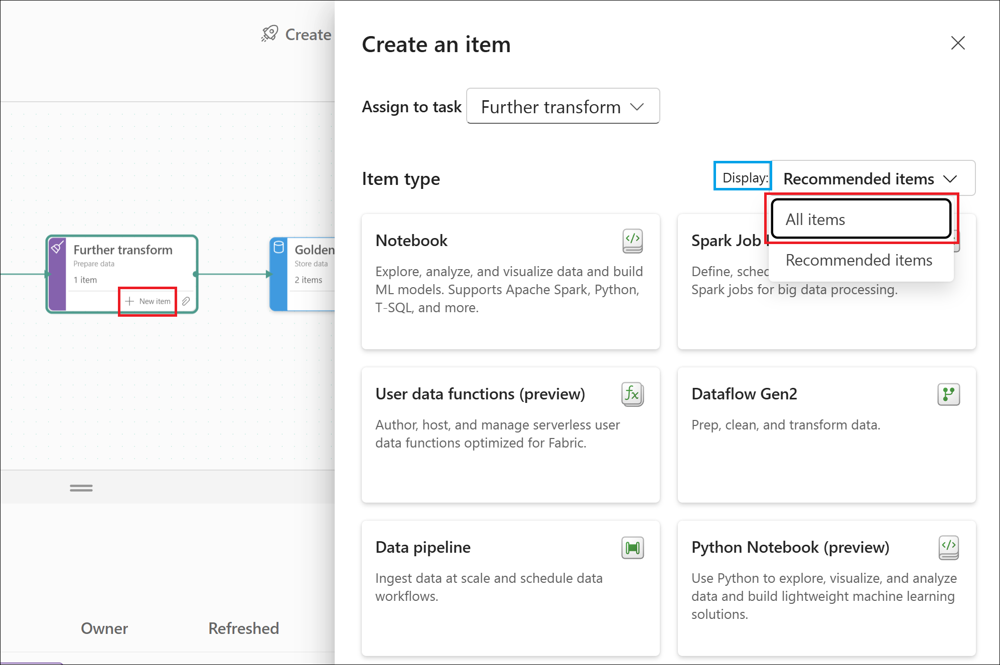
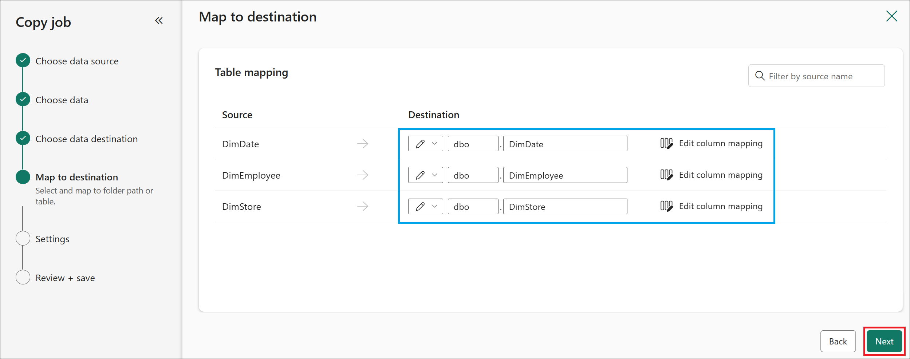
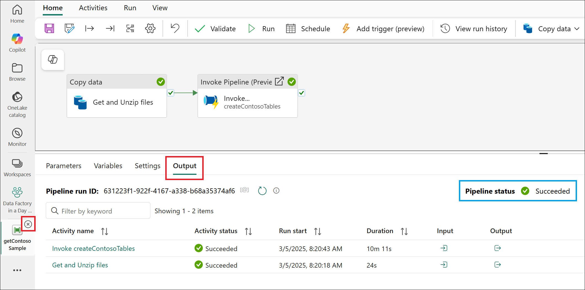
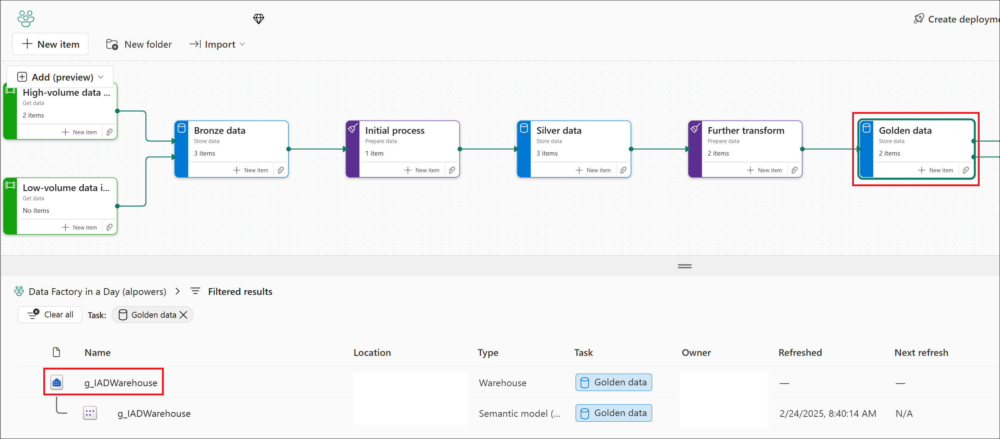

# **Microsoft Fabric - Data Factory in a Day - Lab 3**

## Contents
- Introduction
    - Task 1: Creating Golden data storage and a Dataflow Gen2
    - Task 2: Connecting to lakehouse tables
    - Task 3: Preparing data using Power Query Online
    - Task 4: Outputting data to the warehouse destination
    - Task 5: Group queries and save
    - Task 6: Further transform task flow
    - Task 7: Copy data into the warehouse
    - Task 8: End-to-end orchestration with pipelines
    - Task 9: Unlock the power of T-SQL, Power BI Direct Lake mode, Excel connectivity, and more with your data
- Summary

## Introduction
In this lab, you'll learn about how to shape and orchestrate your data using Data Factory experiences.

1. How to create a [Dataflow Gen2](https://docs.microsoft.com/power-bi/transform-model/dataflows/dataflows-introduction-self-service) to prepare and load data using Power Query Online.

1. Understanding the [storage and compute staging](https://blog.fabric.microsoft.com/blog/data-factory-spotlight-dataflows-gen2?ft=Data-factory:category) architecture for large scale data transformations.

1. Configuring [data destination outputs](https://learn.microsoft.com/fabric/data-factory/dataflow-gen2-data-destinations-and-managed-settings).

1. How to create and configure a [Copy job](https://learn.microsoft.com/fabric/data-factory/what-is-copy-job) for a streamlined and user-friendly data ingestion process from source to destination.

## Task 1: Creating Golden data storage and a Dataflow Gen2

1. In the Fabric portal, open the previously created workspace named **Data Factory in a Day_<inject key="Deployment ID" enableCopy="false"/>**.

1. Select the **+ New item** option on the **Gold data** from your task flow to add another storage item to your project. Within the **Item type** selection, select **Warehouse**.

    

1. In the New warehouse window, set the warehouse name to **g_IADWarehouse** (shorthand for gold in a day) and then select **Create**.

    

1. Within the warehouse item from the **Home** tab select **Get data** from **New Dataflow Gen2**.

    

1. In the top-left corner of the **New Dataflow Gen2** window, rename the dataflow to **PrepContoso**, then press **Enter** to apply the change.
    
    .png)

## Task 2: Connecting to lakehouse tables

1. Navigate to the **Home** tab, click on **Get data**, and then choose **More...** to access additional data source options.

    .png)

1. Within the Get data explorer's search bar, type **s_iad** to locate the silver lakehouse item. Select the **s_IADLake** item within the OneLake catalog's returned results.

    

1. From the **Get data** table navigator, select the specified tables to perform data transformation and merge operations for downstream business intelligence projects, then click **Create**.

    | Table Name |
    | :--- |
    | DimCustomer |
    | DimGeography |
    | DimProduct |
    | DimProductCategory |
    | DimProductSubcategory |
    | FactOnlineSales |

    

## Task 3: Preparing data using Power Query Online

1. Select the **DimCustomer (1)** table and from the **Home (2)** tab, navigate to the **Combine (3) -> Merge queries (4)** option and select **Merge queries as new (5)**.

    .png)

1. From the Merge query window, set the **Right table for merge** to **DimGeography**. In the top right corner, select the lightbulb which has detected a possible column match. In this example, both tables contain a column titled **GeographyKey**. Select this option to set the columns to be merged on. For the Join kind, select **Inner** and then **OK** to proceed.

    .png)

1. On the right-hand side in the Query settings pane, update the **Name** of the query to be **DimCustomers**

    .png)

1. Navigate to the far right for the **DimCustomers** table and select the joined **DimGeography** table column's top right corner to expand the table, from the avaialble column selections deselect **GeographyKey** since this column is what we used to merge on and already exists in the dataset before selecting **OK** to continue.

    

1. Next, select the **DimProduct** table and from the **Home** tab, navigate to the **Combine -> Merge queries** option and select **Merge queries as new**.

    .png)

1. From the Merge query window, set the **Right table for merge** to **DimProductSubcategory**. In the top right corner, select the lightbulb which has detected a possible column match. In this example, both tables contain a column titled **ProductSubcategoryKey**. Select this option to set the columns to be merged on. For the Join kind, select **Inner** and then **OK** to proceed.

    .png)

1. Navigate to the far right fo the **Merge** Queries and select the joined **DimProductSubcategory** table column's top right corner to expand the table, from the avaialble column selections **deselect** **ProductSubCategoryKey** since this column is what we used to merge on and already exists in the dataset before selecting **OK** to continue.

    

1. Select the **Merge** query and from the **Home** tab, navigate to the **Combine -> Merge queries** option and select **Merge queries**.

    .png)

1. From the Merge query window, set the **Right table for merge** to **DimProductCategory**. In the top right corner, select the lightbulb which has detected a possible column match. In this example, both tables contain a column titled **ProductCategoryKey**. Select this option to set the columns to be merged on. For the join kind, select **Inner** and then **OK** to proceed.

    .png)

1. On the right-hand side in the Query settings pane, update the **Name** of the query to be **DimProducts**

    

1. Navigate to the far right for the **DimProducts** table and select the joined **DimProductCategory** table column's top right corner to expand the table, from the avaialble column selections deselect **ProductCategoryKey** since this column is what we used to merge on and already exists in the dataset before selecting **OK** to continue.

    

## Task 4: Outputting data to the warehouse destination

1. First, we need to remove the default data destination. Select the **FactOnlineSales (1)** query, on the **Home** tab, click on **Default data destination (2)**, and then select **Remove (3)**.

    .png)

1. On Remove default data destination dialog opens. Select **Remove**.

    .png)

1. Select the **FactOnlineSales** query again and from the **Home** tab, select **Add data destination** and then choose the **Warehouse** option.

    

1. If a connection window asks you to authenticate, confirm your credentials. Otherwise, in the **Choose destination target** window, select **g_IADWarehouse** and then click **Next**.

    

1. In the **Choose destination settings** window, change the **Update method** to **Append** and click **Save settings**.

    

1. In the bottom right-hand corner, hover above the **Data destination** field to view the configuration values of your queries at a glance.

    

1. Select the **DimCustomers** query and from the **Home** tab, select **Add data destination** and then choose the **Warehouse** option.

    

1. If a connection window asks you to authenticate, confirm your credentials. Otherwise, in the **Choose destination target** window, select **g_IADWarehouse** and then click **Next**.

    

1. In the **Choose destination settings** window, ensure the **Update method** is set to the default **Replace** and then click **Save settings**. This will delete data from the table and replace the values after each refresh.

    

1. Select the **DimProducts** query and from the **Home** tab, select **Add data destination** and then choose the **Warehouse** option.

    

1. If a connection window asks you to authenticate, confirm your credentials. Otherwise, in the **Choose destination target** window, select **g_IADWarehouse** and then click **Next**.

    

1. In the **Choose destination settings** window, ensure the **Update method** is set to the default **Replace** and then click **Save settings**. This will delete data from the table and replace the values after each refresh.

    

## Task 5: Group queries and save

1. Select the **DimCustomer**, **DimGeography**, **DimProduct**, **DimProductCategory** and **DimProductSubcategory** queries by holding the shift key, as they are all adjacent to each other. Right-click and select **Move to group**, then select **New group..**

    

1. In the New group window, set the properties as needed below and select **OK**.

    | Name | Description |
    | :-- | :-- |
    | Data reference | Data used only as a source from the silver lakehouse |

    

1. Select the **FactOnlineSales**, **DimCustomers** and **DimProducts** queries by holding the control key. Right-click and choose **Move to group**, then select **New group...**

    

1. In the New group window, set the properties as needed below and select **OK**.

    | Name | Description |
    | :-- | :-- |
    | Data load | Data loaded to the gold warehouse |

    

1. Click **Publish** to save and apply the changes to the dataflow.

    .png)

## Task 6: Further transform task flow

1. If you don't automatically return to the workspace upon closing the dataflow, select the workspace name on the left side-rail.

    .png)

1. From the task flow, select the **Further transform** task and click on the paper clip icon to assign a previously created item.

    

1. Select the **PrepContoso** item and then press **Select**.

    

1. From the task flow, select the **Further transform** task and click on the **+ New item** option. Within the Create an item pane, display properties, change the toggle to the **All items** option.

    

1. From the list of available items, navigate to the Data Factory section and select the **Copy job** item.

    

## Task 7: Copy data into the warehouse

1. In the New copy job window, set the copy job name to **CopyContoso** and then select **Create**.

    

1. From the Copy job window, search for the data source starting with **s_IAD** in the search bar and then select **s_IADLake** from the OneLake catalog list.

    

1. Now that you're on the **Choose data** step, select the following tables:

    | Table Name |
    | :-- |
    | DimDate |
    | DimEmployee |
    | DimStore |

    

1. The copy job also supports a limited set of transformations, such as column mapping, setting schema names, and renaming tables. Expand the **DimStore** table and then deselect the **GeoLocation** and **Geometry** columns. Once done, select **Next** to continue.

    

1. Within the Choose data destination step, search for the data source starting with **g_IAD** in the search bar and then select **g_IADWarehouse** from the OneLake catalog list.

    

1. Within the Map to destination step, you can review the added tables and update the schema or table names. Once done reviewing, select **Next** to continue.

    

1. On the Settings step, review the Copy job mode options and then select **Next** to continue.

    

1. On the Review + save step, **deselect** the **Start data transfer immediately** option and then select **Save** to continue.

    

1. Now that you've reviewed the configuration, from the **Home** tab, select the **Run** option to begin copying data from the lakehouse into the warehouse.

    

1. You can monitor the copy job in the **Results** tab at the bottom to confirm that it has successfully completed.

    

1. Hover over the copy job on the left side-rail and select the **X** to close it.

    

## Task 8: End-to-end orchestration with pipelines

1. Within the workspace, select the **Initial process** task flow item and from the filtered list, select the **createContosoTables** pipeline.

    

1. From the **Home** tab, add a new **Dataflow** activity to the pipeline.

    

1. Drag the **On success** conditional path between the **For each file** activity and the new **Dataflow1** activity. Next, go to the **Settings** section and within the Dataflow drop-down, select the **PrepContoso** dataflow.

    

1. With the dataflow activity still selected, go to the **General** tab and update the activity name to **PrepContoso**. Once complete, select the **Save** icon.

    

1. On the left side-rail, select the **X** to close out of the **createContosoTables** pipeline.

    

1. Within the workspace, select the **High-volume data ingest** task flow item and from the filtered list, select the **getContosoSample** pipeline.

    .png)

1. From the **Home** tab, add the **Invoke Pipeline (Preview)** activity.

    

1. Create a conditional **On success** path between the **Get and Unzip files** activity and the **Invoke pipeline1** activity. From the activity settings **Connection** option, select **More**.

    .png)

1. On the **Choose a data source to get started** dialog appears, select the **Fabric Data Pipelines** as your data source.

    .png)

1. Enter **FabricDataPipelines** as the connection name, then click **Sign in** to open the sign-in window. Enter the credentials provided below.

    - **Email/Username:** <inject key="AzureAdUserEmail"></inject>

    - **Password:** <inject key="AzureAdUserPassword"></inject>

      .png)

1. After signing in successfully, click **Connect** to establish the connection.

    .png)

1. From the activity settings **Pipeline** option, select the **createContosoTables** pipeline.

    .png)

1. With the invoke pipeline activity still selected, go to the **General** tab and update the activity **Name** to **Invoke createContosoTables**. Once complete, select the **Save** icon and then **Run**.

    >**Note:** You can set a schedule from this first pipeline, and it will call the subsequent pipelines and its dataflow upon successful completion or have the pipeline triggered by events like when new files are added to the lakehouse.

    

1. From the **Output** pane monitor that the activities and **Succeedded** and once done close the pipeline by selecting the **X** on the left side-rail to return to the workspace.

    

## Task 9: Unlock the power of T-SQL, Power BI Direct Lake mode, Excel connectivity, and more with your data

1. Within the workspace, select the **Golden data** task flow item and from the filtered list, select the **g_IADWarehouse** Warehouse.

    

1. Now that your data ingestion processes are complete, using the Fabric warehouse as your gold layer simplifies data management and enhances the user experience in several ways:

    - The Fabric warehouse offers built-in [RLS, CLS, and OLS security](https://learn.microsoft.com/fabric/data-warehouse/security) and schemas, ensuring secure and organized data access. 
    - Users can write [T-SQL queries](https://learn.microsoft.com/fabric/data-warehouse/sql-query-editor), build [Direct Lake semantic models](https://learn.microsoft.com/fabric/fundamentals/direct-lake-develop) via the Reporting tab, and use Excel for direct connectivity to up-to-date information.
    - Additionally, [Power BI explorations](https://learn.microsoft.com/power-bi/consumer/explore-data-service) allow for instant visual creation, making data analysis and reporting more efficient and user-friendly.

        

## Summary

In this lab, you explored the **medallion architecture** to manage and transform data efficiently across four layers: **Bronze** (raw), **Silver** (cleansed), **Gold** (curated), and **Platinum** (insight-ready via Power BI semantic models).

You worked with **dynamic pipelines**, **Copy activities**, and **Dataflow Gen2** to orchestrate data movement and transformation using low-code/no-code interfaces. These tools streamlined ingestion, optimized storage, and ensured that data was ready for analysis.

### You have successfully completed the lab.
