# Transforming and copying data

### Creating Golden data storage and a Dataflow Gen2

1. Select the **New item** option on the **Gold data** from your task flow to add another storage item to your project. Within the **Item type** selection, select **Warehouse**.

    

1. In the New warehouse window, set the warehouse name to "g_IADWarehouse" (shorthand for gold in a day) and then select **Create**. Consistentcy in naming conventions like this help in easily identifying and managing different layers in your project.

    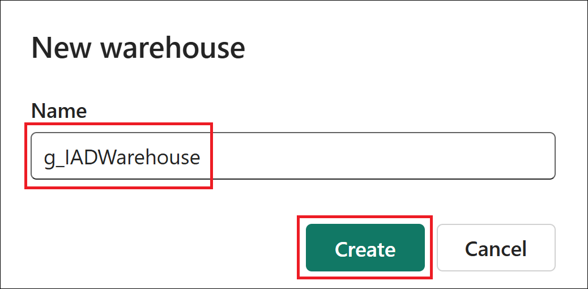

1. Within the warehouse item from the **Home** tab select **Get data** from **New Dataflow Gen2**.

    

1. In the New Dataflow Gen2 window, set the dataflow name to **PrepContoso**, select the **Enable Git integration, deployment pipelines and Public API scenarios (preview)** and then select **Create**.

    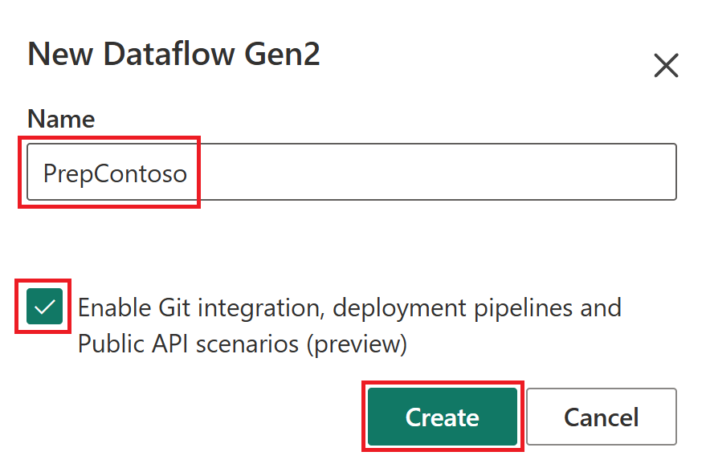

### Connecting to lakehouse tables

1. From the **Home** tab, select **Get data** and then the **More...** option. This step allows you to access a wider range of data sources and connectors, providing flexibility in integrating different data streams into your project.

    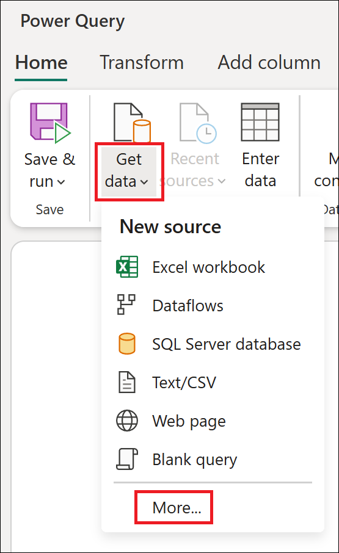

1. Within the Get data explorer's search bar, type **s_iad** to locate the silver lakehouse item. Select the **s_IADLake** item within the OneLake catalog's returned results.

    You can also navigate to the OneLake catalog tab to view all items that you have access to in your tenant. This step ensures that you are connecting to the correct data source, which is essential for accurate data retrieval and analysis.

    If prompted to Connect to data source, ensure a Lakehouse connection is listed as the and select **Connect**.

    

1. From the Get data table navigator, select the tables listed below to perform data transformation operations and merge the tables for our downstream business intelligence projects.

    | Table Name |
    | :--- |
    | DimCustomer |
    | DimGeography |
    | DimProduct |
    | DimProductCategory |
    | DimProductSubcategory |
    | FactOnlineSales |

    

### Preparing data using Power Query Online

1. Select the **DimCustomer** table and from the Home tab, navigate to the **Merge queries** option and select **Merge queries as new**.

    Note that there are two options: Merge queries, which will merge a table with the existing query, or Merge queries as new, which will create a new query in your editor. This step allows you to combine data from different tables, enhancing the comprehensiveness of your dataset.

    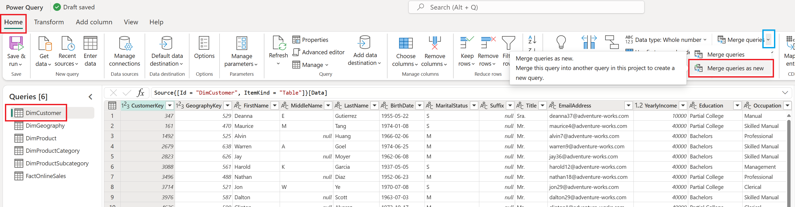

1. From the Merge query window, set the **Right table for merge** to **DimGeography**. In the top right corner, select the lightbulb which has detected a possible column match. In this example, both tables contain a column titled **GeographyKey**. Select this option to set the columns to be merged on. For the join kind, select **Inner** and then **OK** to proceed. This activity ensures that the data is accurately combined based on matching columns.

    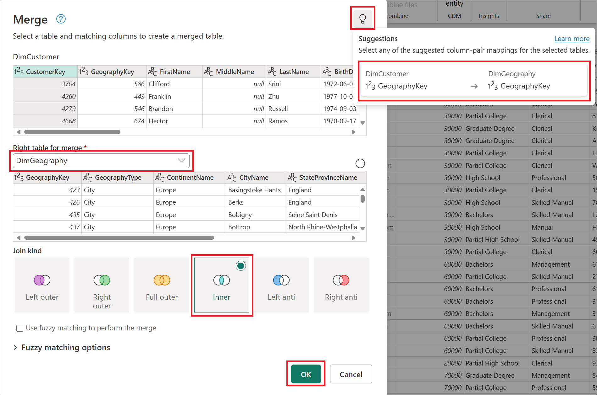

1. Navigate to the far right fo the **DimCustomer** table and select the joined **DimGeography** table column's top right corner to expand the table, from the avaialble column selections deselect **GeographyKey** since this column is what we used to merge on and already exists in the dataset before selecting **OK** to continue.

    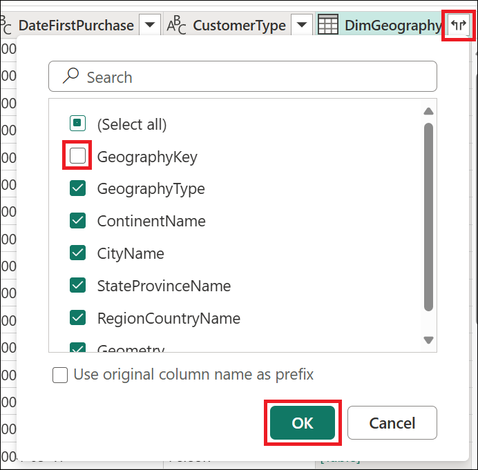

1. On the right-hand side in the Query settings pane, update the **Name** of the query to be **DimCustomers**.

    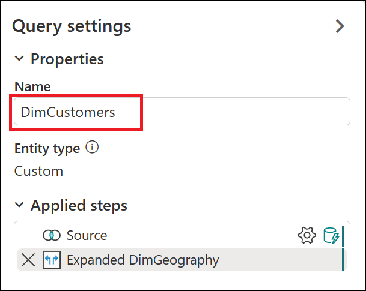

1. Within the Query settings pane, you can review the Applied steps list, which records the steps of your transformations. In this example, query folding indicators highlight that our queries are successfully folding back to the lakehouse's SQL endpoint for large-scale transformations.

    Additionally, the options to View data source query and View query plan allow you to review the generated SQL or the execution plan for the query. This step ensures that the data transformations are applied correctly and efficiently, maintaining the integrity and performance of your dataflow.

    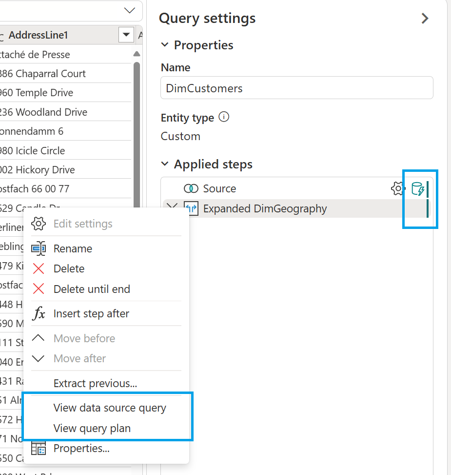

1. Next, select the **DimProduct** table and from the **Home** tab, navigate to the **Merge queries** group and select **Merge queries as new**.

    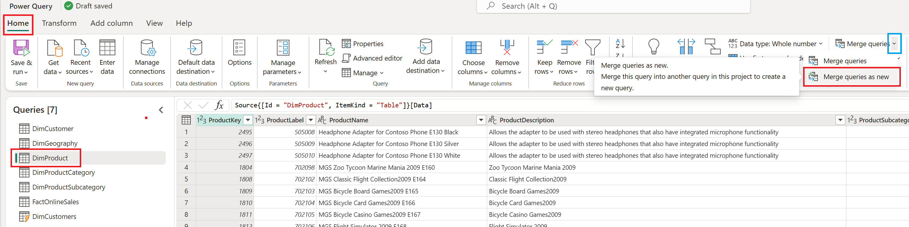

1. From the Merge query window, set the **Right table for merge** to **DimProductSubcategory**. In the top right corner, select the lightbulb which has detected a possible column match. In this example, both tables contain a column titled **ProductSubcategoryKey**. Select this option to set the columns to be merged on. For the join kind, select **Inner** and then **OK** to proceed.

    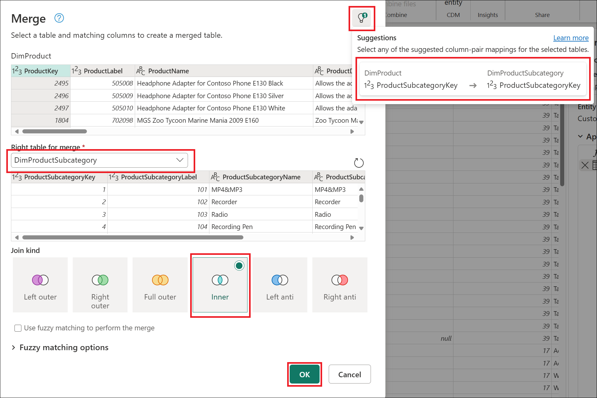

1. Navigate to the far right fo the **DimProduct** table and select the joined **DimProductSubcategory** table column's top right corner to expand the table, from the avaialble column selections deselect **ProductSubCategoryKey** since this column is what we used to merge on and already exists in the dataset before selecting **OK** to continue.

    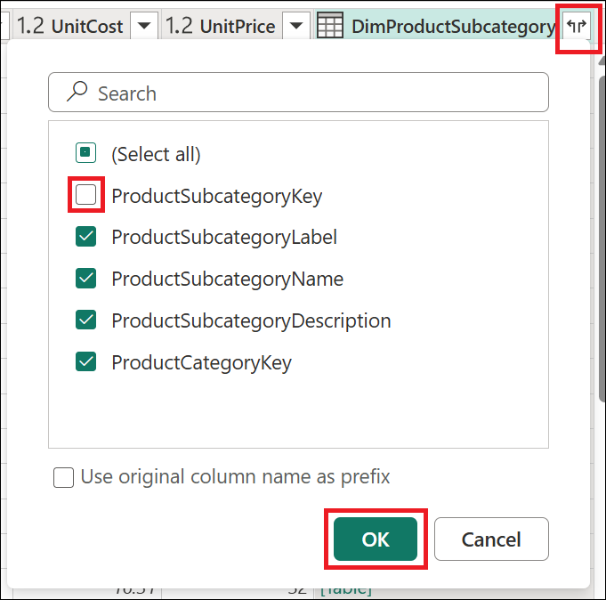

1. Select the **Merge** query and from the **Home** tab, navigate to the **Merge queries** group and select **Merge queries**.

    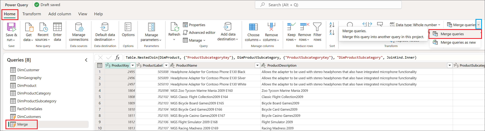

1. From the Merge query window, set the **Right table for merge** to **DimProductCategory**. In the top right corner, select the lightbulb which has detected a possible column match. In this example, both tables contain a column titled **ProductCategoryKey**. Select this option to set the columns to be merged on. For the join kind, select **Inner** and then **OK** to proceed.

    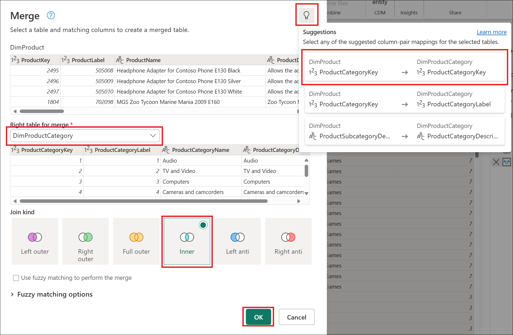

1. Navigate to the far right fo the **DimProduct** table and select the joined **DimProductCategory** table column's top right corner to expand the table, from the avaialble column selections deselect **ProductCategoryKey** since this column is what we used to merge on and already exists in the dataset before selecting **OK** to continue.

    

1. On the right-hand side in the Query settings pane, update the **Name** of the query to be **DimProducts**.

    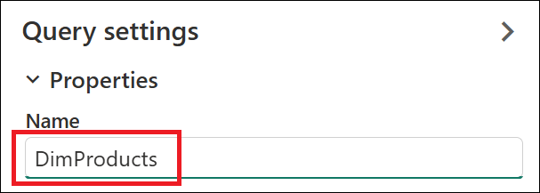

1. ⭐ [**Optional**] Select **Copilot** from the Home tab. In the Copilot pane, we'll apply a transformation to remove any unnecessary columns that are not needed for relationships in our final semantic model.

    Enter the following text into the Copilot text entry and then select the Submit button.

    ```text
    Keep the ProductKey column and remove all other columns containing ID, Key or Label in the name.
    ```

    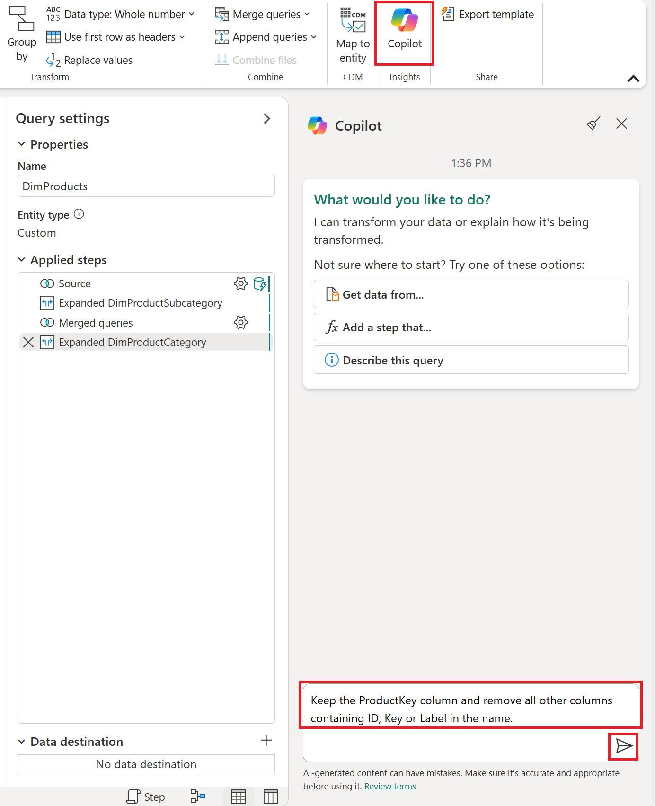

1. Copilot has now generated an expression and added it to our Applied Steps list. Always ensure the correct transformations are applied by using the data preview window or inspecting the formula bar logic. If there are any errors, you can select **Undo**, type the correction into the text box, or select the **X** next to the step in the Applied Steps list.

    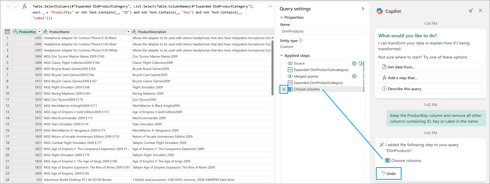

1. Ask Copilot for a description of your query and its steps for better understanding and clarity by using the following text prompt.

    ```text
    Describe what this query is doing
    ```

    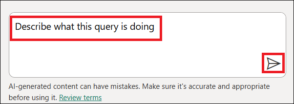

    **Important:** You can also ask Copilot to describe a single step instead of the full query.

1. Select the **[+ Add to query]** button to add the query and step-level descriptions directly to your query as documentation.

    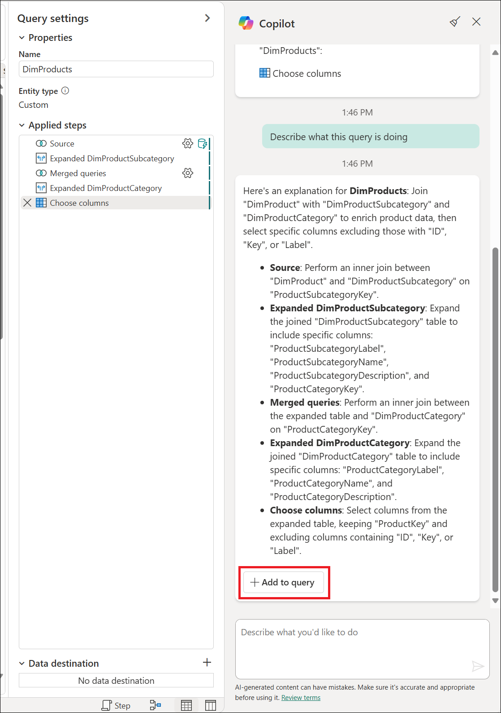

1. When you hover over the query or individual steps, you'll see the descriptions have been applied. By instantly describing your queries, you can ensure your work is clearly documented.

    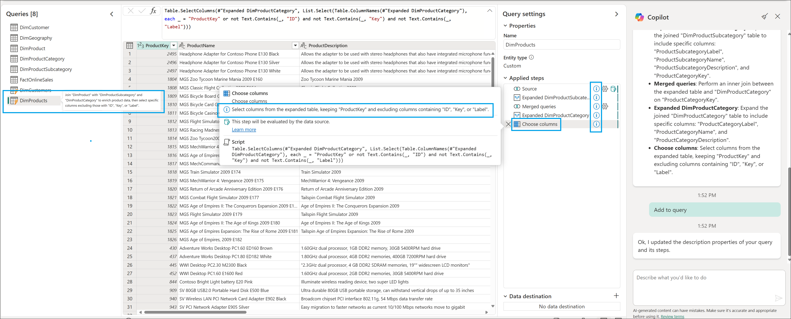

### Outputting data to the warehouse destination

1. Select the **FactOnlineSales** query and from the **Home** tab, select **Add data destination** and then choose the **Warehouse** option.

    

1. If a connection window asks you to authenticate, confirm your credentials. Otherwise, in the **Choose destination target** window, select **g_IADWarehouse** and then click **Next**.

    **Note:** You can also add to existing tables that have already been created or rename your tables.

    

1. In the **Choose destination settings** window, change the **Update method** to **Append**. This will add data to the destination while preserving existing rows, which is common for large fact tables where you're adding new data and previous record values do not change.

    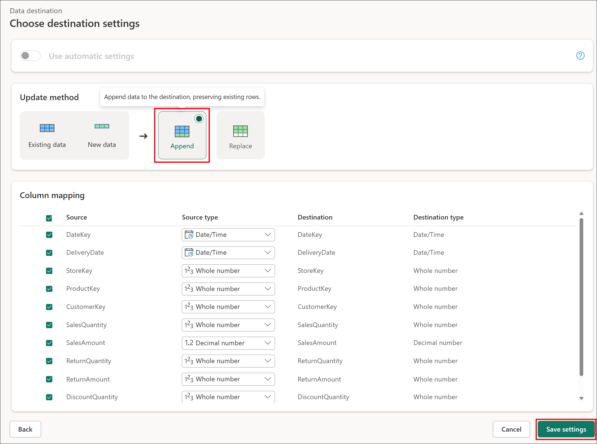

1. In the bottom right-hand corner, hover above the **Data destination** field to view the configuration values of your queries at a glance. You can also select the settings cog to modify these values if necessary.

    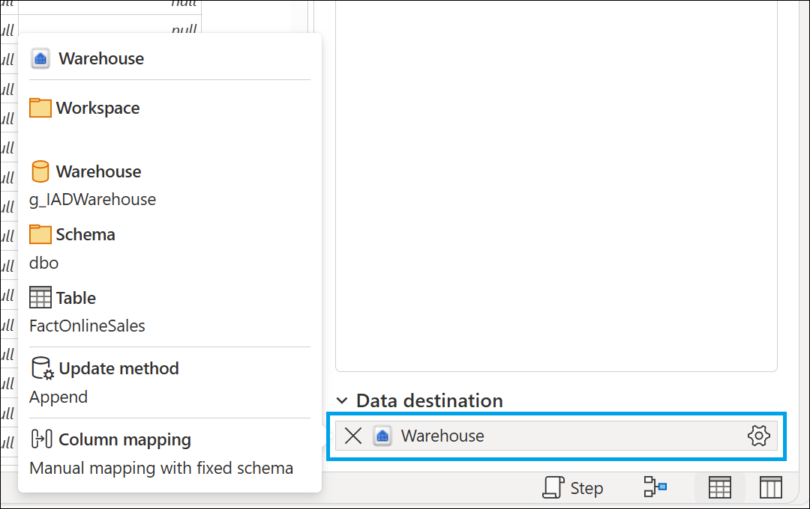

1. Select the **DimCustomers** query and from the **Home** tab, select **Add data destination** and then choose the **Warehouse** option.

    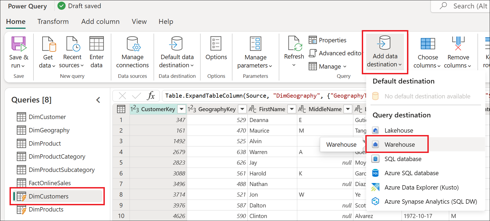

1. If a connection window asks you to authenticate, confirm your credentials. Otherwise, in the **Choose destination target** window, select **g_IADWarehouse** and then click **Next**.

    

1. In the **Choose destination settings** window, ensure the **Update method** is set to the default **Replace** and then click **Save settings**. This will delete data from the table and replace the values after each refresh.

    

1. Select the **DimProducts** query and from the **Home** tab, select **Add data destination** and then choose the **Warehouse** option.

    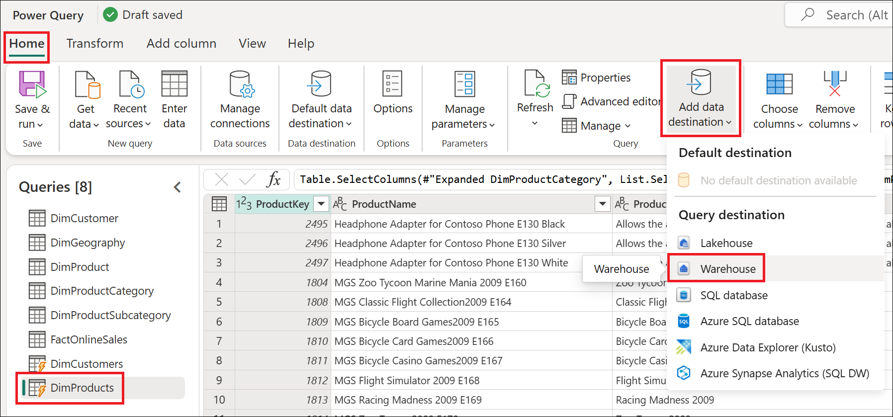

1. If a connection window asks you to authenticate, confirm your credentials. Otherwise, in the **Choose destination target** window, select **g_IADWarehouse** and then click **Next**.

    

1. In the **Choose destination settings** window, ensure the **Update method** is set to the default **Replace** and then click **Save settings**. This will delete data from the table and replace the values after each refresh.

    

### Group queries and save

1. Select the **DimCustomer**, **DimGeography**, **DimProduct**, **DimProductCategory** and **DimProductSubcategory** queries by holding the shift key, as they are all adjacent to each other. Right-click and select **Move group**, then select **New group**.

    

1. In the New group window, set the properties as needed below and select **OK**.

    | Name | Description |
    | :-- | :-- |
    | Data reference | Data used only as a source from the silver lakehouse |

    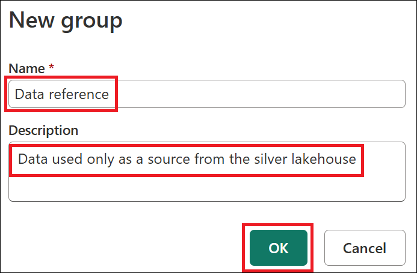

1. Select the **FactOnlineSales**, **DimCustomers** and **DimProducts** queries by holding the control key. Right-click and choose **Move group**, then select **New group**.

    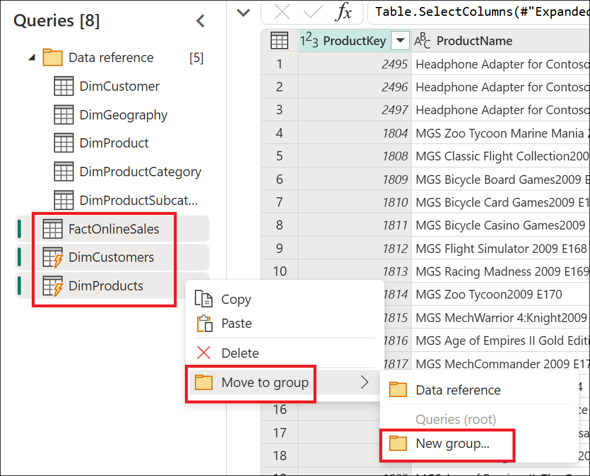

1. In the New group window, set the properties as needed below and select **OK**. This step helps in organizing your queries into logical groups, making it easier to manage and navigate your data.

    | Name | Description |
    | :-- | :-- |
    | Data load | Data loaded to the gold warehouse |

    

1. From the **Home** tab, click the chevron below the **Save & run** option, and then select **Save**.

    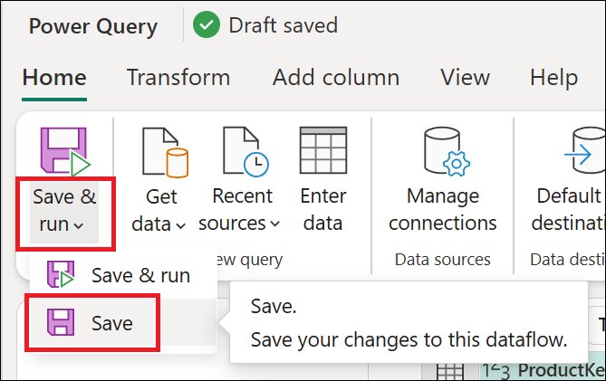

1. Hover over the dataflow on the left side-rail and select the **X** to close it.

    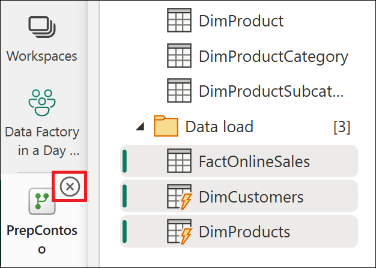

### Further transform task flow

1. If you don't automatically return to the workspace upon closing the dataflow, select the workspace name on the left side-rail.

    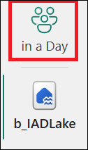

1. From the task flow, select the **Further transform** task and click on the paper clip icon to assign a previously created item.

    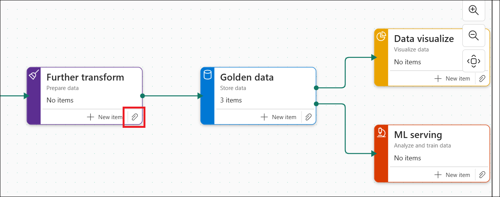

1. Select the **PrepContoso** item and then press **Select**.

    

1. From the task flow, select the **Further transform** task and click on the **New item** option. Within the Create an item pane display properties, change the toggle to the **All items** option.

    

1. From the list of available items, navigate to the Data Factory section and select the **Copy job** item.

    

### Copy data into the warehouse

1. In the New copy job window, set the copy job name to **CopyContoso** and then select **Create**.

    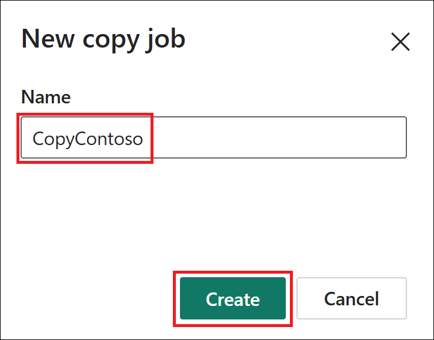

1. From the Copy job window, search for the data source starting with **s_IAD** in the search bar and then select **s_IADLake** from the OneLake catalog list.

    You can also use the OneLake tab at the top if you want to set additional criteria such as filters or item types.

    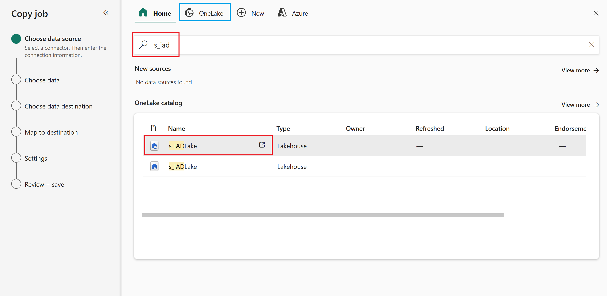

1. Now that you're on the **Choose data** step, select the following tables:

    | Table Name |
    | :-- |
    | DimDate |
    | DimEmployee |
    | DimStore |

    

1. The copy job also supports a limited set of transformations such as column mapping, setting schema names, and renaming tables. Expand the **DimStore** table and then deselect the **GeoLocation** and **Geometry** columns. Once done, select **Next** to continue.

    

1. Within the Choose data destination step, search for the data source starting with **g_IAD** in the search bar and then select **g_IADWarehouse** from the OneLake catalog list.

    

1. Within the Map to destination step, you can review the added tables and update the schema or table names. Once done reviewing, select **Next** to continue.

    

1. On the Settings step, review the Copy job mode options and then select Next to continue.

    

1. On the Review + save step, deselect the **Start data transfer immediately** option and then select **Save** to continue.

    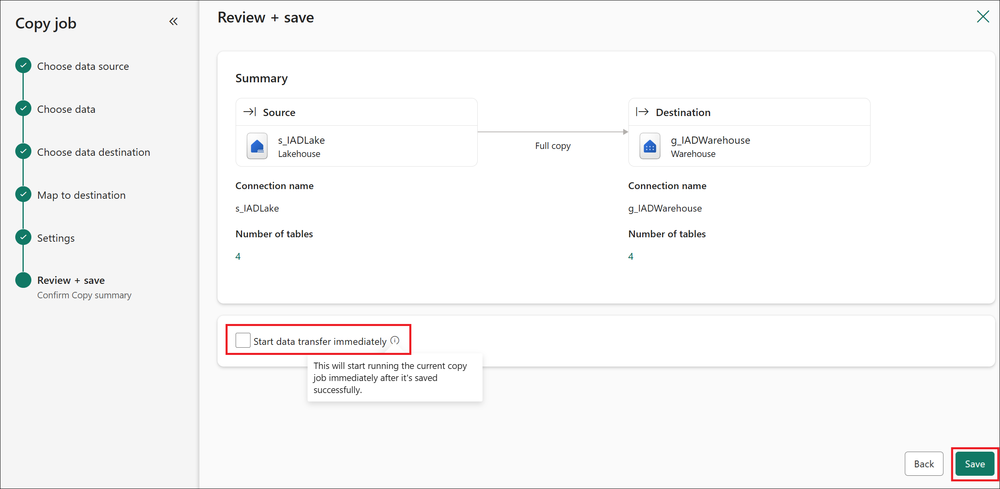

1. Now that you've reviewed the configuration, from the **Home** tab, select the **Run** option to begin copying data from the lakehouse into the warehouse.

    To configure the copy job items' name, description, refresh schedule, or other properties, you can select the settings icon (cog) to edit.

    

1. You can monitor the copy job in the **Results** tab at the bottom to confirm that it has successfully completed.

    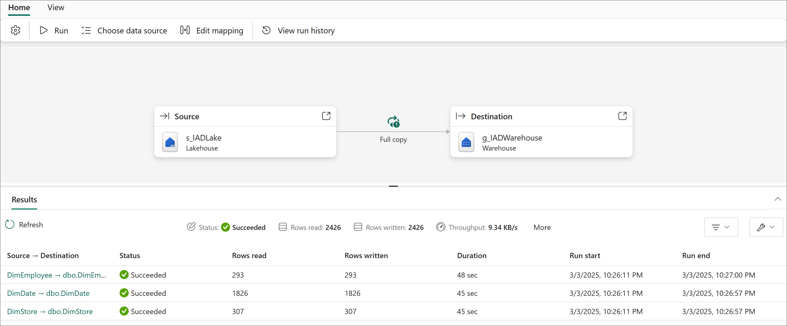

1. Hover over the copy job on the left side-rail and select the **X** to close it.

    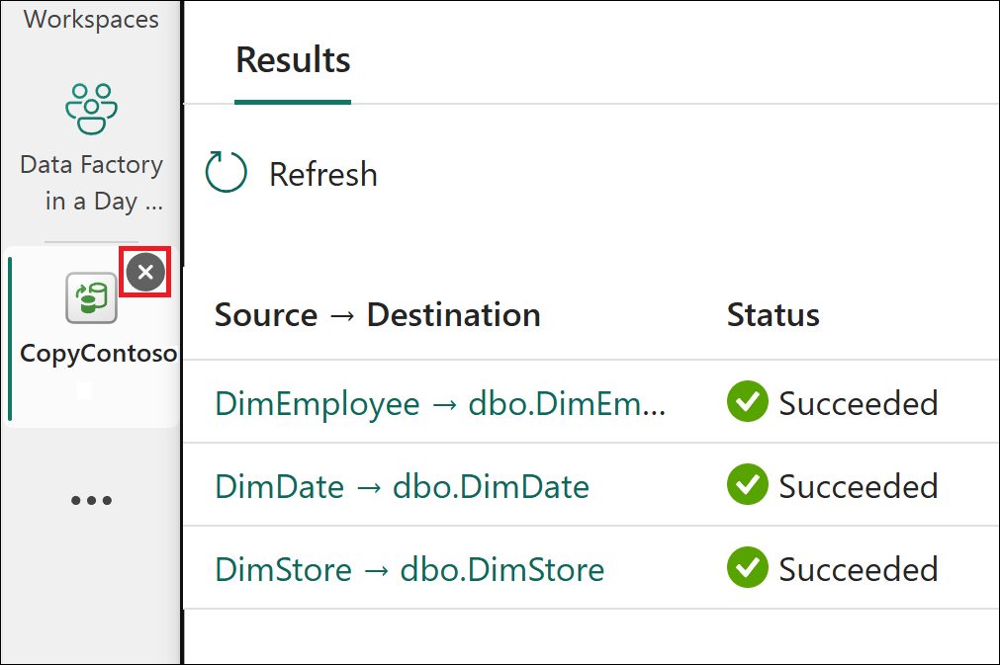

### End-to-end orchestration with pipelines

1. Within the workspace, select the **Initial process** task flow item and from the filtered list, select the **createContosoTables** pipeline.

    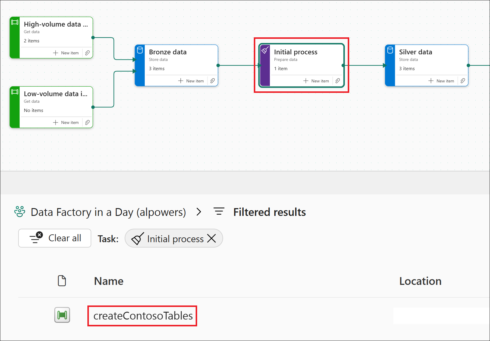

1. From the **Home** tab, add a new **Dataflow** activity to the pipeline.

    

1. Drag the **On success** conditional path between the **For each file** activity and the new **Dataflow1** activity. Next, go to the **Settings** section and within the Dataflow drop-down, select the **PrepContoso** dataflow.

    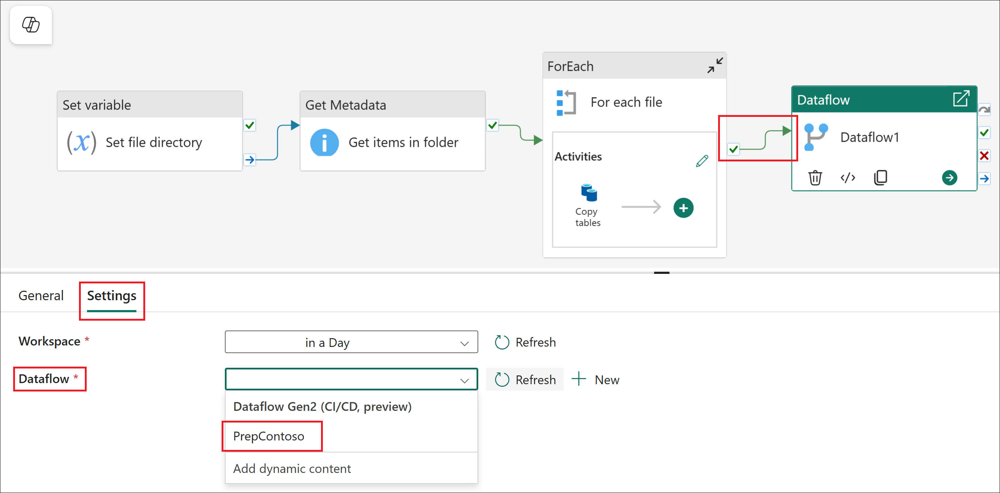

1. With the dataflow activity still selected, go to the **General** tab and update the activity name to **PrepContoso**. Once complete, select the **Save** icon.

    

1. On the left side-rail, select the **X** to close out of the **createContosoTables** pipeline.

    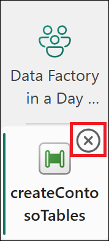

1. Within the workspace, select the **High-volume data ingest** task flow item and from the filtered list, select the **getContosoSample** pipeline.

    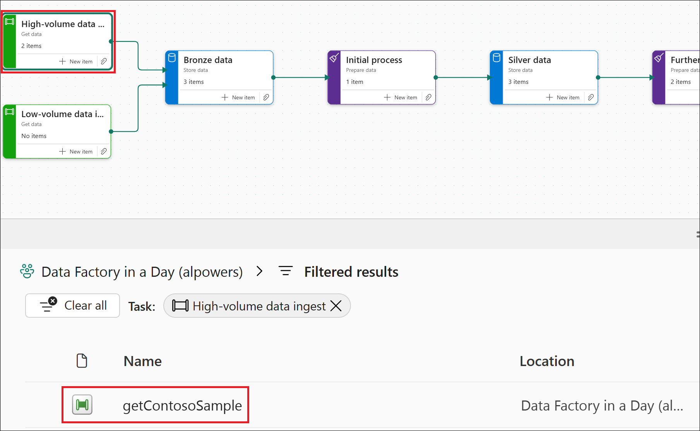

1. From the **Home** tab, add the **Invoke Pipeline (Preview)** activity.

    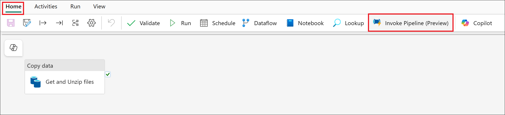

1. Create a conditional **On success** path between the **Get and Unzip files** activity and the **Invoke pipeline1** activity. From the activity settings **Pipeline** option, select the **createContosoTables** pipeline.

    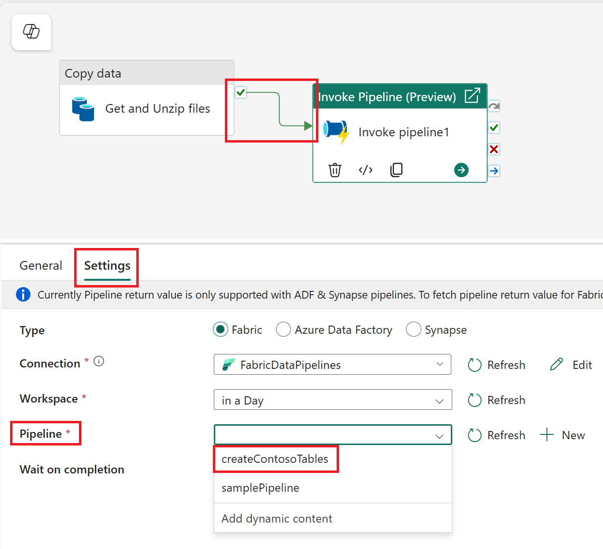

1. With the invoke pipeline activity still selected, go to the **General** tab and update the activity **Name** to **Invoke createContosoTables**. Once complete, select the **Save** icon and then **Run**.

    **Note:** You can set a schedule from this first pipeline, and it will call the subsequent pipelines and its dataflow upon successful completion or have the pipeline triggered by events like when new files are added to the lakehouse.

    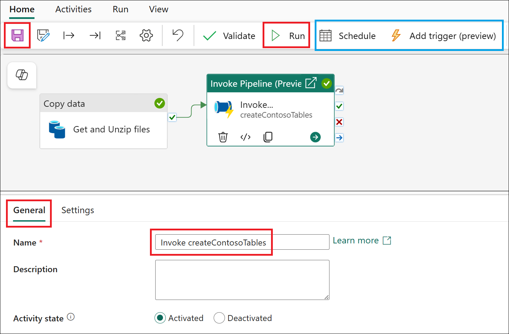

    **Important:** Designing modular pipelines makes development, testing, and maintenance easier. They are also portable, allowing components to be reused across different projects. This approach is particularly beneficial in large-scale data processing environments, where reusability and modularization are key to efficient data integration workflows.

1. From the Output pane monitor that the activities and **Succeedded** and once done close the pipeline by selecting the **X** on the left side-rail to return to the workspace.

    

# Next steps

In this lab, we covered a comprehensive range of topics essential for connecting to and transforming data with Dataflow Gen2. This included merging and shaping data tables, and writing it to a lakehouse data destination. We also explored the use of shortcuts to eliminate data duplication in projects. By creating shortcuts to data sources, we reduced the need for data duplication and unnecessary data movements, thereby saving storage space and improving the performance of our data workflows.

Overall, these skills are essential for effectively leveraging a low-code data prep interface. They enable you to streamline your data projects, optimize storage and retrieval, and ensure that your data is always ready for analysis.

- Return to the [Data Factory in a Day](./README.md) homepage