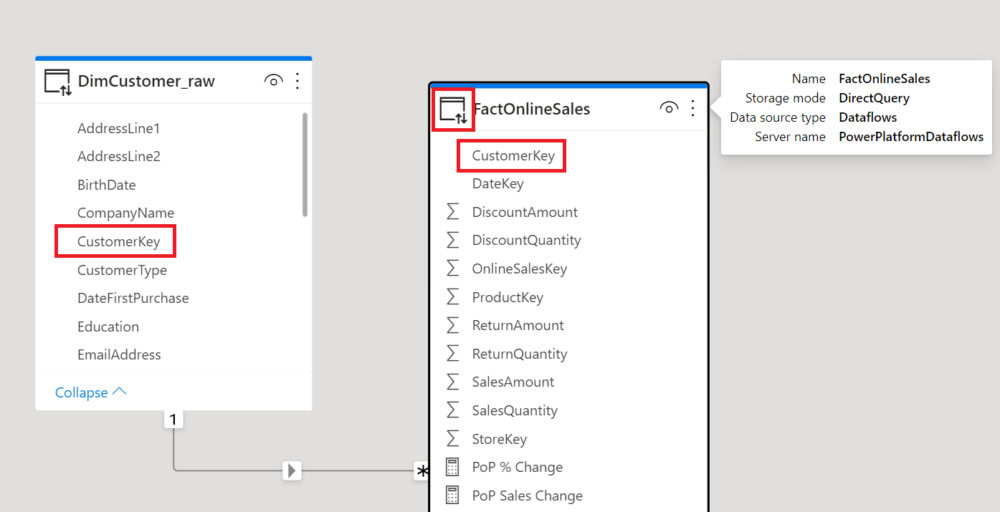
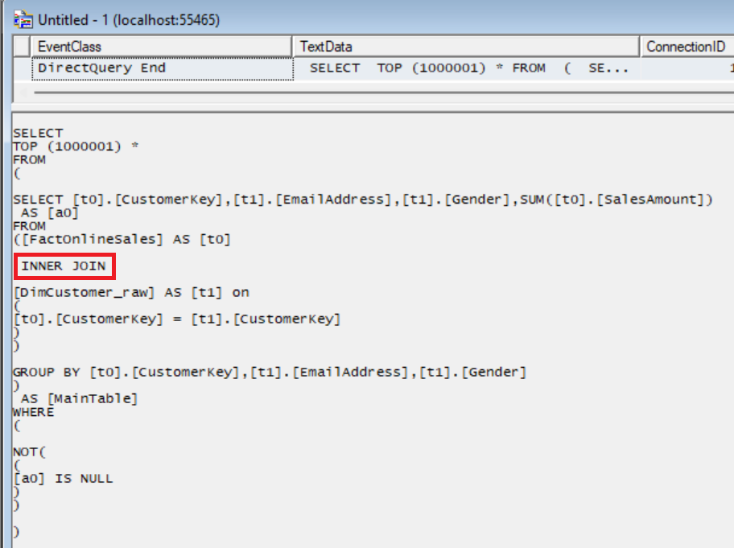
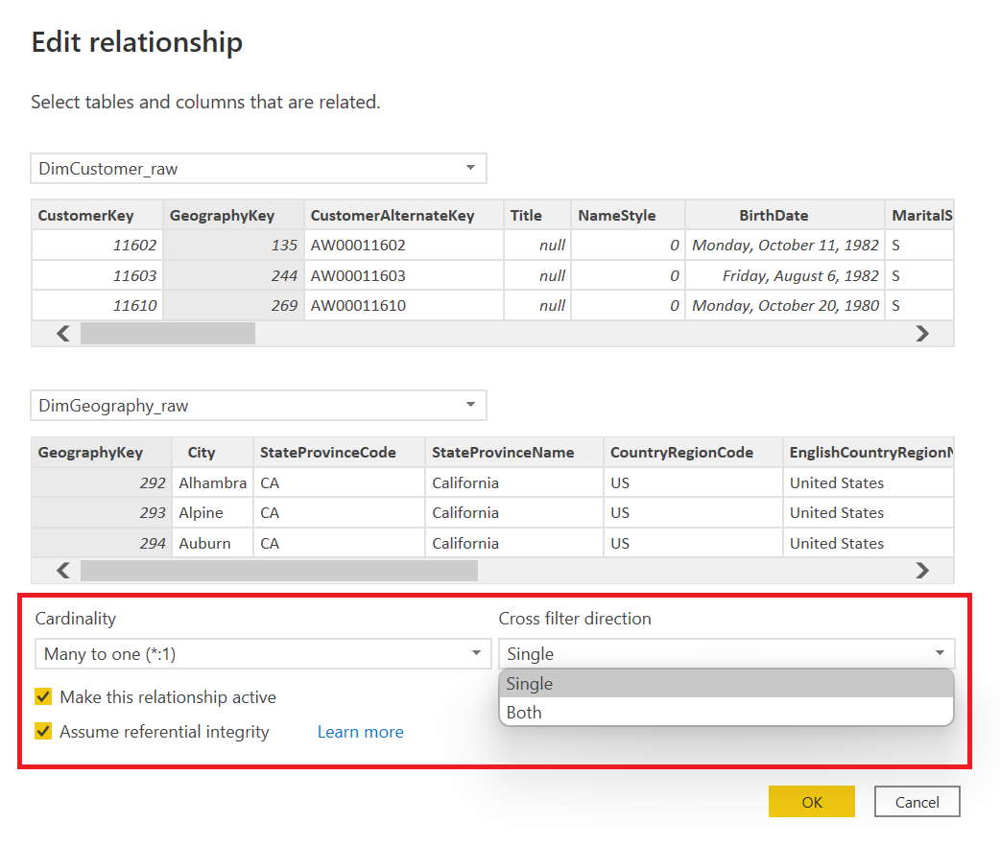
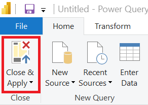
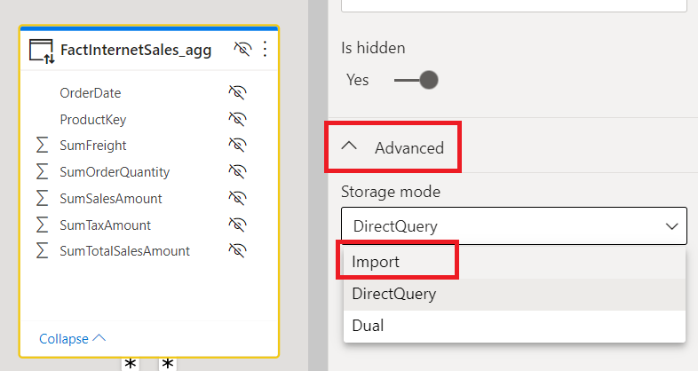
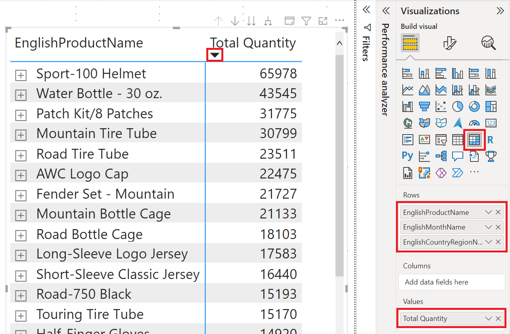

# Data Modeling

# Storage modes

[Learn more about storage modes](https://docs.microsoft.com/power-bi/transform-model/dataflows/dataflows-introduction-self-service)

---

## DirectQuery


[Learn more about DirectQuery model guidance](https://docs.microsoft.com/power-bi/guidance/directquery-model-guidance)

---

1. One of the first things we might notice is that on our left side-rail the **Data** view is now missing and in the bottom right corner of Power BI Desktop is the text **Storage Mode: DirectQuery**.

    

1. To confirm that our connection to our dataflow is indeed working, we'll now add the following columns below into a **Table** visual to view data on a report page.

    | Table | Column |
    |:----- | :------ |
    | DimCustomer | EmailAddress|
    | DimCustomer | Gender |

    

1. While the visual has rendered successfully, we want to confirm that the information is being sent to our source via a **Direct query**. To confirm we'll navigate to the **View** tab and then select **Performance analyzer**.

    

1. Once the **Performance analyzer** pane is visible, we'll now select **Start recording**.

    

1. With the **Performance analyzer** recording, we'll hover above the **Table** visual and select the **Analyze this visual** option to refresh a single visual. Once complete we'll select the expand/collapse box next to the **Table** visual to confirm that a **Direct query** value is now present. We can also now select the **Copy query** option and paste our query into a text editor of our choice.

    

1. From the copied query, we are able to view the **DAX Query** that was sent to the analysis services database engine.

    ```dax
    // DAX Query
    DEFINE
      VAR __DS0Core = 
        SUMMARIZE('DimCustomer', 'DimCustomer'[Gender], 'DimCustomer'[EmailAddress])
    
      VAR __DS0PrimaryWindowed = 
        TOPN(501, __DS0Core, 'DimCustomer'[Gender], 1, 'DimCustomer'[EmailAddress], 1)
    
    EVALUATE
      __DS0PrimaryWindowed
    
    ORDER BY
      'DimCustomer'[Gender], 'DimCustomer'[EmailAddress]
    ```
    [Learn more about DirectQuery guidance](https://docs.microsoft.com/en-us/power-bi/guidance/directquery-model-guidance)

---

# Optional - Event traces

---

One important item of note that was missing from our above query is our [Transact-SQL](https://docs.microsoft.com/learn/modules/introduction-to-transact-sql/) statement for the **Direct query** value. To trace this event we'll use an external tool titled [SQL Server Profiler](https://docs.microsoft.com/sql/tools/sql-server-profiler/sql-server-profiler) to view event traces. We can leverage the [external tools in Power BI Desktop](https://docs.microsoft.com/power-bi/transform-model/desktop-external-tools) integration to easily view the event traces against our underlying Analysis Services instance.

## Prerequisite - Register the SQL Server Profiler external tool

1. Download and install [SQL Server Management Studio](https://docs.microsoft.com/en-us/sql/ssms/download-sql-server-management-studio-ssms) or the [Azure Data Studio with the SQL Server Profiler extension](https://docs.microsoft.com/sql/azure-data-studio/extensions/sql-server-profiler-extension?view=sql-server-ver15).

1. Download the registered external tool [SQL Server Profiler External Tools](https://raw.githubusercontent.com/microsoft/pbiworkshops/main/Day%20After%20Dashboard%20in%20a%20Day/Source_Files/SQLProfiler.pbitool.json) (json) file. (Courtesy of Microsoft MVP [Steve Campbell](https://mvp.microsoft.com/PublicProfile/5004099))

1. After the above is downloaded add the local file (SQLProfiler.pbitool.json) to the below file path location. Once complete close and restart your Power BI Desktop application.

    ```
    C:\Program Files (x86)\Common Files\Microsoft Shared\Power BI Desktop\External Tools
    ```
[Learn more about external tools](https://docs.microsoft.com/power-bi/transform-model/desktop-external-tools)

## DirectQuery events

1. From the **Trace Properties** window select the **Events Selection** tab. Within the **Events** section, expand the **Query Processing** group and then select the **DirectQuery End** event. Once complete select the **Run** option in the bottom right to start tracing events.

    

1. We'll now return to the Power BI Desktop application and select the **Analyze this visual** option again to send a query to our source.

    

1. Returning to the **SQL Server Profiler** application, a **DirectQuery end** event is now displayed including the **Text data** of the SQL query generated by Power BI, the total time it took to return a result with the **Duration** and more.

    

    ```sql
    SELECT
        TOP (501) [t1].[EmailAddress],
        [t1].[Gender]
    FROM
        [DimCustomer] AS [t1]
    GROUP BY
        [t1].[EmailAddress],
        [t1].[Gender]
    ORDER BY
        [t1].[Gender] ASC,
        [t1].[EmailAddress] ASC
    ```

---

# Relationships

---

1. Navigate to the model view on the side-rail

    

1. To create a relationship between two of our tables, we'll drag-and-drop the following column values from the table listed below.
    1. If we hover above our table's headers we'll also get important details related to the **Storage mode**, **Data source type**, **Server name** and a visual indicator in the top left which provides indicates the **Storage mode** which in this example is **DirectQuery**.

    | Table | Column |
    |:----- | :------ |
    | DimCustomer | CustomerKey|
    | FactInternetSales | CustomerKey |

    

1. Returning to our report page, we'll complete the following steps.
    1. Add the **SalesAmount** column from the **FactInternetSales** table.
    1. Select the **Clear** option in the **Performance analyzer** pane to remove previous events.
    1. Select the **Analyze this visual** to test the performance of the added column.
    
    

1. **Optional:** Returning to the **SQL Server Profiler** application, we can locate the **DirectQuery end** event with the **Text data** display of the SQL query generated when using data across multiple tables. In this example a [**LEFT OUTER JOIN**](https://docs.microsoft.com/sql/relational-databases/performance/joins?view=sql-server-ver15#fundamentals) is used.

    

    ```sql
    SELECT
        TOP (1000001) *
    FROM (
        SELECT
            [t1].[EmailAddress],
            [t1].[Gender],
            SUM([t0].[SalesAmount]) AS [a0]
        FROM (
            [FactInternetSales] AS [t0]
            LEFT OUTER JOIN [DimCustomer] AS [t1]
            ON ([t0].[CustomerKey] = [t1].[CustomerKey])
        )
        GROUP BY
            [t1].[EmailAddress],
            [t1].[Gender]
    ) [MainTable]
    WHERE (NOT( ([a0] IS NULL)))
    ```

1. Since all of our sales include a customer key, we can improve our performance by changing the default join. We'll navigate now to the **Modeling** tab and select the **Manage relationships** option.

    

1. In the **Manage relationships** dialog window select the **Edit...** option.
    1. You can also double click to enter the relationship view.

    

1. In the **Edit relationship** dialog window select the checkbox next to the [**Assume referential integrity**](https://docs.microsoft.com/power-bi/connect-data/desktop-assume-referential-integrity) property, then **OK** and close the **Manage relationships** window to return to the report page.

    

1. Returning to our report page, we'll complete the following steps.
    1. Select the **Clear** option in the **Performance analyzer** pane to remove previous events.
    1. Select the **Analyze this visual** to test the performance of the added column.

    

1. **Optional:** Returning to the **SQL Server Profiler** application, we can locate the **DirectQuery end** event with the **Text data** display of the SQL query generated using an [**INNER JOIN**](https://docs.microsoft.com/sql/relational-databases/performance/joins?view=sql-server-ver15#fundamentals).

    

    ```sql
    SELECT
        TOP (1000001) *
    FROM (
        SELECT
            [t1].[EmailAddress],
            [t1].[Gender],
            SUM([t0].[SalesAmount]) AS [a0]
        FROM (
            [FactInternetSales] AS [t0]
            INNER JOIN [DimCustomer] AS [t1]
            ON ([t0].[CustomerKey] = [t1].[CustomerKey])
        )
        GROUP BY
            [t1].[EmailAddress],
            [t1].[Gender]
    ) [MainTable]
    WHERE (NOT( ([a0] IS NULL)))
    ```

1. Returning to the **Model** view we'll create the below relationships by dragging and dropping our columns and setting the necessary configurations within the **Edit relationship** window.
    1. We can also create relationships between tables by selecting the **Manage relationships** button from the **Home** tab and then **New...** option in the bottom left.

    | Active | From: Table (Column) | Column | Cardinality | Assume referential integrity | Cross filter direction | 
    | :----- |:----- | :------ | :----- | :----- | :----- |
    | ☑ | DimCustomer (GeographyKey) | DimGeography (GeographyKey) | Many to one (*:1) | ☑ | Single | 
    | ☑ | DimEmployee (SalesTerritoryKey) | DimSalesTerritory (SalesTerritoryKey) | Many to one (*:1) | ☑ | Both |
    | ☑ | DimProduct_raw (ProductSubcategoryKey) | DimProductSubcategory_raw (ProductSubcategoryKey) | Many to one (*:1) |  | Single |
    | ☑ | DimProductSubcategory_raw (ProductCategoryKey) | DimProductCategory_raw (ProductCategoryKey) | Many to one (*:1) | ☑ | Single |
    | ☑ | FactInternetSales (CustomerKey) | DimCustomer (CustomerKey) | Many to one (*:1) | ☑ | Single |
    | ☑ | FactInternetSales (ProductKey) | DimProduct_raw (ProductKey) | Many to one (*:1) | ☑ | Single |
    | ☑ | FactInternetSales (SalesTerritoryKey) | DimSalesTerritory (SalesTerritoryKey) | Many to one (*:1) | ☑ | Single |
    | ☑ | FactInternetSales (OrderDate) | DimDate (DateKey) | Many to one (*:1) | ☑ | Single |
    |  | FactInternetSales (ShipDate) | DimDate (DateKey) | Many to one (*:1) | ☑ | Single |

    

---
# User-defined aggregations

Aggregations in Power BI can improve query performance over very large DirectQuery datasets. By using aggregations, you cache data at the aggregated level in-memory. Aggregations in Power BI can be manually configured in the data model, as described in this article, or for Premium subscriptions, automatically by enabling the [Automatic aggregations](https://docs.microsoft.com/power-bi/admin/aggregations-auto) feature in dataset Settings.

[To learn more about user-defined aggregations](https://docs.microsoft.com/power-bi/transform-model/aggregations-advanced)

---

1. Within the **Home** tab select the **Transform data** button to return to the Power Query editor.

    
 
1. Within the Queries pane, right click the **FactInternetSales** table and select the **Duplicate** option to create a new query.

    

1. Select the **Tranform** tab and then the **Group By** button.

    

1. Within the **Group By** window, we'll first select the **Advanced** tab and create our groupings using the **Add grouping** button for the **ProductKey** and **OrderDate** columns. And for our aggregates - new column names, operations and columns use the **Add aggregation** button and the below configuration. Once complete select **OK**.

    | New column name | Operator | Column |
    |:----- | :------ | :------ |
    | SumOrderQuantity | Sum | OrderQuantity |
    | SumSalesAmount | Sum | SalesAmount |
    | SumTaxAmount | Sum | TaxAmount |
    | SumFreight | Sum | Freight |
    | SumTotalSalesAmount | Sum | TotalSalesAmount |

    

1. Before we proceed we must ensure that our data types are consistent between our two tables. If we toggle between the **FactInternetSales** and **FactInternetSales (2)** table we'll notice that the **OrderQuantity** and **SumOrderQuantity** are not of the same data type.

    

1. Navigate to the **FactInternetSales (2)** table and within the formula bar for the **Grouped Rows** step, update the date type for the **SumOrderQuantity** from **type nullable number** to **type nullable Int64.Type**.
    1. Complete formula below.

    ```powerquery-m
    = Table.Group(#"Entity Name", {"ProductKey", "OrderDate"}, {{"SumOrderQuantity", each List.Sum([OrderQuantity]), type nullable Int64.Type}, {"SumSalesAmount", each List.Sum([SalesAmount]), type nullable number}, {"SumTaxAmount", each List.Sum([TaxAmount]), type nullable number}, {"SumFreight", each List.Sum([Freight]), type nullable number}, {"SumTotalSalesAmount", each List.Sum([TotalSalesAmount]), type nullable number}})
    ```

    

1. Within the queries pane right click the **FactInternetSales (2)** and select **Rename** to update the table name to **FactInternetSales_agg**.

    

1. Now that we're ready to return to our modeling view navigate to the **Home** tab and select the **Close & Apply** option.

    

1. Navigate to the **Model** view on the side-rail of Power BI Desktop, where we'll now create a new relationship between the **FactInternetSales_agg** and our existing tables in our model.

    

1. By dragging and dropping the columns or navigating to the **Manage relationships** menu, complete the below relationships.

    | Active | From: Table (Column) | Column | Cardinality | Assume referential integrity | Cross filter direction | 
    | :----- |:----- | :------ | :----- | :----- | :----- |
    | ☑ | FactInternetSales_agg (ProductKey) | DimProduct (ProductKey) | Many to one (*:1) | ☑ | Single | 
    | ☑ | FactInternetSales_agg (OrderDate) | DimDate (DateKey) | Many to one (*:1) | ☑ | Single |

    

1. Right click the **FactInternetSales_agg** table and select the **Manage aggregations** option.

    

1. Within the **Manage aggregations** window complete the following configurations and select **Apply all** once complete.
    1. GroupBy not required, but may be recommended.

    |AGGREGATION COLUMN | SUMMARIZATION | DETAIL TABLE | DETAIL COLUMN |
    | :-- | :-- | :-- | :-- |
    | OrderDate | GroupBy | FactInternetSales | OrderDate |
    | ProductKey | GroupBy | FactInternetSales | ProductKey |
    | SumFreight | Sum | FactInternetSales | Freight |
    | SumOrderQuantity | Sum | FactInternetSales | OrderQuantity |
    | SumSalesAmount | Sum | FactInternetSales | SalesAmount |
    | SumTaxAmount | Sum | FactInternetSales | TaxAmount |
    | SumTotalSalesAmount | Sum | FactInternetSales | TotalSalesAmount |
    
    
    

1. With the **FactInternetSales_agg** selected, navigate to the **Properties** pane of the Modeling view and expand the **Advanced** section to change the **Storage mode** of our table to **Import**.

    

1. A **Storage mode** window is now displayed providing us with the detail that changing to **Import** is an irreversible operation and has provided us with the suggestion to set the tables with relationships to our aggregate table to **Dual** mode. We'll follow Power BI's suggestion wit the **Set affected tables to dual** option checked and select the **OK** button to proceed.

    

1. The **Refresh** window is now displayed as our tables with **Import** and **Dual** storage are cached in to our model.

    

1. Returning to our report page, we'll complete the following steps.
    1. Add a **Matrix** visual to our report page.
    1. Add the **EnglishProductName**, **EnglishMonthName** and **EnglishCountryRegionName** fields to **Rows**.
    1. Add the **Total Quantity** measure to **Values**.
    1. Select the **Total Quantity** column header in the matrix visual to sort descending to ascending.

    

1. Expanding our **Performance analyzer** pane once again, we can select the **Clear** option to remove any previous results and then select the **Analyze this visual** on our table, once complete expand the **Matrix** tables results, where only a **DAX query** is now present meaning that our aggregate table is being used.

    

1. If we expand one of the **EnglishProductName** values in our **Matrix** the **Performance analyer** includes the **Drilled down/up** action where the second level of our hierarchy is also leveraging the speed and performance of the aggregate table.

    

1. If we expand one of the **EnglishMonthName** values in our **Matrix** the **Performance analyer** includes a second **Drilled down/up** action where a **Direct query** value is now present meaning that our agg table did not have the necessary information to complete the query and it's now had to utilize the **FactInternetSales** table.

    

# Schema design

# Snowflake Schema

## Star Schema
1. 

1. Snowflake schema
1. Star Schema

1. Add a **Table** visualization using the following columns:

| Table | Column |
|:----- | :------ |
| Customer | EmailAddress|
| Internet Sales | Sales Amount |