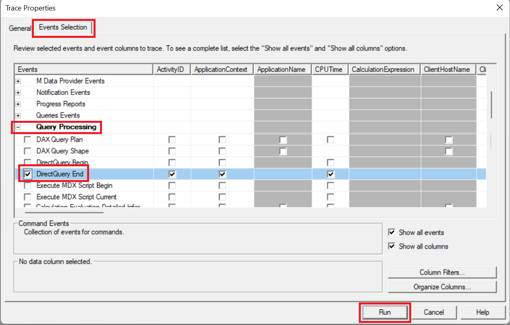
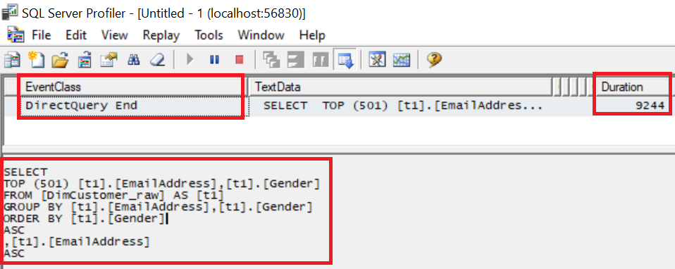

# Data Modeling

# Storage modes

[Learn more about storage modes](https://docs.microsoft.com/power-bi/transform-model/dataflows/dataflows-introduction-self-service)

## DirectQuery

1. Some of the first things we might notice is that in the bottom right corner of Power BI Desktop is the text **Storage Mode: DirectQuery** and on the left side-rail our **Data** view is now missing.

    

1. To confirm that our connection to our dataflow is indeed working, we'll now add the following columns below into a **Table** visual to view data on a report page.

    | Table | Column |
    |:----- | :------ |
    | DimCustomer | EmailAddress|
    | DimCustomer | Gender |

    

1. While the visual has rendered successfully, we want to confirm that the information is being sent to our source via a **Direct query**. To confirm we'll navigate to the **View** tab and then select **Performance analyzer**.

    

1. Once the **Performance analyzer** pane is visible, we'll now select **Start recording**.
    
    

1. With the **Performance analyzer** recording, we'll hover above the **Table** visual and select the **Analyze this visual** option to refresh a single visual. Once complete we'll select the expand/collapse box next to the **Table** visual to confirm that a **Direct query** value is now present. We can also now select the **Copy query** option and paste our query into a text editor of our choice.

    

1. From the copied query, we are able to view the **DAX Query** that was sent to the analysis services database instance.

    ```dax
    // DAX Query
    DEFINE
      VAR __DS0Core = 
        SUMMARIZE('DimCustomer', 'DimCustomer'[Gender], 'DimCustomer'[EmailAddress])
    
      VAR __DS0PrimaryWindowed = 
        TOPN(501, __DS0Core, 'DimCustomer'[Gender], 1, 'DimCustomer'[EmailAddress], 1)
    
    EVALUATE
      __DS0PrimaryWindowed
    
    ORDER BY
      'DimCustomer'[Gender], 'DimCustomer'[EmailAddress]
    ```
    [Learn more about DirectQuery guidance](https://docs.microsoft.com/en-us/power-bi/guidance/directquery-model-guidance)

---

# Optional - Event traces

---

One important item of note that was missing from our above query is the [Transact-SQL](https://docs.microsoft.com/learn/modules/introduction-to-transact-sql/) statement for the **Direct query** value. To trace this event we'll use an external tool titled [SQL Server Profiler](https://docs.microsoft.com/sql/tools/sql-server-profiler/sql-server-profiler) to view event traces. We can leverage [external tools in Power BI Desktop](https://docs.microsoft.com/power-bi/transform-model/desktop-external-tools) to view the event traces against our underlying Analysis Services instance.


## Prerequisite - Register the SQL Server Profiler external tool

1. Download and install [SQL Server Management Studio](https://docs.microsoft.com/en-us/sql/ssms/download-sql-server-management-studio-ssms) or the [Azure Data Studio with the SQL Server Profiler extension](https://docs.microsoft.com/sql/azure-data-studio/extensions/sql-server-profiler-extension?view=sql-server-ver15).

1. Download the registered external tool [SQL Server Profiler External Tools](https://raw.githubusercontent.com/microsoft/pbiworkshops/main/Day%20After%20Dashboard%20in%20a%20Day/Source_Files/SQLProfiler.pbitool.json) (json) file. (Courtesy of Microsoft MVP [Steve Campbell](https://mvp.microsoft.com/PublicProfile/5004099))

1. After the above is downloaded add the local file (SQLProfiler.pbitool.json) to the below file path location. Once complete close and restart your Power BI Desktop application.

    ```
    C:\Program Files (x86)\Common Files\Microsoft Shared\Power BI Desktop\External Tools
    ```
[Learn more about external tools](https://docs.microsoft.com/power-bi/transform-model/desktop-external-tools)

## DirectQuery events

1. From the **Trace Properties** window select the **Events Selection** tab. Within the **Events** section, expand the **Query Processing** group and then select the **DirectQuery End** event. Once complete select the **Run** option in the bottom right to start tracing events.

    

1. We'll now return to the Power BI Desktop application and select the **Analyze this visual** option again to send a query to our source.

    

1. Returning to the **SQL Server Profiler** application, a **DirectQuery end** event is now displayed including the **Text data** of the SQL query generated by Power BI, the total time it took to return a result with the **Duration** and more.

    

    ```sql
    SELECT
        TOP (501) [t1].[EmailAddress],
        [t1].[Gender]
    FROM
        [DimCustomer] AS [t1]
    GROUP BY
        [t1].[EmailAddress],
        [t1].[Gender]
    ORDER BY
        [t1].[Gender] ASC,
        [t1].[EmailAddress] ASC
    ```

---

## Relationships


---

1. Navigate to the model view on the side-rail

    

1. To create a relationship between two of our tables, we'll drag-and-drop the following column values from the table listed below.
    1. If we hover above our table's headers we'll also get important details related to the **Storage mode**, **Data source type**, **Server name** and a visual indicator in the top left which provides indicates the **Storage mode** which in this example is **DirectQuery**.

    | Table | Column |
    |:----- | :------ |
    | DimCustomer | CustomerKey|
    | FactInternetSales | CustomerKey |

    

1. Returning to our report page view, we'll complete the following steps.
    1. Add the **SalesAmount** column from the **FactInternetSales** table.
    1. Select the **Clear** option in the **Performance analyzer** pane to remove previous events.
    1. Select the **Analyze this visual** to test the performance of the added column.
    
    

1. Create relationships
1. Referential integrity
1. Snowflake schema
1. Star Schema

1. Add a **Table** visualization using the following columns:

| Table | Column |
|:----- | :------ |
| Customer | EmailAddress|
| Internet Sales | Sales Amount |