# Data Modeling

# Storage modes

In Microsoft Power BI Desktop, you can specify the storage mode for each table individually in your model. Setting the storage mode provides many advantages, including the following: query performance, large datasets, data refresh requirements and near-real time requirements.

[Learn more about storage modes](https://docs.microsoft.com/power-bi/transform-model/desktop-storage-mode)

---

## DirectQuery

For DirectQuery, when using Get Data in Power BI Desktop to connect to a data source, no data is imported into Power BI. Instead, upon building a visual within Power BI Desktop, queries are sent to the underlying data source to retrieve the necessary data. The time taken to refresh the visual depends on the performance of the underlying data source.

[Learn more about DirectQuery model guidance](https://docs.microsoft.com/power-bi/guidance/directquery-model-guidance)

---

1. One of the first things we might notice is that on our left side-rail the **Data** view is now missing and in the bottom right corner of Power BI Desktop is the text **Storage Mode: DirectQuery**.

    

1. To confirm that our connection to our dataflow is indeed working, we'll now add the following columns below into a **Table** visual to view data on a report page.

    | Table | Column |
    |:----- | :------ |
    | DimCustomer_raw | EmailAddress|
    | DimCustomer_raw | Gender |

    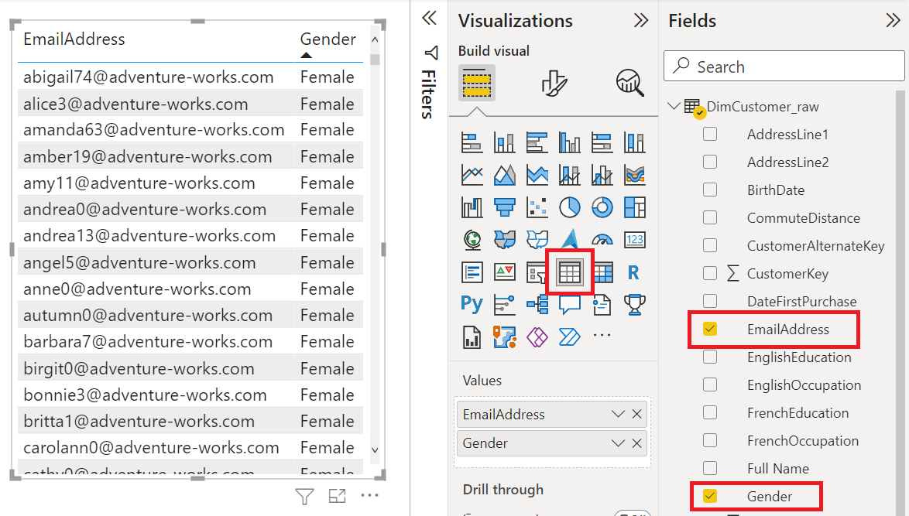

1. While the visual has rendered successfully, we want to confirm that the information is being sent to our source via a **Direct query**. To confirm we'll navigate to the **View** tab and then select **Performance analyzer**.

    

1. Once the **Performance analyzer** pane is visible, we'll now select **Start recording**.

    

1. With the **Performance analyzer** recording, we'll hover above the **Table** visual and select the **Analyze this visual** option to refresh a single visual. Once complete we'll select the expand/collapse box next to the **Table** visual to confirm that a **Direct query** value is now present. We can also now select the **Copy query** option and paste our query into a text editor of our choice.

    

1. From the copied query, we are able to view the **DAX Query** that was sent to the analysis services database engine.

    ```dax
    // DAX Query
    DEFINE
      VAR __DS0Core = 
        SUMMARIZE('DimCustomer_raw', 'DimCustomer_raw'[Gender], 'DimCustomer_raw'[EmailAddress])
    
      VAR __DS0PrimaryWindowed = 
        TOPN(501, __DS0Core, 'DimCustomer_raw'[Gender], 1, 'DimCustomer_raw'[EmailAddress], 1)
    
    EVALUATE
      __DS0PrimaryWindowed
    
    ORDER BY
      'DimCustomer_raw'[Gender], 'DimCustomer_raw'[EmailAddress]
    ```
---

# Optional - Event traces


One important item of note that was missing from our above query is our [Transact-SQL](https://docs.microsoft.com/learn/modules/introduction-to-transact-sql/) statement for the **Direct query** value. To trace this event we'll use an external tool titled [SQL Server Profiler](https://docs.microsoft.com/sql/tools/sql-server-profiler/sql-server-profiler) to view event traces. We can leverage the [external tools in Power BI Desktop](https://docs.microsoft.com/power-bi/transform-model/desktop-external-tools) integration to easily view the event traces against our underlying Analysis Services instance.

## Prerequisite - Register the SQL Server Profiler external tool

1. Download and install [SQL Server Management Studio](https://docs.microsoft.com/en-us/sql/ssms/download-sql-server-management-studio-ssms) or the [Azure Data Studio with the SQL Server Profiler extension](https://docs.microsoft.com/sql/azure-data-studio/extensions/sql-server-profiler-extension?view=sql-server-ver15).

1. Download the registered external tool [SQL Server Profiler External Tools](https://raw.githubusercontent.com/microsoft/pbiworkshops/main/Day%20After%20Dashboard%20in%20a%20Day/Source_Files/SQLProfiler.pbitool.json) (json) file. (Courtesy of Microsoft MVP [Steve Campbell](https://mvp.microsoft.com/PublicProfile/5004099))

1. After the above is downloaded add the local file (SQLProfiler.pbitool.json) to the below file path location. Once complete close and restart your Power BI Desktop application.

    ```
    C:\Program Files (x86)\Common Files\Microsoft Shared\Power BI Desktop\External Tools
    ```
[Learn more about external tools](https://docs.microsoft.com/power-bi/transform-model/desktop-external-tools)

## DirectQuery events

1. From the **Trace Properties** window select the **Events Selection** tab. Within the **Events** section, expand the **Query Processing** group and then select the **DirectQuery End** event. Once complete select the **Run** option in the bottom right to start tracing events.

    

1. We'll now return to the Power BI Desktop application and select the **Analyze this visual** option again to send a query to our source.

    

1. Returning to the **SQL Server Profiler** application, a **DirectQuery end** event is now displayed including the **Text data** of the SQL query generated by Power BI, the total time it took to return a result with the **Duration** and more.

    

    ```sql
    SELECT
        TOP (501) [t1].[EmailAddress],
        [t1].[Gender]
    FROM
        [DimCustomer_raw] AS [t1]
    GROUP BY
        [t1].[EmailAddress],
        [t1].[Gender]
    ORDER BY
        [t1].[Gender] ASC,
        [t1].[EmailAddress] ASC
    ```

---

# Relationships

When using multiple tables, chances are you'll do some analysis using data from all those tables. Relationships between those tables are necessary to accurately calculate results and display the correct information in your reports.

[Learn more about relationships](https://docs.microsoft.com/power-bi/transform-model/desktop-create-and-manage-relationships)

---

1. Navigate to the model view on the side-rail

    

1. To create a relationship between two of our tables, we'll drag-and-drop the following column values from the table listed below.
    1. If we hover above our table's headers we'll also get important details related to the **Storage mode**, **Data source type**, **Server name** and a visual indicator in the top left which provides indicates the **Storage mode** which in this example is **DirectQuery**.

    | Table | Column |
    |:----- | :------ |
    | DimCustomer_raw | CustomerKey|
    | FactInternetSales | CustomerKey |

    

1. Returning to our report page, we'll complete the following steps.
    1. Add the **SalesAmount** column from the **FactInternetSales** table.
    1. Select the **Clear** option in the **Performance analyzer** pane to remove previous events.
    1. Select the **Analyze this visual** to test the performance of the added column.
    
    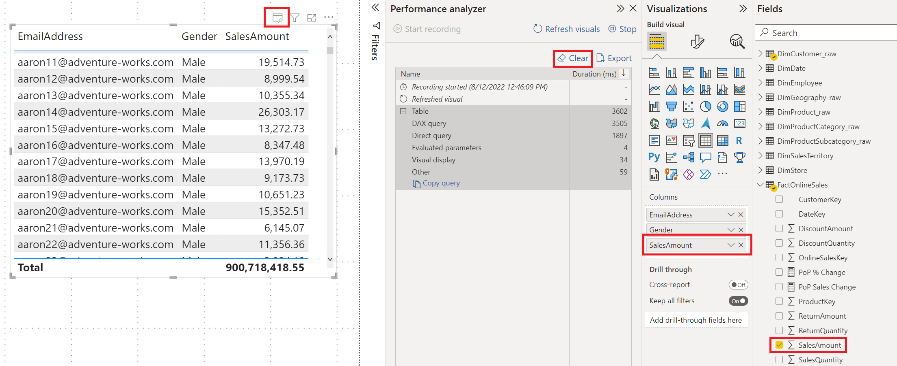

1. **Optional:** Returning to the **SQL Server Profiler** application, we can locate the **DirectQuery end** event with the **Text data** display of the SQL query generated when using data across multiple tables. In this example a [**LEFT OUTER JOIN**](https://docs.microsoft.com/sql/relational-databases/performance/joins?view=sql-server-ver15#fundamentals) is used.

    

    ```sql
    SELECT
        TOP (1000001) *
    FROM (
        SELECT
            [t1].[EmailAddress],
            [t1].[Gender],
            SUM([t0].[SalesAmount]) AS [a0]
        FROM (
            [FactInternetSales] AS [t0]
            LEFT OUTER JOIN [DimCustomer_raw] AS [t1]
            ON ([t0].[CustomerKey] = [t1].[CustomerKey])
        )
        GROUP BY
            [t1].[EmailAddress],
            [t1].[Gender]
    ) [MainTable]
    WHERE (NOT( ([a0] IS NULL)))
    ```

1. Since all of our sales include a customer key, we can improve our performance by changing the default join. We'll navigate now to the **Modeling** tab and select the **Manage relationships** option.

    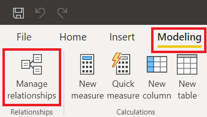

1. In the **Manage relationships** dialog window select the **Edit...** option.
    1. You can also double click to enter the relationship view.

    

1. In the **Edit relationship** dialog window select the checkbox next to the [**Assume referential integrity**](https://docs.microsoft.com/power-bi/connect-data/desktop-assume-referential-integrity) property, then **OK** and close the **Manage relationships** window to return to the report page.

    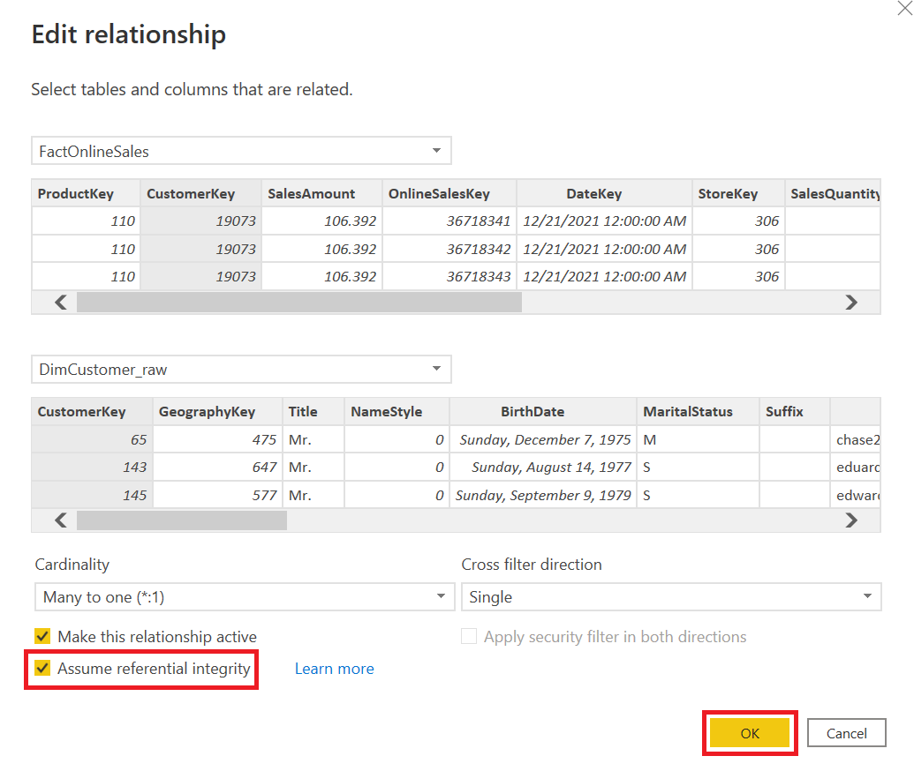

1. Returning to our report page, we'll complete the following steps.
    1. Select the **Clear** option in the **Performance analyzer** pane to remove previous events.
    1. Select the **Analyze this visual** to test the performance of the added column.

    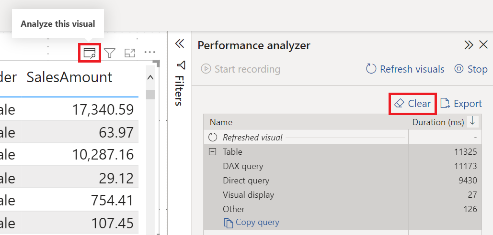

1. **Optional:** Returning to the **SQL Server Profiler** application, we can locate the **DirectQuery end** event with the **Text data** display of the SQL query generated using an [**INNER JOIN**](https://docs.microsoft.com/sql/relational-databases/performance/joins?view=sql-server-ver15#fundamentals).

    

    ```sql
    SELECT
        TOP (1000001) *
    FROM (
        SELECT
            [t1].[EmailAddress],
            [t1].[Gender],
            SUM([t0].[SalesAmount]) AS [a0]
        FROM (
            [FactInternetSales] AS [t0]
            INNER JOIN [DimCustomer_raw] AS [t1]
            ON ([t0].[CustomerKey] = [t1].[CustomerKey])
        )
        GROUP BY
            [t1].[EmailAddress],
            [t1].[Gender]
    ) [MainTable]
    WHERE (NOT( ([a0] IS NULL)))
    ```

1. Returning to the **Model** view we'll create the below relationships by dragging and dropping our columns and setting the necessary configurations within the **Edit relationship** window.
    1. We can also create relationships between tables by selecting the **Manage relationships** button from the **Home** tab and then **New...** option in the bottom left.

    | Active | From: Table (Column) | Column | Cardinality | Assume referential integrity | Cross filter direction | 
    | :----- |:----- | :------ | :----- | :----- | :----- |
    | ☑ | DimCustomer_raw (GeographyKey) | DimGeography_raw (GeographyKey) | Many to one (*:1) | ☑ | Single | 
    | ☑ | DimEmployee (SalesTerritoryKey) | DimSalesTerritory (SalesTerritoryKey) | Many to one (*:1) | ☑ | Both |
    | ☑ | DimProduct_raw (ProductSubcategoryKey) | DimProductSubcategory_raw (ProductSubcategoryKey) | Many to one (*:1) |  | Single |
    | ☑ | DimProductSubcategory_raw (ProductCategoryKey) | DimProductCategory_raw (ProductCategoryKey) | Many to one (*:1) | ☑ | Single |
    | ☑ | FactInternetSales (CustomerKey) | DimCustomer_raw (CustomerKey) | Many to one (*:1) | ☑ | Single |
    | ☑ | FactInternetSales (ProductKey) | DimProduct_raw (ProductKey) | Many to one (*:1) | ☑ | Single |
    | ☑ | FactInternetSales (SalesTerritoryKey) | DimSalesTerritory (SalesTerritoryKey) | Many to one (*:1) | ☑ | Single |
    | ☑ | FactInternetSales (OrderDate) | DimDate (DateKey) | Many to one (*:1) | ☑ | Single |
    |  | FactInternetSales (ShipDate) | DimDate (DateKey) | Many to one (*:1) | ☑ | Single |

    

---
# User-defined aggregations

Aggregations in Power BI can improve query performance over very large DirectQuery datasets. By using aggregations, you cache data at the aggregated level in-memory. Aggregations in Power BI can be manually configured in the data model, as described in this article, or for Premium subscriptions, automatically by enabling the [Automatic aggregations](https://docs.microsoft.com/power-bi/admin/aggregations-auto) feature in dataset Settings.

[To learn more about user-defined aggregations](https://docs.microsoft.com/power-bi/transform-model/aggregations-advanced)

---

1. Within the **Home** tab select the **Transform data** button to return to the Power Query editor.

    
 
1. Within the Queries pane, right click the **FactInternetSales** table and select the **Duplicate** option to create a new query.

    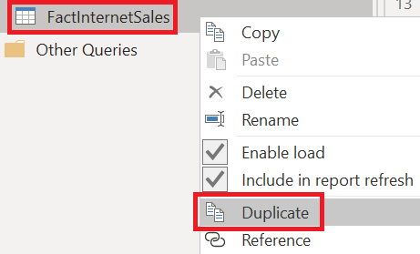

1. Select the **Tranform** tab and then the **Group By** button.

    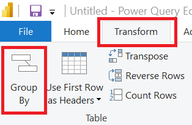

1. Within the **Group By** window, we'll first select the **Advanced** tab and create our groupings using the **Add grouping** button for the **ProductKey** and **OrderDate** columns. And for our aggregates - new column names, operations and columns use the **Add aggregation** button and the below configuration. Once complete select **OK**.

    | New column name | Operator | Column |
    |:----- | :------ | :------ |
    | SumOrderQuantity | Sum | OrderQuantity |
    | SumSalesAmount | Sum | SalesAmount |
    | SumTaxAmount | Sum | TaxAmount |
    | SumFreight | Sum | Freight |
    | SumTotalSalesAmount | Sum | TotalSalesAmount |

    

1. Before we proceed we must ensure that our data types are consistent between our two tables. If we toggle between the **FactInternetSales** and **FactInternetSales (2)** table we'll notice that the **OrderQuantity** and **SumOrderQuantity** are not of the same data type.

    

1. Navigate to the **FactInternetSales (2)** table and within the formula bar for the **Grouped Rows** step, update the date type for the **SumOrderQuantity** from **type nullable number** to **type nullable Int64.Type**.
    1. Complete formula below.

    ```powerquery-m
    = Table.Group(#"Entity Name", {"ProductKey", "OrderDate"}, {{"SumOrderQuantity", each List.Sum([OrderQuantity]), type nullable Int64.Type}, {"SumSalesAmount", each List.Sum([SalesAmount]), type nullable number}, {"SumTaxAmount", each List.Sum([TaxAmount]), type nullable number}, {"SumFreight", each List.Sum([Freight]), type nullable number}, {"SumTotalSalesAmount", each List.Sum([TotalSalesAmount]), type nullable number}})
    ```

    

1. Within the queries pane right click the **FactInternetSales (2)** and select **Rename** to update the table name to **FactInternetSales_agg**.

    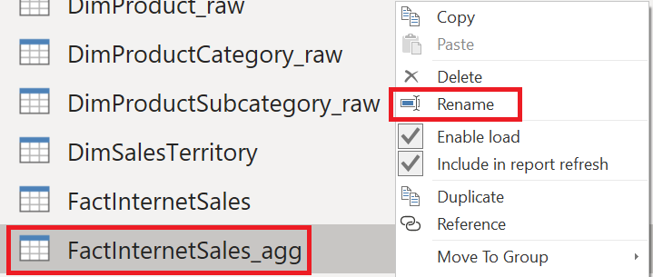

---
### Incremental Refresh
---

1. From the **Home** tab of the **Power Query Editor** select the **Manage Parameters** and then the **New Parameter** option.

    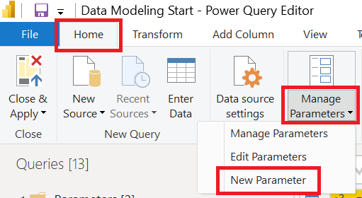

1. From the **Manage Parameters** window, select the **New** button and create the below two values.
    1. **Important Note**: these are case sensitive, reserved keywords and must match exactly for incremenetal refresh to properly work.

    | Name | Type | Current Value |
    |:----- | :------ | :------ |
    | RangeStart | Date/Time | 1/1/2011 |
    | RangeEnd | Date/Time | 6/30/2021 |

    

1. From the **FactInternetSales_agg** table, select the **OrderDate** column's drop down in the top right corner, the **Number Filters** option and then the **Between** value.

    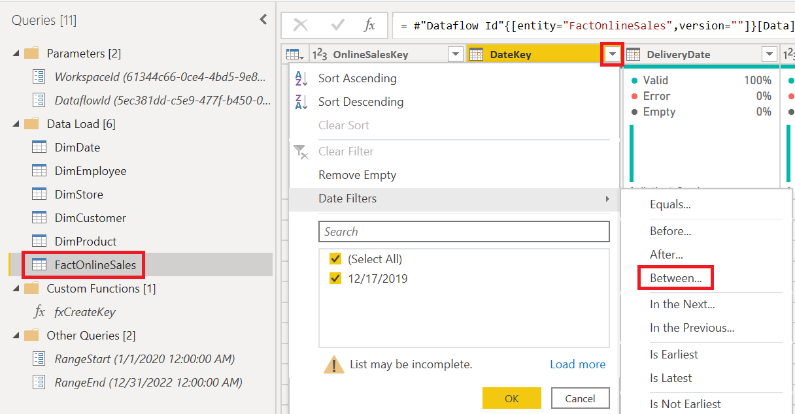

1. Within the **Filter Rows** menu, set the following values below.

    Keep rows where 'OrderDate'
    | Keep Rows | |
    |:- | :- |
    | is greater than or equal to | 20110101 |
    | is less than | 20210701 |

    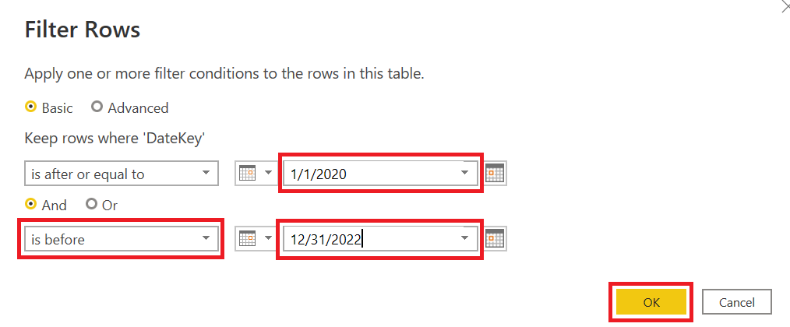

1. In the **Power Query Editor** formula bar update the current integer values to utilize the **RangeStart** and **RangeEnd** parameters. These will need to be updated using the **fxCreateKey** function.

    1. Completed formula below.
    ```powerquery-m
    = Table.SelectRows(#"Grouped Rows", each [OrderDate] >= fxCreateKey(RangeStart) and [OrderDate] < fxCreateKey(RangeEnd))
    ```

    

1. Now that we're ready to return to our modeling view navigate to the **Home** tab and select the **Close & Apply** option.

    

1. Navigate to the **Model** view on the side-rail of Power BI Desktop, where we'll now setup our incremental refresh policy and create a new relationship between the **FactInternetSales_agg** and our existing tables in our model.

    

1. Righ click the **FactInternetSales_agg** and select **Incremental refresh**.

    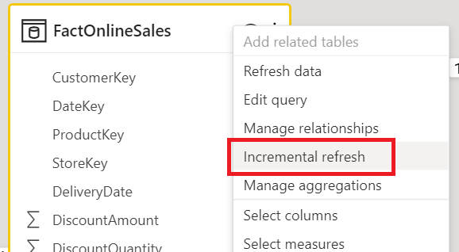

1. From the **Incremental refresh and real-time data** menu, set the following configurations below and select **Apply** once complete.
    1. ☑️Incrementally refresh this table
    1. Archive data starting **3 Years**
    1. Incrementally refresh data starting **1 Days**

    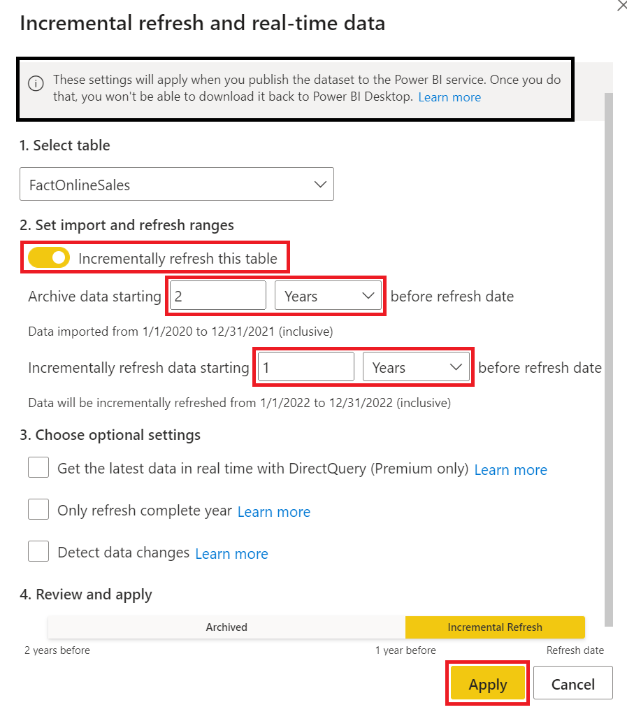

1. We'll now create relationships by dragging and dropping the columns or navigating to the **Manage relationships** menu, complete the below relationships.

    | Active | From: Table (Column) | Column | Cardinality | Assume referential integrity | Cross filter direction | 
    | :----- |:----- | :------ | :----- | :----- | :----- |
    | ☑ | FactInternetSales_agg (ProductKey) | DimProduct_raw (ProductKey) | Many to one (*:1) | ☑ | Single | 
    | ☑ | FactInternetSales_agg (OrderDate) | DimDate (DateKey) | Many to one (*:1) | ☑ | Single |

    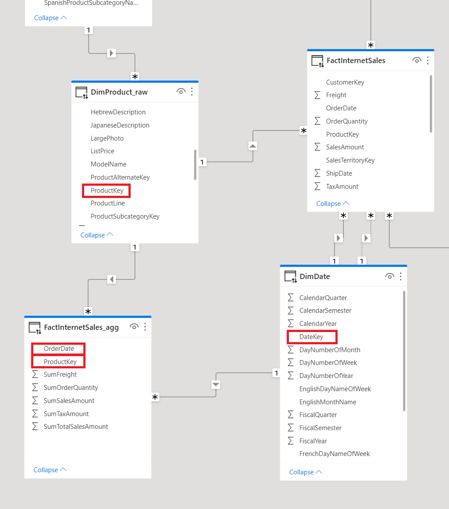

1. Right click the **FactInternetSales_agg** table and select the **Manage aggregations** option.

    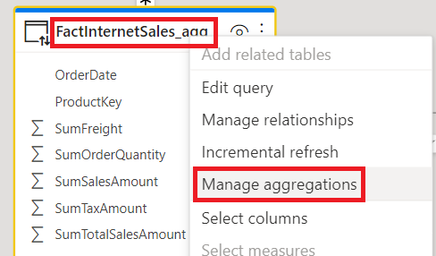

1. Within the **Manage aggregations** window complete the following configurations and select **Apply all** once complete.
    1. If relationships exist the **GroupBy** fields are not required.

    |AGGREGATION COLUMN | SUMMARIZATION | DETAIL TABLE | DETAIL COLUMN |
    | :-- | :-- | :-- | :-- |
    | OrderDate | GroupBy | FactInternetSales | OrderDate |
    | ProductKey | GroupBy | FactInternetSales | ProductKey |
    | SumFreight | Sum | FactInternetSales | Freight |
    | SumOrderQuantity | Sum | FactInternetSales | OrderQuantity |
    | SumSalesAmount | Sum | FactInternetSales | SalesAmount |
    | SumTaxAmount | Sum | FactInternetSales | TaxAmount |
    | SumTotalSalesAmount | Sum | FactInternetSales | TotalSalesAmount |
    
    
    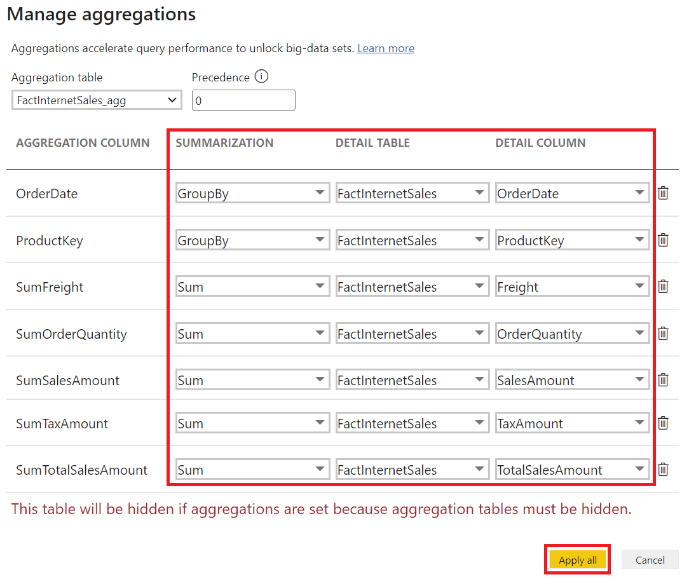

1. With the **FactInternetSales_agg** selected, navigate to the **Properties** pane of the Modeling view and expand the **Advanced** section to change the **Storage mode** of our table to **Import**.

    

1. A **Storage mode** window is now displayed providing us with the detail that changing to **Import** is an irreversible operation and has provided us with the suggestion to set the tables with relationships to our aggregate table to **Dual** mode. We'll follow Power BI's suggestion wit the **Set affected tables to dual** option checked and select the **OK** button to proceed.

    

1. The **Refresh** window is now displayed as our tables with **Import** and **Dual** storage are cached in to our model.

    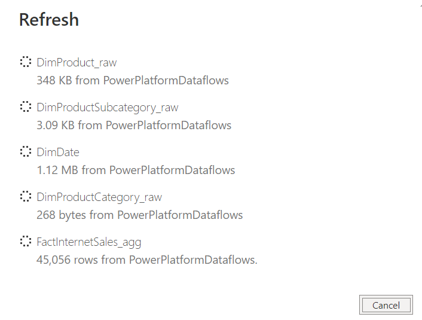

1. Returning to our report page, we'll complete the following steps.
    1. Add a **Matrix** visual to our report page.
    1. Add the **EnglishProductName**, **EnglishMonthName** and **EnglishCountryRegionName** fields to **Rows**.
    1. Add the **Total Quantity** measure to **Values**.
    1. Select the **Total Quantity** column header in the matrix visual to sort descending to ascending.

    

1. Expanding our **Performance analyzer** pane once again, we can select the **Clear** option to remove any previous results and then select the **Analyze this visual** on our table, once complete expand the **Matrix** tables results, where only a **DAX query** is now present meaning that our aggregate table is being used.

    

1. If we expand one of the **EnglishProductName** values in our **Matrix** the **Performance analyer** includes the **Drilled down/up** action where the second level of our hierarchy is also leveraging the speed and performance of the aggregate table.

    

1. If we expand one of the **EnglishMonthName** values in our **Matrix** the **Performance analyer** includes a second **Drilled down/up** action where a **Direct query** value is now present meaning that our agg table did not have the necessary information to complete the query and it's now had to utilize the **FactInternetSales** table which is in the **DirectQuery** storage mode.

    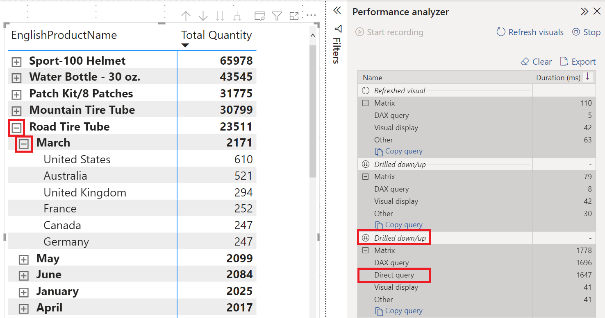

---

## Optional - Aggregation event traces

---

1. If we return to the **SQL Server Profiler** window, we can select the **Pause** button to pause the existing trace and then select **File** > **Properties**.

    

1. From the **Trace Properties** window select the **Events Selection** tab. Within the **Events** section, expand the **Query Processing** group and then select the **Aggregate Table Rewrite Query** event. Once complete select the **Run** option in the bottom right to start tracing events.
    1. If you have an abbreviated list of events, select the **Show all events** option.

    

1. Return to Power BI Desktop and select the **Analyze this visual** option to send a query to the analysis services engine.

    

1. Within the **SQL Server Profiler** three events are displayed with the **Aggregate Table Rewrite Query**, when reading thru each's **TextData** we'll notice the **matchingResult** field and in one example the **attemptFailed** was returned, indicating that the aggregate table was unable to be used, whereas the other values include a **matchFound** value.

    

    ```json
    {
      "table": "FactInternetSales",
      "matchingResult": "attemptFailed",
      "failureReasons": [
        {
          "alternateSource": "FactInternetSales_agg",
          "reason": "no column mapping",
          "column": "DimGeography_raw[EnglishCountryRegionName]"
        }
      ],
      "dataRequest": [
        {
          "aggregation": "Sum",
          "table": "FactInternetSales",
          "column": "OrderQuantity"
        },
        {
          "table": "DimDate",
          "column": "EnglishMonthName"
        },
        {
          "table": "DimGeography_raw",
          "column": "EnglishCountryRegionName"
        },
        {
          "table": "DimProduct_raw",
          "column": "EnglishProductName"
        }
      ]
    }
    ```

---
## Optional - DAX Studio
---

DAX Studio is a tool to write, execute, and analyze DAX queries in Power BI Designer, Power Pivot for Excel, and Analysis Services Tabular. It includes an Object Browser, query editing and execution, formula and measure editing, syntax highlighting and formatting, integrated event tracing and query execution breakdowns.

**Important note:** DAX Studio will automatically install the external tools json file.

[Learn more about DAX Studio](https://daxstudio.org)

---

1. Within Power BI Desktop, select the **External Tools** tab and the **DAX Studio** button.

    

1. Navigate to the **Advanced** tab and select the **View Metrics** option. Within the VertiPaq Analyzer Metrics that is now displayed and the **Tables** tab, select the **% DB** column to sort the tables in descending order by the largest percentage.

    

1. Expand the **DimProduct_raw** table, to view the columns and their metrics.
    1. One of the first items of note is that the **ProductAlternateKey** is the largest column in our table with nearly 6% of the table size and nearly 2% of the database size.
    1. The second item is that our **ProductKey**'s cardinality matches the row count value of **606** for our entire table and is nearly 4% of the table size and nearly 2% of the database size.
    
    

1. The above **ProductAlternateKey** and **ProductKey** may be good candidates for removal from our dataset if they are not currently being used in any of our table relationships. Select the **Relationships** tab and by selecting the Table name review the different relationship values to confirm if the above columns can be removed.
    1.  **Important note:** While the size of the relationships in this lab is small, this field may be worth investigating if you have a model with a large number of snowflake dimensions that can be joined.

    

---
# Dimensional modeling
---

Importance of the Star Schema.

---

1. Navigate to the model view on the side-rail

    

1. In our modeling view, we notice a [snowflaked dimension](https://www.kimballgroup.com/data-warehouse-business-intelligence-resources/kimball-techniques/dimensional-modeling-techniques/snowflake-dimension/) from the **DimProductCategory_raw** > **DimProductSubcategory_raw** > **DimProductCategory_raw** tables and the **DimGeography_raw** > **DimCustomer_raw** tables. This type of modeling approaching may affect our datasets query performance, as these dimensions contain the same information - to better optimize our dataset we'll flatten the three tables into a single dimension table for use.

    

1. Within them model view we'll select the vertical ellipses ( ⋮ ) at the top right of the **DimProduct_raw** table and then the **Edit query** option to return to the Power Query Editor.
    1. Important you can also right click the table header as opposed to selecting the ellipses.

    

1. In the Power Query Editor - **Queries** pane select the following tables and in the formula bar we'll update the following entity value to our merged table from the previous [**Data Preparation**](https://github.com/microsoft/pbiworkshops/blob/main/Day%20After%20Dashboard%20in%20a%20Day/DataPreparation.md#joining-tables-using-the-diagram-view) section.
    
    1. Select the **DimProduct_raw** table and complete the before and after: 

    | Before | After |
    | :-- | :-- |
    |= #"Dataflow Id"{[entity="**DimProduct_raw**",version=""]}[Data] | = #"Dataflow Id"{[entity="**DimProduct**",version=""]}[Data] |

    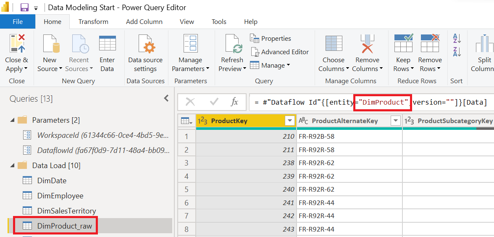

    1. Select the **DimCustomer_raw** table and the **Navigation** step from the **Query Settings** pane and complete the before and after:

    | Before | After |
    | :-- | :-- |
    |= #"Dataflow Id"{[entity="**DimCustomer_raw**",version=""]}[Data] | = #"Dataflow Id"{[entity="**DimCustomer**",version=""]}[Data] |

    

1. Within the **Queries** pane right click the following tables and select the **Rename** option to change the table names to the following:

    | Before | After |
    | :-- | :-- |
    | DimProduct_raw | DimProduct  |
    | DimCustomer_raw | DimCustomer  |

    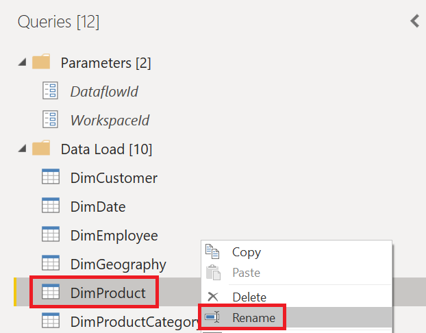

1. Within the **Queries** pane while holding shift click the **DimGeography_raw**, **DimProductCategory_raw**, and **DimProductSubcategory_raw** tables and select the **Delete** option to remove the tables from our dataset.

    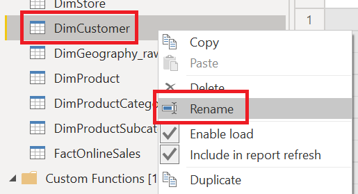

1. Now that we're ready to return to our modeling view navigate to the **Home** tab and select the **Close & Apply** option.

    

# Next steps
We hope this portion of the lab has shown how various storage modes and modeling options can offer a flexible and optimized experience to build enterprise scalable solutions using Power BI Desktop.

- Continue to the [Data Visualization](./DataVisualization.md) lab
- Return to the [Day After Dashboard in a Day](./README.md) homepage