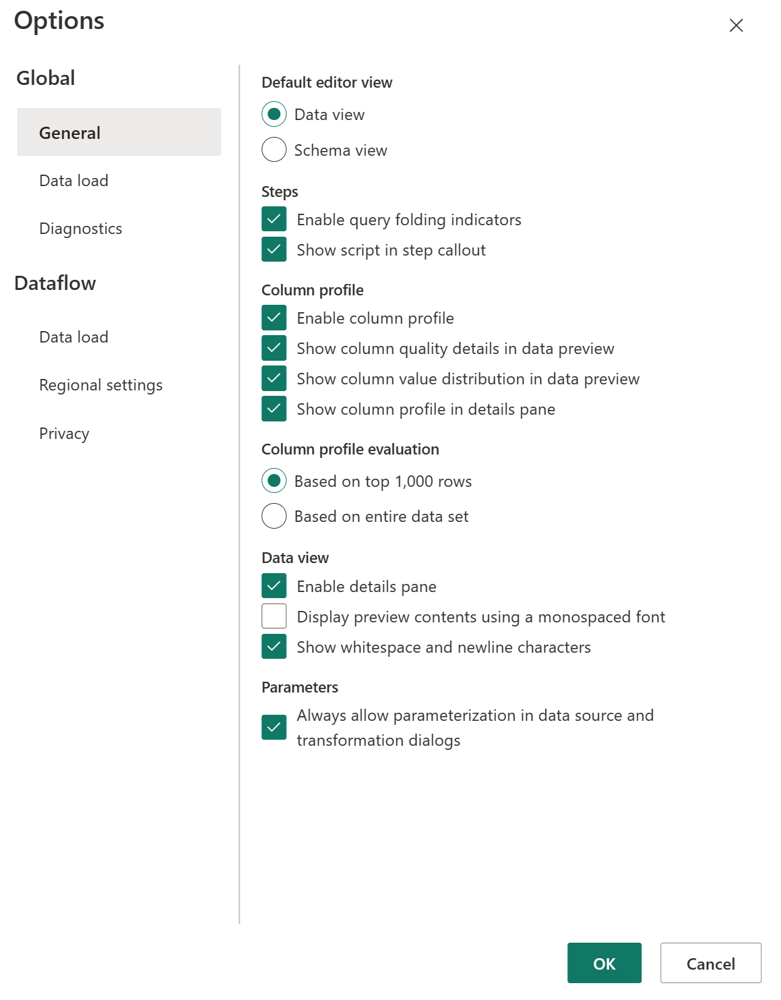
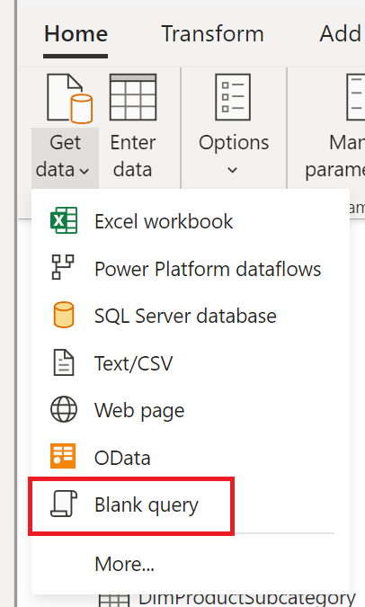
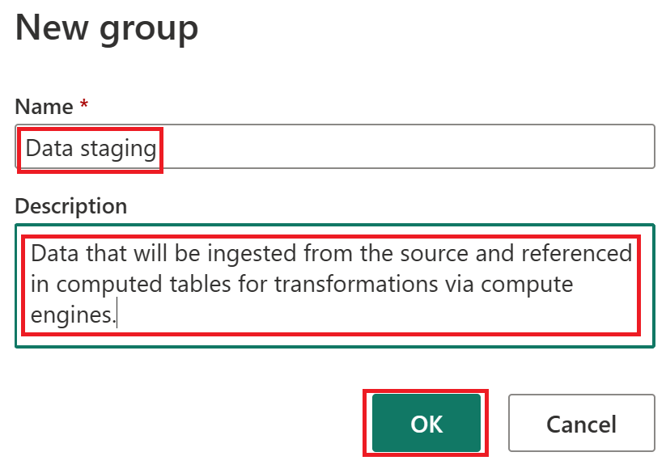
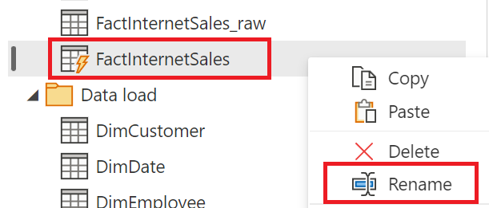
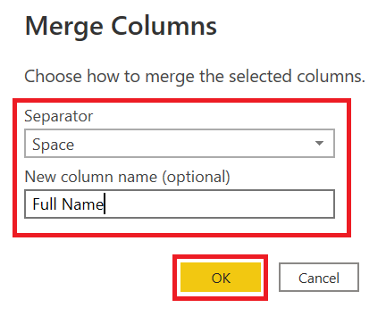

## Data Preparation

#### Sample data
The data for this lab is from the AdventureWorks sample database, published by Microsoft to showcase how to design SQL Server databases and Analysis Services models.

### Import a dataflow model into a group workspace and edit credentials

A dataflow has been partially started, which we'll utilize to the labs completion. To get started we'll import the existing dataflow model and edit credentials, so that we can ingest and transform our data and perform refresh operations.

1. Download the sample **Dataflow demo.json** file, which contains the dataflow model.

1. Navigate to a new, empty or non-production group workspace to utilize the [premium features of dataflows](https://docs.microsoft.com/power-bi/transform-model/dataflows/dataflows-premium-features) for this lab. To confirm a group workspace has a capacity assigned - in the top right corner of the group workspace, select the **Settings** option and in the navigation pane select the **Premium** tab to confirm that a **Premium** license mode has been enabled from any one of the options below.

    **License mode:**
    - [Premium per user](https://docs.microsoft.com/power-bi/admin/service-premium-per-user-faq)
    - [Premium per capacity](https://docs.microsoft.com/power-bi/admin/service-premium-gen2-faq)
    - [Embedded](https://docs.microsoft.com/power-bi/developer/embedded/embedded-capacity)

    

1. After we've confirmed the group workspace has the appropriate license mode enabled, in the top left of the group workspace select **New** and then the **Dataflow** option.

    

1. From the **Start creating your dataflow** screen, select the **Import Model** option to import an existing dataflow model and then select the **Dataflow demo.json** file downloaded from the previous step to a local save destination.

    

1. Once the import has successfully completed, we can select the **Edit credentials** button from the toast notification in the top right.
    1. Alternatively within the workspace we can also select the vertical ellipses ( ⋮ ) adjacent to the dataflow name and then the **Settings** option to configure.

    

1. Within the Settings page for the dataflow, expand the **Data source credentials** section and select **Edit credentials** adjacent to the **Web** source. For this lab, we'll be connecting to publicly accessible sample files in this GitHub repository - to complete the configuration in the **Configure** dialog box set the following values below and then select **Sign in** once complete:
    1. Authentication method | **Anonymous**
    1. Privacy level setting for this data source | **Public**
        1. To learn more, see [Power Query privacy level settings](https://docs.microsoft.com/power-bi/admin/desktop-privacy-levels#configure-a-privacy-level)
    1. ☑️ **Skip test connection**

    

---

### Configure Global options in the Power Query Online editor

With our dataflow successfully imported and credentials set, we'll want to configure our development environment's experience for an optimal workflow when authoring in the Power Query Online editor.

---

1. From the group workspace, select the ellipses (...) adjacent to the dataflow name and then the **Edit** option.

    

1. Our imported dataflow model includes additional standardized categories as part of the [metadata file (model.json)](https://docs.microsoft.com/common-data-model/model-json). The standardized format enables discovery across other Microsoft products and provide semantic information to applications - including the table information's column types, metadata descriptions and more. To update the dataflow model in the top right select the **Edit tables** option to navigate into the Power Query Online interface.

    

1. Within the Power Query Online editor we'll want to enable additional authoring settings which will persist across all projects - from the **Home** tab - select the **Options** > **Global options** property.

    

1. Within the **Global options** window ensure the following settings are enabled.

    **Steps**
    1. Enable step cost indicators
    1. Show script in step callout

    **Column profile**
    1. Enable column profile
    1. Show column value distribution in data preview
    1. Show column value distribution in data preview
    1. Show column profile in details pane

    **Type detection**
    1. Never detect column types and headers for unstructured sources

    **Parameters**
    1. Always allow parameterization in data source and transformation dialogs

    

---

### Generate a list of values

Now that we're ready to begin ingesting data, for this portion of the lab our scenario is as follows - new information is being added to a (**Web page**) file location which we'll combine during refresh activities for our analysis. The total number of files that will be added is unknown but will continue to grow with time, to which we'll need to account for with a [future proofed](https://docs.microsoft.com/power-query/best-practices#future-proofing-queries) solution. Fortunately for us, the files maintain a consistent column naming, data type and file naming structure (**FactInternetSales_#.csv**) to make collecting and appending new data easier.

---

1. From the **Home** tab select the drop-down for **Get data** and the **Blank query** option to create a new query.

    

1. Within the **Advanced editor** window, we'll create a custom function for our file name that [combines text](https://docs.microsoft.com/powerquery-m/text-combine) for our prefix, file number and file extension and converts the [text from](https://docs.microsoft.com/powerquery-m/text-from) a value. Select **Ok** when complete.

    ```fsharp
    let
      // A function that accept a file number value and concatenates text
      fxFileName = (#"File number" as number) as text =>
                    Text.Combine(
                        {
                            "FactInternetSales_",
                            Text.From(#"File number"),
                            ".csv"
                        }
                    )
    in
      fxFileName
    ```

2. Open the **Advanced Editor** once again, add a comma to end of the **fXFileName** step and add a new step with the identifier name **Source** which equals a **Record** data type, containing the names **fileCount**, **fileName** and **data** and their corresponding value pairing as displayed below and update the return value to **Source** after the text **in**.
    
    | Name | Value |
    | :--- | :---- |
    | fileCount | 1 |
    | fileName | fxFileName(fileCount) |
    | data | fxGetFile(fileName) |

    ```fsharp
    let
      // A function that accept a file number value and concatenates text
      fxFileName = (#"File number" as number) as text =>
                    Text.Combine(
                        {
                            "FactInternetSales_",
                            Text.From(#"File number"),
                            ".csv"
                        }
                    ),
      Source = [
                fileCount = 1,
                fileName = fxFileName(fileCount),
                data = fxGetFile(fileName)
            ]
    in
      Source
    ```

4. Enable the **Query script** view, to view the full script in the center of the window. 
    1. To validate the results are updating, change the **fileCount** value to **2** and review the data preview's **fileName** and **data** values.
    1. Return the **fileCount** value to **1** before proceeding.

    

5. Within the expanded **Query script** view, add a comma to the end of the **Source** step and add a new step with the step identifier name of **fileList** with the **List.Generate** function value, and update the text after the **in** statement to **fileList** to review the functions documentation.
    1. Typing any function name without the open and closed parenthesis proceeding will return the function's documentation.

    ```fsharp
    let
      // A function that accept a file number value and concatenates text
      fxFileName = (#"File number" as number) as text =>
                    Text.Combine(
                        {
                            "FactInternetSales_",
                            Text.From(#"File number"),
                            ".csv"
                        }
                    ),
      Source = [
                fileCount = 1,
                fileName = fxFileName(fileCount),
                data = fxGetFile(fileName)
            ],
      fileList = List.Generate
    in
      fileList
    ```

6. Now that we've reviewed the documentation, update the **Query script** view to the below.
    1. For the **initial** parameter include the goes-to "**=>**" symbol and then the **Source** step.
    1. For the **condition** parameter, we'll use square brackets to reference the initialized **Source** value's **[data]** to logically test that the returned value is **not** empty, when using the **[Table.IsEmpty()](https://docs.microsoft.com//powerquery-m/table-isempty)** function.
    1. For the **next** parameter, create a record that matches the **Source** step's **fileCount**, **fileName** and **data** fields and increment the **fileCount** by it's current integer value plus **one**.

    ```fsharp
    let
      // A function that accept a file number value and concatenates text
      fxFileName = (#"File number" as number) as text =>
                    Text.Combine(
                        {
                            "FactInternetSales_",
                            Text.From(#"File number"),
                            ".csv"
                        }
                ),
        Source = [
            fileCount = 1,
            fileName = fxFileName(fileCount),
            data = fxGetFile(fileName)
        ],
        fileList =
            List.Generate(
                () => Source,
                each not Table.IsEmpty([data]),
                each
                    [
                        fileCount = [fileCount] + 1,
                        fileName = fxFileName(fileCount),
                        data = fxGetFile(fileName)
                    ]
            )
    in
        fileList
    ```
1. To convert out returned list to a table, navigate to the **List tools** tab in the ribbon and select the **To table** option.

    

1. In the top right of the **Column1** column - we'll select the expand columns icon, and disable the **Use original column name as prefix** option and select **OK** when complete.

    

1. Right click the **data** column and select the **Remove other columns** option to remove all other columns from the current table. 

    

1. In the top right of the **data** column - select the expand columns icon, disable the **Use original column name as prefix** option and select **OK** when complete.(#tab/step)

    

1. While holding the **shift** key on our keyboard, select the **ProductKey** column and then **Freight** column to highlight all columns in our table. Navigate to the **Transform** tab and then select **Detect data type** to change the current columns [any value](https://docs.microsoft.com/power-query/data-types) (ABC123) to a more appropriate data type automatically.
    1. We can also select any cell in our table and press **Ctrl+A** to select all cells and columns.

    

1. Within the **Query settings** pane, change the **Name** of the completed query to **FactInternetSales_raw**.

    

### Optional: Power Query M function reference

To view a complete list of Power Query function documentation, from the **Home** tab select **Get data** and **Blank query**. Update the **Source** step value to **#shared** and select **Next** to proceed.

```fsharp
let
    Source = #shared
in
    Source
```
A record set is returned including the [Power Query M function reference](https://docs.microsoft.com/powerquery-m/power-query-m-function-reference) documentation.

### Grouping queries

1. In the **Queries** pane, while holding **ctrl**, select the following tables from the list below, once complete right click and select the **Move to group** > **New group...** option.

    1. DimProduct_raw
    1. DimProductCategory_raw
    1. DimProductSubcategory_raw
    1. FactInternetSales_raw

    

    1. In the **New group** window set the name to **Data staging** and the **Description** to the following text below and select **Ok** once complete.

        ```
        Data that will be ingested from the source and referenced in computed tables for transformations via the enhanced compute engine.
        ```
    
        

1. In the **Queries** pane, while holding **ctrl**, select the following tables from the list below, once complete right click and select the **Move to group** > **New group...** option.

    1. DimCustomer
    1. DimDate
    1. DimEmployee
    1. DimGeography

    

    1. In the **New group** window set the name to **Data load** and the **Description** to the following text below and select **Ok** once complete.

        ```
        Data that will be ingested from the source without transformations.
        ```
    
        

1. Our **Queries** pane now contains two groups to help make managing and distinguishing our queries intent more effective at a glance. For more detail we can also hover above the group's folder icon where the **description** value of each will be visible.

    

---

### Computed tables for transformation logic

With data now being ingested and stored in our dataflow's [Azure Data Lake Storage Gen2](https://docs.microsoft.com/azure/storage/blobs/data-lake-storage-introduction), we'll want to leverage [computed tables](https://docs.microsoft.com/power-query/dataflows/computed-entities-scenarios) to apply our transformation logic via the enhanced compute engine. 

[Learn more about the benefits of loading data without transformation for Text/CSV files](https://docs.microsoft.com/power-query/dataflows/computed-entities-scenarios#load-data-without-transformation-for-textcsv-files)

---

1. In the **Queries** pane - right click the **FactInternetSales_raw** table you created earlier and select **Reference** to create a computed table. Once complete you will see a new query has been created with a lightning bolt icon (⚡) indicating that this is now a computed table.

    

1. In the **Queries** pane - right click the **FactInternetSales_raw (2)** table, select **Rename** and update the query title to **FactInternetSales**.

    

1. In the **Queries** pane - right click the **FactInternetSales** computed table, select the following tables from the list below, once complete right click and select the **Move to group** > **New group...** option and complete the following.
    1. **Name:** Data transformation
    1. **Description:** Data that will be ingested from the data lake storage for transformations.

    

1. FactInternetSales - SURROGATE KEYS on Order Date and Ship Date columns.

### Enabling the enhanced compute engine

1. Within the **Enhanced compute engine settings**, select the **On** option and then select the **Apply** button.


1. After we've received the **Success!** notification, return to the workspace and select the **Refresh now** option of the datalfow for the optimization to take effect.

    

[Learn more about DirectQuery with dataflows](https://docs.microsoft.com/power-bi/transform-model/dataflows/dataflows-premium-features#use-directquery-with-dataflows-in-power-bi)

### Query folding

1. Within **Power BI Desktop**'s **Home** ribbon select the **Get data** button. Within the **Get dialog** window select the **Power Platform** section and then **Dataflows** connector. Select **Connect** to continue to the **Dataflows** navigator window.

    

1. Within the **Navigator** window, navigate to the group Workspace where the dataflow is located and select all of the tables located within the dataflow. Select **Transform Data** when complete to enter the **Power Query Editor** window.

    

1. Navigate to the **DimCustomer** table, holding the **shift** key select the **FirstName**, **MiddleName** and **LastName** columns, right click one of the selected columns and choose the **Merge Columns** option.

    

1. Within the **Merge columns** window change the **Separator** option to **Space**, set the **New column name (optional)** option to **Full Name** and select **OK** when complete.

    

1. In the **Query settings** pane on the right, navigate to the **Merge Columns** step, right click and select the **View Native Query** option.

    

1. Navigate to the **Add Column** tab and select the **Conditional Column** option. Within the **Add Conditional Column** dialog complete the following and select **OK** when complete:
    1. New column name: **Gender**
    1. Match the following conditions to the table below.
        1. Use the **Add Clause** to add new conditions.

    |  | Column Name | Operator | Value | Output | 
    | :------- | :-------| :-------| :-------| :-------|
    | If | Title | equals | Mr. | Male |
    | If | Title | equals | Sr. | Male |
    | If | Title | equals | Ms. | Female |
    | If | Title | equals | Sra. | Female |
    | else | Unknown | | |

    

1. In the **Query settings** pane on the right, navigate to the **Add Conditional Column** step, right click and select the **View Native Query** option.

    

1. From the **Formula bar** select the **Add Step** button and type in the following formula below.
    1. If the **Formula Bar** is not enabled navigate to the **View** tab and select the **Formula Bar** checkbox.

    

    ```fsharp
    = Table.AddColumn(
                #"Merged Columns",
                "Gender",
                each
                    if
                        List.Contains(
                            {
                                "Mr.",
                                "Sr."
                            },
                            [Gender]
                        )
                    then
                        "Male"
                    else if
                        List.Contains(
                            {
                                "Ms.",
                                "Sra."
                            },
                            [Gender]
                        )
                    then
                        "Female"
                    else
                        "Not Provided",
                type text
            )
    ```

1. In the **Query settings** pane on the right, navigate to the **Custom1** step, right click and select the **View Native Query** option to review the difference in the generated query which now uses the [IN (Transact-SQL)](https://docs.microsoft.com/sql/t-sql/language-elements/in-transact-sql?view=sql-server-ver15) clause.

    

1. Right click the **Applied Steps** step named **Custom1** and select **Properties...** to open the **Step Properties** dialog box. Once the **Step Properties** is visible update the **Name** property to **Custom: Gender** and the **Description** field to the below text. Once complete select **OK** to complete.

    ```bash
    If value is Mr. or Sr. replace with Male.
    If value is Ms. or Sra. replace with Female.
    Otherwise replace with Not Provided.
    ```

    

1. Review the new **Custom: Gender** step's properties by hovering above the step name to view the documentation.

    

1. Right click the original **Added Conditional Column** step and select the **Delete** option to remove.
    1. Selecting the adjacent **X** to the left of the step name is also an option.

    

## Next steps:
We hope this tour has shown how the data preparation capabilities in Power BI can provide...

- Continue to the [Data Modeling](./DataModeling.md) lab
- Or return to the [Day After Dashboard in a Day](./README.md) homepage