# Data Visualization

✏️ Lab scenario
---
This lab demonstrates how to create fast and professional reports that reveal new insights for our users. We will follow the best practices of report design experts to explore design ideas to develop production-ready reports.

Learn more about [Designing effective Power BI reports](https://docs.microsoft.com/users/heyrob/collections/o4dhk4z8xpr8q) by visiting Microsoft Learn

## Live Connection

A good practice for enterprise scale deployments is to separate dataset development from report and dashboard development. You can do this in Power BI Desktop by creating a separate PBIX file for each. For instance, you can upload a dataset PBIX file to the development stage and then connect it to a report PBIX file using a live connection. This way, different creators can work on modeling and visualizations independently. You can also apply this method across workspaces with shared datasets.

Learn more about [connecting to Power BI datasets](https://learn.microsoft.com/power-bi/connect-data/desktop-report-lifecycle-datasets).

---

1. Create a new Power BI file by selecting **File** and **New** (shortcut Ctrl+N) or opening Power BI Desktop.

    

1. Select the **Data hub** option and then **Power BI datasets** from the **Home** tab to create a new live connection to an existing dataset.

    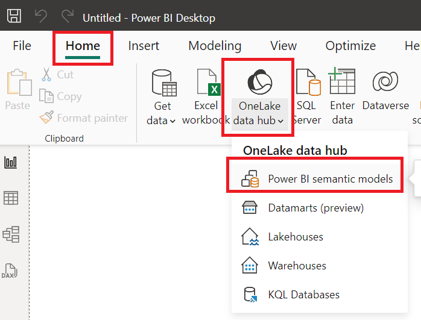

1. Select the published dataset from the **Data modeling** lab and click **Connect** to create a live connection to our dataset.

    

1. The bottom right corner of our file shows **Connected live to the Power BI dataset**, with the dataset and workspace names.

    

---

## Page canvas and elements

A Power BI report page canvas is a single page that displays visualizations of your data. You can create and customize your report page canvas in Report view1 by adding fields, filters, and formatting options. You can also change the canvas settings to adjust the display ratio and size of your report page canvas.

Learn more about [report view](https://learn.microsoft.com/power-bi/create-reports/desktop-report-view)

---

### Canvas background

1. Click the "**+**" icon at the bottom left of the current file to create a new page.

    

1. Right-click on the page name at the bottom left and select **Rename Page** from the menu. Type in the new name from the table below and press Enter.

    | Previous Page Name | Renamed Page Name |
    | :--- | :--- |
    | Page1 | Summary |
    | Page2 | Detail |

    

1. For each page listed below, go to the **Visualizations** pane and click **Format your report page**. Under **Canvas background**, update these settings:
    1. For **Image**, click **Browse...** and paste the corresponding URL into the **File name:** field.

    

    | Page | Image fit | Transparency |
    | :--- |  :--- | :--- |
    | Summary | Fit | 0% |

    **Image (file)**
    ```
    https://raw.githubusercontent.com/microsoft/pbiworkshops/main/Day%20After%20Dashboard%20in%20a%20Day/Media/ContosoSummary.svg
    ``` 

    | Page | Image fit | Transparency |
    | :--- |  :--- | :--- |
    | Detail | Fit | 0% |

    **Image (file)**
    ```
    https://raw.githubusercontent.com/microsoft/pbiworkshops/main/Day%20After%20Dashboard%20in%20a%20Day/Media/ContosoDetail.svg
    ```

    

<font size="6">✅ Lab check</font>

We used PowerPoint to create a rich background for our Power BI report. We chose PowerPoint because it has design templates and shapes that match the slide dimensions of our report canvas. This way, we could plan our design elements before importing them into Power BI. All we had to do was size our visuals to fit the individual squares.

This technique can also improve the performance of our report by reducing the rendering times of having extra elements on our report page.

Learn more about [themeable backgrounds](https://alluringbi.com/2020/05/05/themeable-backgrounds-for-power-bi/) from the community resource [AlluringBI.com](https://alluringbi.com)

---

### Elements

1. Go to the **Insert** tab and select **Text box**. Then, do the following:
    1. Change the Font size to **18** and the Font color to **White, 50% Darker**.
    1. Type **SALES REPORT** in the text box.

    

1. With the text box selected, go to the **Format** pane and type **background** in the search box. Under **Effects**, turn off the **Background** property.

    

1. Go to the **Insert** tab and select **Buttons**, then **Navigator** and the **Page navigator** option. Move the buttons to the top right corner of the canvas.

    

1. Select both the text box and the page navigator elements on the **Summary** page by clicking and dragging with your mouse or pressing CTRL+A. Copy them by clicking **Copy** on the Home tab or pressing CTRL+C.

    

1. Go to the **Detail** page and paste them by clicking **Paste** on the **Home** tab or pressing CTRL+V. This will align them perfectly with those on Summary page.

    

1. Select only text box on Detail page and change its text from "**SALES REPORT**" to "**SALES DETAIL |**"

1. Select the **Text box** element on the **Detail** page and update the text from "**SALES REPORT**" to "**SALES DETAIL |**"

    

## Visualizations

Visualizations are ways of displaying data insights in Power BI reports. They can be charts, maps, tables, gauges, and many other types of graphics. You can create visualizations by selecting fields from your data model or by using Q&A. You can also customize your visualizations with different colors, shapes, filters, and interactions.

Learn more about [data visualizations](https://learn.microsoft.com/power-bi/visuals/power-bi-report-visualizations)

---

### Consolidating visuals

Our users want to see **Total Sales Amount**, **Total Items Discounted** and **Total Returned Items** at the top of our report. These are the key measures often used for their team discussion.

To optimize our report performance, we will use a single Table visual instead of three Card visuals. This will reduce the number of visuals on our canvas and save space.

---

1. Drag the **Table** visual from the **Visualizations** pane to the canvas and add the following measures to the table in this order:
    1. **Total Sales Amount**
    1. **Total Items Discounts**
    1. **Total Return Items**
    
    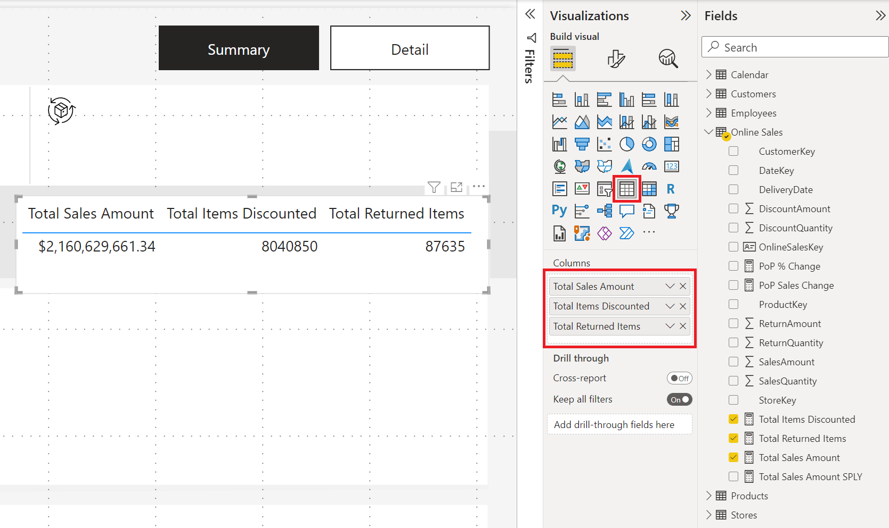

1. Resize and position the table to fit the top horizontal section of our report.


1. To format our visual, go to the **Visualizations** pane and click on **Format your visual** to adjust these settings:

    **Note**: We can use the Search box to find specific settings quickly.

    | | |
    | :- | :- |
    | 🔍 Search term | **Style** |
    | Style presets | **None** |

    

    | | |
    | :- | :- |
    | 🔍 Search term | **Effects** |
    | Effects > Background | **Off** |

    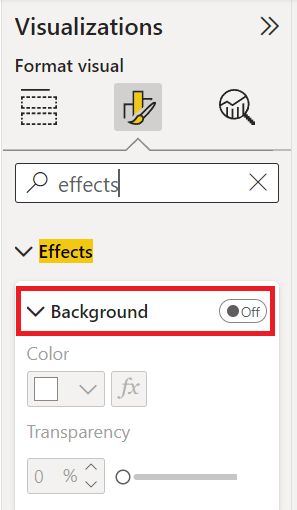

    | | |
    | :- | :- |
    | 🔍 Search term | **Headers** |
    | Column headers > Font  | **Segoe UI Semibold** |
    | Column headers > Font size  | **12** |
    | Column headers > Text color | **#118DFF** |
    | Column headers > Header alignment | **Center** |
    | Column headers > Text wrap | **Off** |

    

    <i>If the text color isn't within your default selection, select <b>More colors...</b> to enter the code manually.</i>
    
    

    | | |
    | :- | :- |
    | 🔍 Search term | **Values** |
    | Values > Font  | **Segoe UI Semibold** |
    | Values > Font size  | **16** |

    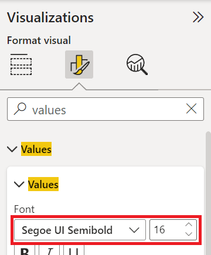

    | | |
    | :- | :- |
    | 🔍 Search term | **Column** |
    | Specific column > Series  | **For each value in the drop down list, update the alignment below** |
    | Specific column > Alignment  | **Center** |

    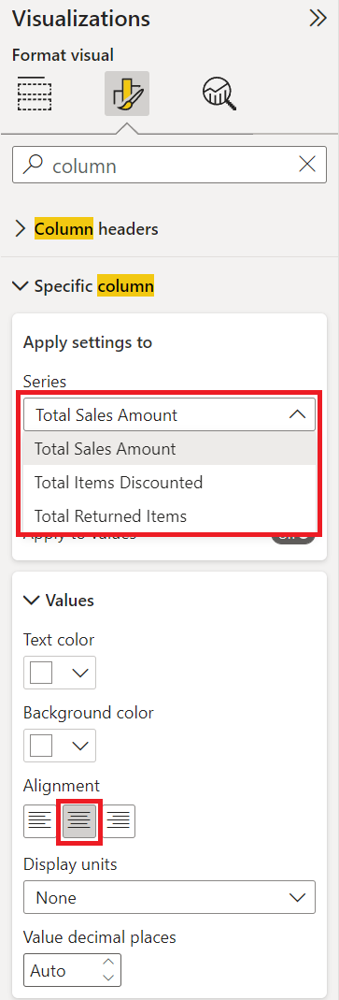

    | | |
    | :- | :- |
    | 🔍 Search term | **Border** |
    | Grid | **Border** |
    | Section | **Column header** |
    | Border position | **Deselect any/all enabled options** |

    

1. Next, we’ll adjust the table columns and analyze the performance of our visual. To resize the columns, hover between them until you see the resize mouse icon. Then, drag them to align with the dividers on the canvas.

    

1. To check the performance of our table, go to the **View** tab and click on **Performance analyzer**. Then, click on **Start recording** and **Refresh** visuals. You can see the results for our table in the pane.
    1. To copy the query that was sent to our dataset, click on **Copy query** and paste it into a text editor.
    1. When you are done, click on **Stop** and minimize the **Performance analyzer** pane.

    

<font size="6">✅ Lab check</font>

We have created a table visual that looks like three card visuals but uses only one query. This improves our report performance and makes it more appealing for our users. Reducing queries is important in Power BI.

Learn more about [DAX Fusion](https://dax.tips/2019/08/05/dax-fusion/) from the community resource [DAX.tips](https://dax.tips)

### Slicers

Slicers are a type of visual that filters the other visuals on a report page. They let you select values from a field and see how they affect your data. You can use slicers to create customized charts and reports that show only the information you want3.

There are different types of slicers in Power BI, such as relative date slicer, numeric range slicer, dropdown slicer, etc. You can add slicers from the Visualizations pane and sync them across multiple pages.

Learn more about [slicers](https://learn.microsoft.com/power-bi/visuals/power-bi-visualization-slicers?tabs=powerbi-desktop)

---

1. Drag the **Slicer** visual from the **Visualizations** pane to the canvas below the **Total Sales Amount** column. Add the **DateKey** field from the **Calendar** table to the slicer and then click on the downward chevron (**V**) on the top right of the slicer and change it from **Between** to **Relative Date**.

    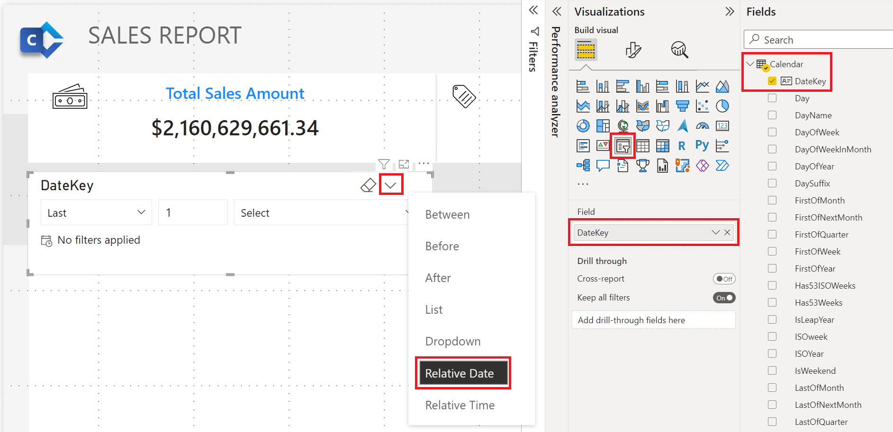

1. Set the slicer value to **Last 18 Months**. This will filter our data for the past 18 months and update automatically every day.

    

1. To format our slicer, go to the **Visualizations** pane and click on **Format your visual**. Then, adjust these settings:

    **Note**: We can use the Search box to find specific settings quickly.

    | | |
    | :- | :- |
    | 🔍 Search term | **Header** |
    | Slicer header > Title text | **Date** |
    | Slicer header > Font | **Segoe UI Semibold** |
    | Slicer header > Font size | **9** |
    | Slicer header > Background | **White, 10% darker** |

    

    | | |
    | :- | :- |
    | 🔍 Search term | **Background** |
    | Values > Background > Background color | **White** |
    | Effects > Background | **Off** |

    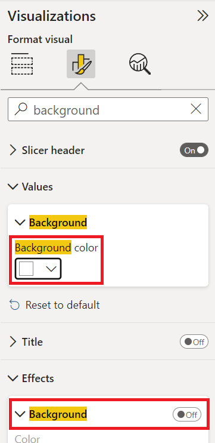

1. Add a **Slicer** visual from the **Visualizations** pane below the **Total Items Discounted** column. Add the **ProductCategoryName** and **ProductSubcategoryName** fields from the **Products** table to the slicer.

    

1. To check how this slicer affects the performance of your report, go to the **View** tab and click on **Performance analyzer**. Then, click on **Start recording** and hover over the slicer. We will see an **Analyze this visual** button on the top right. Click on it and expand the Slicer name in the pane. We will see a **DAX query** that was sent to display the values in the slicer.

    

1. To improve our report performance, we'll change our slicer from a list to a dropdown. Click on the downward chevron (**V**) on the top right of the slicer and select **Dropdown**. This will reduce the number of queries sent to your dataset.

    

1. To verify this improvement, hover over the slicer again and click on **Analyze this visual**. We will notice that there is no longer a **DAX query** under the Slicer name when it is collapsed. The query will only run when you click on the slicer to see its values.

    

1. From the **Visualizations** pane add a **Slicer** visual below the **Total Returned Items** column. Insert the **CustomerType** field from the **Customer** table either into the **Field** value in the **Visualizations** pane or the slicer itself and in the top right of the slicer select the downward chevron **(V)** and change the value to **Dropdown**.

    

1. To transfer visual configurations, select the **Date** slicer and then navigate to the **Home** tab to select the **Format painter** button. Repeat the following steps for the other two slicers.
    1. Paste to the **ProductCategoryName, ProductSubcategoryName** slicer.
    1. Paste to the **CustomerType** slicer.
    
    

1. We'll now click and hold the left mouse click and select both the **ProductCategoryName, ProductSubcategoryName** and **CustomerType** slicers (or press and hold Ctrl and then Click) on our page, navigate to the **Visualizations** pane's **Format your visual** section and update the following configurations below.

    | | |
    | :- | :- |
    | 🔍 Search term | **Background** |
    | Values > Background > Color | **White** |

    

<font size="6">✅ Lab check</font>


Maintaining a consistent look across report elements ensures a professional experience for end users. Utilizing features like **Format painter** (found across Office applications) or by bulk updating configurations is quick way to ensure our configurations are consistent.

### Natural language

Q&A in Power BI is a feature that lets you explore your data using natural language. You can type questions in the Q&A box and get answers in the form of visuals. You can also use Q&A to create visuals for your reports by asking questions about your data. Q&A recognizes the words you type and figures out where and how to find the answer.

Learn more about [Q&A](https://learn.microsoft.com/power-bi/create-reports/power-bi-tutorial-q-and-a?tabs=powerbi-desktop)

---

1. Double click the bottom left corner of the canvas to create a **Q&A** visual. Then complete the following:
    1. Type **Total Sales Amount by manufacturer** in the dialog box.
    1. Select **turn this Q&A result into a standard visual** next to the search box. 
    1. Resize the visual to fit within the white square.

    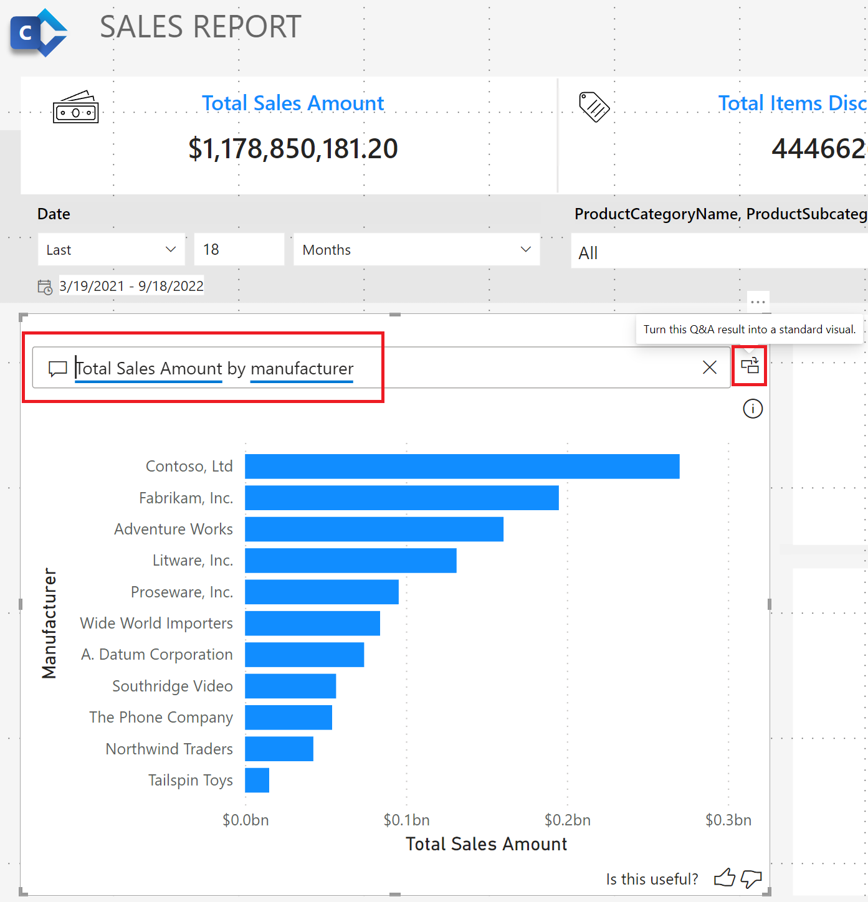

1. Double click the top right corner of the canvas to create a **Q&A** visual. Then complete the following:
    1. Type **Total Sales Amount by week** in the dialog box.
    1. Select **turn this Q&A result into a standard visual** next to the search box.
    1. Resize the visual to fit within the white square.

    

1. To create a line chart for each **Occupation**, add **Occupation** from **Customers table** into **Small multiples** field in Visualizations pane with our current line chart selected. To update our line charts small multiple properties, use **Format your visual** section in **Visualizations** pane.

    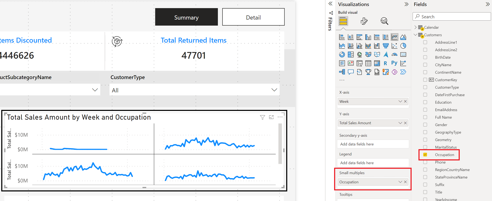

1. In the **Visualizations** pane’s **Format your visual** section, update these settings for our line charts small multiple properties.

    **Note**: We can use the Search box to find specific settings quickly.

    | | |
    | :- | :- |
    | 🔍 Search term | **Multiples** |
    | Small multiples > Layout > Rows | **1** |
    | Small multiples > Border > Gridlines | **Vertical only** |
    | Small multiples > Title > Position | **Bottom** |
    | Small multiples > Title > Font | **Segoe UI** |

    

1. In the **Visualizations** pane’s **Add further analyses to your visual** section, update these settings for our line chart to add more insights.

    **Note**: We can use the Search box to find specific settings quickly.

    | | |
    | :- | :- |
    | 🔍 Search term | **Median** |
    | Median line > Apply settings to | select **Add line** |
    | Median line > Line > Color | **Black** |

    
1. Select the ellipses (**…**) in the top right corner of our current small multiples line chart.
    1. Choose **Sort small multiples** and sort by **Total Sales Amount**
    1. Choose **Sort small multiples** again and select **Sort descending**

    

1. Add the **Azure map** visual below the small multiples line chart in the bottom right corner of our page, and configure it like this:
    1. Drag the **StateProvinceName** field from the **Customers** table into the **Location** value in the **Visualizations** pane or the map itself.
    1. Drag the **Total Sales Amount** measure from the **Fact Online Sales** table into the **Size** value in the **Visualizations** pane or on the map itself.

    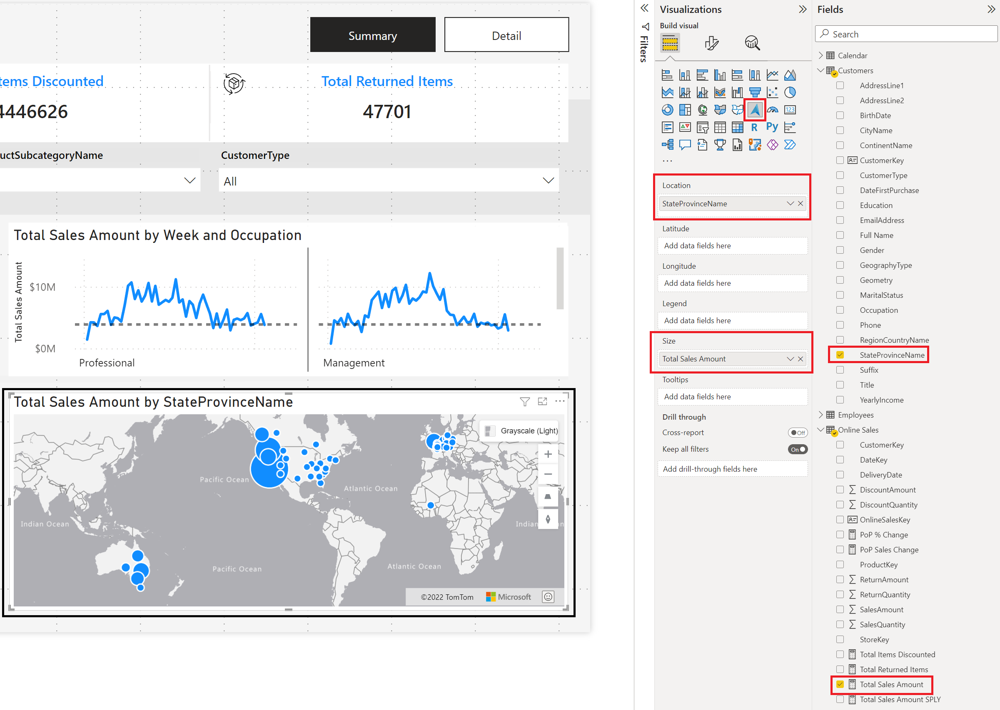

<font size="6">✅ Lab check</font>

You can create visuals with natural language, split them into multiple versions with small multiples or use rich mapping capabilities - there are many ways to visualize your data in Power BI by typing a description.


---

### Spark lines

Sparklines are mini charts that you can add to a table or matrix visual in Power BI. They help you see trends and patterns in your data without creating separate visuals. You can add up to five sparklines per visual and choose between line or column charts.

Learn more about [sparklines](https://learn.microsoft.com/power-bi/create-reports/power-bi-sparklines-tables)

---

1. Go to the **Detail** page by selecting its name in the bottom left or holding ctrl and clicking the **Detail** button in the top right.

    **Pro-tip:** For reports with many pages, right click the arrows (<>) next to the page tabs to see all page names. This also works in Excel.

    

1. Add the **Matrix** visual from the **Visualizations** pane to the top right rectangle on the **Detail** page and configure it like this.

    | Field | Table | Field/Measure |
    | :-- | :-- | :-- |
    | Rows | Products | Manufacturer |
    | Rows | Stores | StoreName |
    | Rows | Products | ProductName |
    | Values | Online Sales | Total Sales Amount |

    

1. Right click **Total Sales Amount** in the **Visualizations** pane and select **Add a sparkline**.

    **Note:** You can also add a sparkline by going to the **Insert** tab and clicking **Add a sparkline**.

    

1. In the **Add a sparkline** window, choose **DateKey** from the Calendar table under **X-axis**, then click **Create**.

    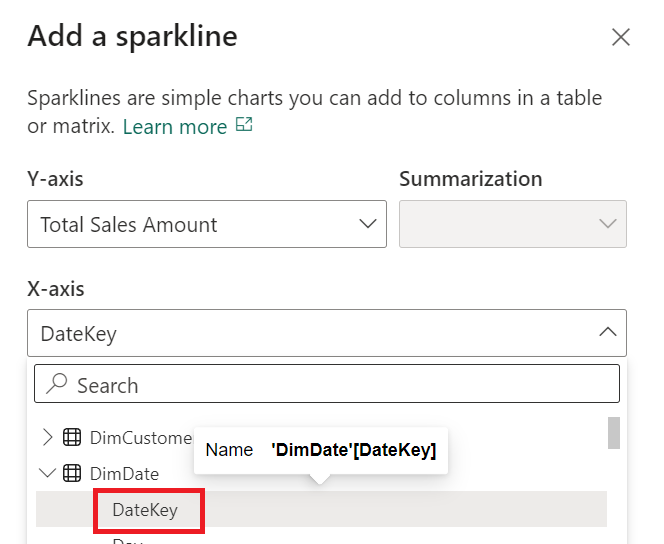

1. Right click **Total Sales Amount** by **DateKey** sparkline in the **Visualizations** pane and select **Rename** for this visual, then type a space character as a new title.

    

1. Check your sparkline is still there but invisible in the pane, then resize your matrix column if you can’t see your sparklines.

    

### Drill-through

Drillthrough is a feature in Power BI that lets you create a target page in your report that focuses on a specific entity, such as a supplier, customer, or manufacturer1. You can then right-click on a data point in another page and drill through to the target page to see details that are filtered to that context. To set up drillthrough, you need to create a target page with the visuals you want and add fields to the Drillthrough filter well. You can also customize your back button image and pass all filters in drillthrough.

Learn more about [drill-through](https://learn.microsoft.com/power-bi/create-reports/desktop-drillthrough)

---

1. Drag-and-drop **Manufacturer** from the **Products** table in the **Fields** pane to **Add drill-through field values here** in the Visualizations pane.

    

1. **Delete** the automatic back button in the top left corner of our page. We already have a page navigation button.

    

1. Go back to the **Summary** page by selecting its name in the bottom left or holding **ctrl** and clicking the **Summary** button in the top right. Right click **Contoso, Ltd** bar in the bottom left corner of our page, choose **Drill-through**, then select **Detail**.

    

1. We’re now on the **Detail** page with only **Contoso, Ltd** manufacturer data in our matrix visual. The bottom right corner of our pane shows that both **Manufacturer is Contoso, Ltd** and current date range from slicer are passed because you enabled **Keep all filters**.

    

1. To highlight your drill-through selection more, create a report level measure for selected manufacturer value and use it as your page title in top left corner. Report level measures are only for this report and not part of live connected model.

    Follow these steps:
    1. Right click **Products** table in the **Fields** pane and select **New measure**.

    

    2. Enter this DAX query in the formula bar and click ✔️ on the left to commit.

    ```sql
    Selected Manufacturer = 
    VAR manufacturer = SELECTEDVALUE('Products'[Manufacturer])
    RETURN
    UPPER(manufacturer)
    ```
    

1. Select the page title in the top left corner. After the pipe, click "**+ Value**" to update dynamic value options below. Click **Save** when done.

    | | |
    | :- | :- |
    | How would you calculate this value | **selected manufacturer** |
    | Name your value | **ManufacturerName** |

    

1. If text format doesn’t match, highlight text and change Font size to **18** and Text color to **White, 60% darker**.

    

## Sparkline formatting

1. To update our matrix with the following configurations below, we’ll use the **Format your visual** section in the **Visualizations** pane.

    **Note**: We can use the Search box to find specific settings quickly.

    | | |
    | :- | :- |
    | 🔍 Search term | **Style** |
    | Style presets | **None** |

    

    | | |
    | :- | :- |
    | 🔍 Search term | **Header** |
    | Column headers > Text > Font | **Segoe UI Semibold** |
    | Column headers > Text > Font size | **10** |
    | Column headers > Text > Text color | **Black** |
    | Column headers > Text > Text wrap | **Off** |
    | Column headers > Options > Auto-size width | **Off** |

    

    | | |
    | :- | :- |
    | 🔍 Search term | **Pad** |
    | Grid > Options > Row padding | **6** |

    

    | | |
    | :- | :- |
    | 🔍 Search term | **icons** |
    | Row headers > +/- icons > Color | **White, 30% darker** |
    | Row headers > +/- icons > Size | **12** |

    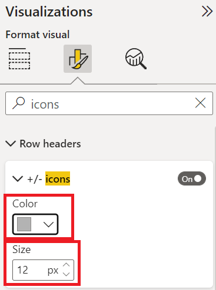

    | | |
    | :- | :- |
    | 🔍 Search term | **spark** |
    | Sparklines > Sparkline > Data color | **White, 30% darker** |
    | Sparklines > Sparkline > Show these markers | **Highest** |
    | Sparklines > Marker > Color | **#118DFF** |
    | Sparklines > Marker > Size | **4** |

    

1. Next, let’s resize the matrix columns to fit the width of our top left rectangle. This will make our sparklines easier to read for our end users.

    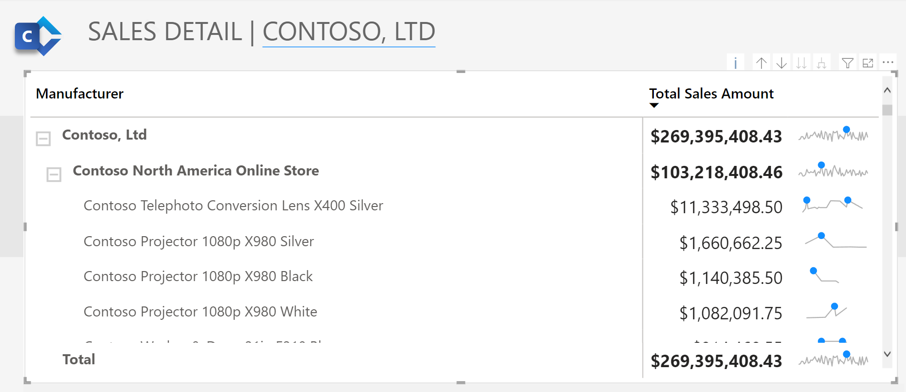

## Artificial Intelligence

Power BI has AI visuals such as Key Influencers, Decomposition Tree, and Anomaly Detection. They can help us optimize our business metrics by finding out what factors affect them.

### Anomaly detection

1. We want to show how our total sales amount changed over time using a line chart. To do this, we need to follow these steps:
    1. Go to the **Visualizations** pane and select a **Line** visual, dragging it to the bottom left rectangle on our canvas.
    1. Add **DateKey** field from the **Calendar** table as our **X-axis**
    1. Add **Total Sales Amount** measure as Y-axis

    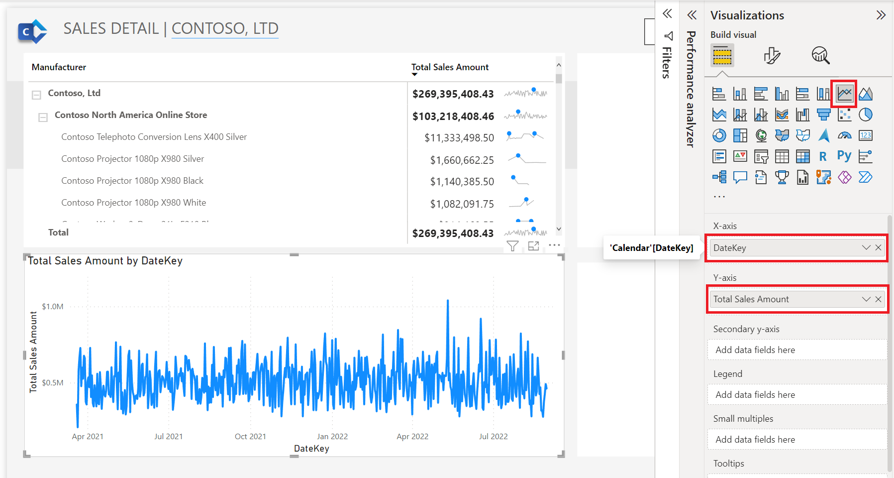    

    1. Enable anomaly detection under **Add further analyses to your visual**

    **Note**: We can use the Search box to find specific settings quickly.

    | | |
    | :- | :- |
    | 🔍 Search term | **Anomalies** |
    | Find anomalies | **On** |

    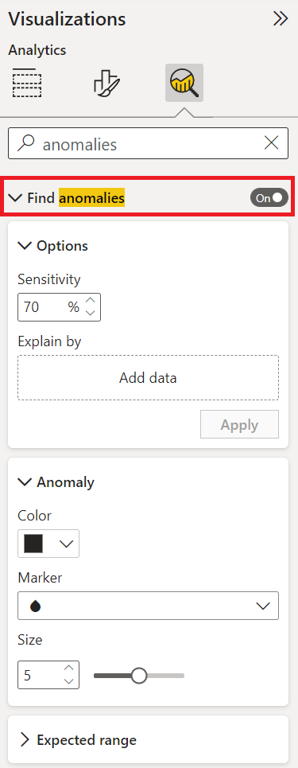

1. Now we have a line chart that shows us unusual patterns in our sales data. We can click on any anomaly marker to see more details on a new **Anomalies** pane. This pane tells us why an anomaly was detected and possible explanations for it. Our end users can also access this feature when they view our reports on Power BI service (cloud).

    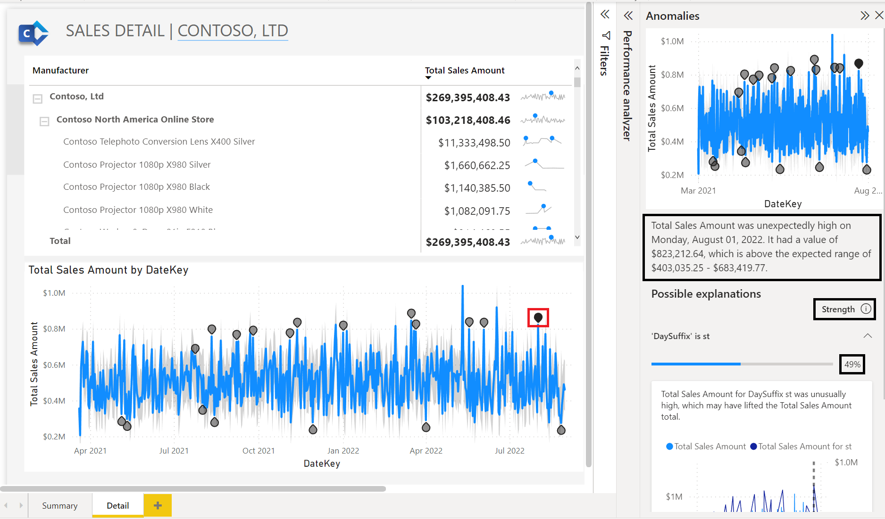

Learn more about [Anomaly detection](https://learn.microsoft.com/power-bi/visuals/power-bi-visualization-anomaly-detection)

### Smart narrative

1. Go to the **Visualizations** pane and select the **Smart narrative** visual. Drag it to the top right rectangle on our canvas.

    

1. Adjust its format using **Format your visual** section within the **Visualizations** pane to the following:

    **Note**: Utilize the Search box, to easily discover configurable settings.

    | | |
    | :- | :- |
    | 🔍 Search term | **Title** |
    | Title | **On** |
    | Title > Text | **Sales Summary** |

    

1. The **Smart narrative** will automatically update its summary based on our selections on other visuals

    

Learn more about [Smart narrative](https://learn.microsoft.com/power-bi/visuals/power-bi-visualization-smart-narrative)

### Q&A visual

1. Last, we want to add a **Q&A** visual that allows our end users to ask their own questions and find new insights. To do this, we need to follow these steps:
    1. Double click on the bottom right rectangle on our canvas
    1. A **Q&A** visual will appear where we can type our questions
    1. The Q&A visual will show us relevant answers using our data

1. For our last visual we'll now add the **Q&A** visual to the bottom right rectangle on our canvas by simply double clicking.

    With including the **Q&A** visual, we can provide our end users the ability to find new insights by typing their own questions, for scenarios that we may not have even thought to visualize yet.

    

Learn more about the [Q&A](https://learn.microsoft.com/power-bi/visuals/power-bi-visualization-q-and-a) visual

# Lab check

<i>Finished summary page</i>


<i>Finished detail page</i>

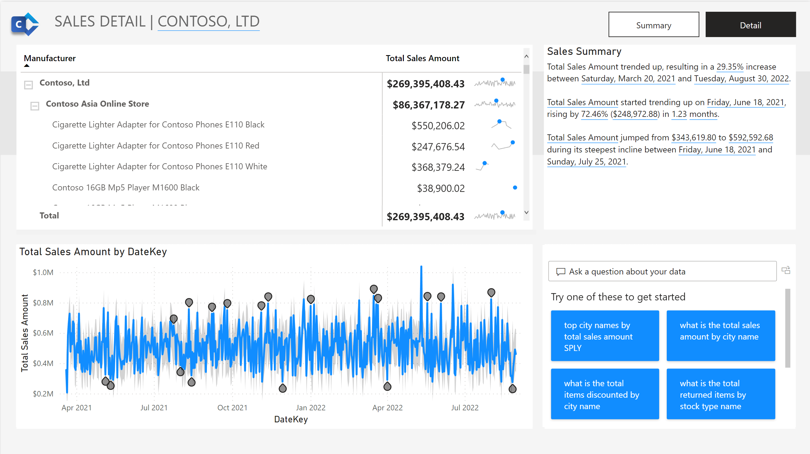


# Next steps
We hope this portion of the lab has shown how well designed reports can lead to increased usage and adoption.

- Return to the [Day After Dashboard in a Day](./README.md) homepage

# Learn more
[Visual Vocabulary](https://app.powerbi.com/view?r=eyJrIjoiMDA4YWIwZWEtMDE3ZS00YmFhLWE5YWMtODFlZWEzNTU1ODNiIiwidCI6IjZjMGE1YjljLTA4OWEtNDk0ZS1iMDVlLTcxNjEwOTgyOTA0NyIsImMiOjF9) from Jason Thomas