# Data Visualization

✏️ Lab scenario
---

For this portion of the lab, we've been tasked with creating a Power BI report to unlock new insights for our users. The interactivity of our report should be both **functional** and **fast** to ensure a pleasant viewing experience for our users, while adhering to the professional look and brand standards of our company.

# Report design

The content throughout this lab utilizes the proven design processes created by leading report design experts. These processes encompasses the phases of understanding the report users and their requirements, exploring pleasing report designs, and developing reports all the way into production.

Learn more about [Designing effective Power BI reports](https://docs.microsoft.com/users/heyrob/collections/o4dhk4z8xpr8q) by visiting Microsoft Learn

## Live Connection

For enterprise scale deployments, it's recommended to separate dataset development, and the development of reports and dashboards.

This approach should start from Power BI Desktop, by creating a separate PBIX file for datasets and reports. For example, you can create a dataset PBIX file and uploaded it to the development stage. Later, your report authors can create a new PBIX only for the report, and connect it to the published dataset using a live connection. This technique allows different creators to separately work on modeling and visualizations.

With shared datasets, you can also use this method across workspaces.

Learn more about [connecting to Power BI datasets](https://learn.microsoft.com/power-bi/connect-data/desktop-report-lifecycle-datasets).

---

1. We'll start by creating a new Power BI file by selecting the **File** and **New** option (shortcut **Ctrl+N**) if Power BI Desktop is currently open.
    1. If Power BI Desktop is not currently open, a new fill will be automatically created upon opening.

    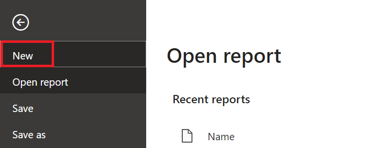

1. From the **Home** tab, we'll select the **Data hub** option and then **Power BI datasets** to create a new live connection to an existing dataset.
    
    

1. From the **Data hub** window, we'll select the published dataset from the **Data modeling** lab and then the **Connect** button to create a new **Live connection** to our dataset.

    

1. In the bottom right corner of our current file, the text **Connected live to the Power BI dataset** is now present, including the name of the dataset and the workspace it's located within.

    

---

## Page canvas and elements

Utilize PowerPoint to design backgrounds.


---

### Canvas background

1. In the bottom left of the current file select the "**+**" icon to create a new page.

    

1. Right click the following page names and select the **Rename Page** option to update to the following names in the table below.

    | Previous Page Name | Renamed Page Name |
    | :--- | :--- |
    | Page1 | Summary |
    | Page2 | Detail |

    

1. For each of the pages below, we'll navigate to the **Visualizations** pane, select the **Format your report page** button and update the following settings within the **Canvas background** section from the table below
    1. For the **Image** field select **Browse...** and then copy/paste the according url into the **File name:** field.

    

    | Page | Image fit | Transparency |
    | :--- |  :--- | :--- |
    | Summary | Fit | 0% |

    **Image (file)**
    ```
    https://raw.githubusercontent.com/microsoft/pbiworkshops/main/Day%20After%20Dashboard%20in%20a%20Day/Media/ContosoSummary.svg
    ``` 

    | Page | Image fit | Transparency |
    | :--- |  :--- | :--- |
    | Detail | Fit | 0% |

    **Image (file)**
    ```
    https://raw.githubusercontent.com/microsoft/pbiworkshops/main/Day%20After%20Dashboard%20in%20a%20Day/Media/ContosoDetail.svg
    ```

    

<font size="6">✅ Lab check</font>

By leveraging PowerPoint, their design templates and shapes we were able to create a rich background that we could easily import into Power BI as the slide dimensions are the same as our report canvas. In leveraging this method we can lay out our design elements before hand to make Power BI as straight forward as sizing our visuals to the individual squares.

This technique also reduces the rendering times of having additional elements on our report page, increasing the overall performance of our report.

Learn more about [themeable backgrounds](https://alluringbi.com/2020/05/05/themeable-backgrounds-for-power-bi/) from the community resource [AlluringBI.com](https://alluringbi.com)

---

### Elements

1. Navigate to the **Insert** tab, select the **Text box** element and complete the following steps below.
    1. Update the Font size to: **18**
    1. Update the Font color to: **White, 50% Darker**
    1. Type the text within the text box: **SALES REPORT**

    

1. With the text box still active, we'll navigate to the **Format** pane and in the search box type in **background**. 

    From the matching options navigate to the **Effects** group and set the **Background** property to **Off**.

    

1. Navigate to the **Insert** tab, select the **Buttons** element and then **Navigator** option. From the available choices select the **Page navigator** option. 

    Reposition the buttons on the top right side of the canvas.

    

1. We'll now click and hold the left mouse click and select both the text box and the page navigator elements on the **Summary** page. Once selected, we can navigate to the **Home** tab and select **Copy** or press the keyboard shortcut **Ctrl+C**
    
    **Note**: we can also select all elements by pressing CTRL+A or holding ctrl when clicking each item.

    

1. Navigate to the **Detail** page and from the **Home** tab select the **Paste** button or press the keyboard shortcut **Ctrl+V**. 
    
    This will ensure our elements are perfectly aligned between both the **Summary** and **Detail** page.

    

1. Select the **Text box** element on the **Detail** page and update the text from "**SALES REPORT**" to "**SALES DETAIL |**"

    

## Visualizations

Learn more about [data visualizations]()

---

### Consolidating visuals

We've been asked by our users to ensure the **Total Sales Amount**, **Total Items Discounted** and **Total Returned Items** measures are prominently displayed at the top of our report as these results will be the most common discussion points.

As more requirements continue to be added to our report design, we want to be cognizant of the number of visuals we are including on our canvas, so we'll leverage a technique below to consolidate a more common design pattern of three **Card** visuals into a more optimized approach with a single **Table** to optimize our report performance.

---

1. From the **Visualizations** pane add a **Table** visual and insert the below measures in the following order.
    1. **Total Sales Amount**
    1. **Total Items Discounts**
    1. **Total Return Items**
    
    

1. We'll position our table to be the same size and width that spans our top horizontal section and place this visual within this section.


1. Utilizing the **Visualizations** pane's **Format your visual** section, we'll update the following configurations below.

    **Note**: Utilize the Search box, to easily discover configurable settings.

    | | |
    | :- | :- |
    | 🔍 Search term | **Style** |
    | Style presets | **None** |

    

    | | |
    | :- | :- |
    | 🔍 Search term | **Effects** |
    | Effects > Background | **Off** |

    

    | | |
    | :- | :- |
    | 🔍 Search term | **Headers** |
    | Column headers > Font  | **Segoe UI Semibold** |
    | Column headers > Font size  | **12** |
    | Column headers > Text color | **#118DFF** |
    | Column headers > Header alignment | **Center** |
    | Column headers > Text wrap | **Off** |

    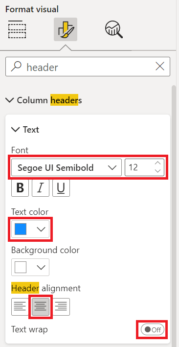

    <i>If the text color isn't within your default selection, select <b>More colors...</b> to enter the code manually.</i>
    
    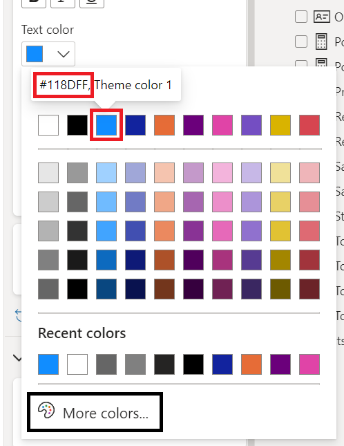

    | | |
    | :- | :- |
    | 🔍 Search term | **Values** |
    | Values > Font  | **Segoe UI Semibold** |
    | Values > Font size  | **16** |

    

    | | |
    | :- | :- |
    | 🔍 Search term | **Column** |
    | Specific column > Series  | **For each value in the drop down list, update the alignment below** |
    | Specific column > Alignment  | **Center** |

    

    | | |
    | :- | :- |
    | 🔍 Search term | **Border** |
    | Grid | **Border** |
    | Section | **Column header** |
    | Border position | **Deselect any/all enabled options** |

    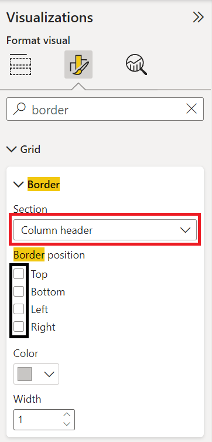

1. Now that we've customized our table visualization to meet the aesthetic of our brand standards, we'll re-size the current columns by hovering between each column until the resize mouse icon appears and we'll align each of our columns with the current dividers in the canvas background.

    

1. We'll now navigate to our **View** tab and select the **Performance analyzer** option. Within the **Performance analyzer** pane we'll select **Start recording** and then **Refresh visuals** where we can review the results for our **Table**. 
    1. To view the fused query, select the **Copy query** option and paste into a text editor.
    1. Once complete, select the **Stop** option and minimize the **Performance analyzer** pane.

    

<font size="6">✅ Lab check</font>
    
Using the above technique we were able to emulate the presentation of three individual card visuals, in the form of a single table - while still preserving an aesthetically pleasing presentation for our users. In Power BI, its important to reduce the amount of queries sent to our dataset to improve our report performance.

Learn more about [DAX Fusion](https://dax.tips/2019/08/05/dax-fusion/) from the community resource [DAX.tips](https://dax.tips)

### Slicers

---

1. From the **Visualizations** pane add a **Slicer** visual below the **Total Sales Amount** column. Insert the **DateKey** field from the **Calendar** table either into the **Field** value in the **Visualizations** pane or drop directly on the slicer itself and update the following configuration below.
    1. In the top right of the date visual select the downward chevron (**V**) and change the current slicer from **Between** to **Relative Date**.

    

1. Update the slicer values to **Last 18 Months** to create a rolling 18 month selection. This filter now will automatically apply as each new day occurs.

    

1. Utilizing the **Visualizations** pane's **Format your visual** section, we'll update the following configurations below to our slicer.

    **Note**: Utilize the Search box, to easily discover configurable settings.

    | | |
    | :- | :- |
    | 🔍 Search term | **Header** |
    | Slicer header > Title text | **Date** |
    | Slicer header > Font | **Segoe UI Semibold** |
    | Slicer header > Font size | **9** |
    | Slicer header > Background | **White, 10% darker** |

    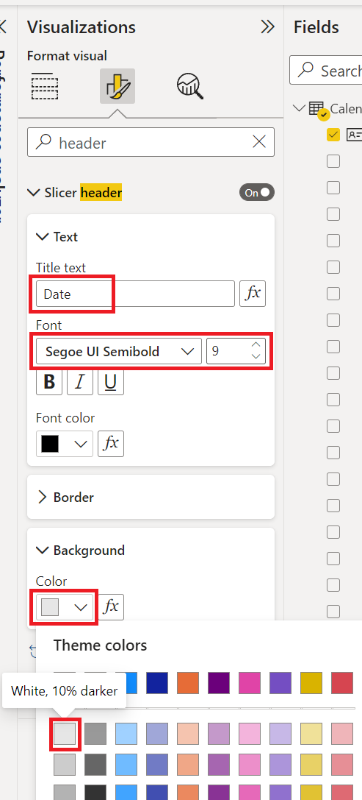

    | | |
    | :- | :- |
    | 🔍 Search term | **Background** |
    | Values > Background > Background color | **White** |
    | Effects > Background | **Off** |

    

1. From the **Visualizations** pane add a **Slicer** visual below the **Total Items Discounted** column and complete the following configurations.
    1. Insert the **ProductCategoryName** field first and the **ProductSubcategoryName** second from the **Products** table either into the **Field** value in the **Visualizations** pane or drop directly on the slicer itself.

    

1. We'll now navigate to the **View** tab and select the **Performance analyzer** option. Within the **Performance analyzer** pane we'll select **Start recording** and then hover above our current slicer and select the **Analyze this visual** button in the top right.

    Within our results, if we expand the **Slicer** name, a **DAX query** is present - this is because to render the current **List** configuration it must send a query to display our values.

    

1. To increase our reports performance, we'll select the downward chevron **(V)** in the top right of our slicer and change the value to **Dropdown**

    

1. Hovering above our current slicer once again, we'll select the **Analyze this visual** button in the top right and review the updated results within the **Performance analyzer** pane where the **Slicer** no longer contains a **DAX query** when collapsed, it will only be when a user selects the slicer that it will then run a query to return our list of values.

    

1. From the **Visualizations** pane add a **Slicer** visual below the **Total Returned Items** column and complete the following configurations.
    1. Insert the **CustomerType** field from the **Customer** table either into the **Field** value in the **Visualizations** pane or drop directly on the slicer itself. 
    1. In the top right of the slicer select the downward chevron **(V)** and change the value to **Dropdown**

    

1. We'll now select the **Date** slicer to make it our active object, navigate to the **Home** tab, select the **Format painter** button and repeat the following steps for the other two slicers.
    1. With the **Format painter** mouse icon now active, select the **ProductCategoryName, ProductSubcategoryName** slicer to transfer the visual configurations.
    1. With the **Format painter** mouse icon now active, select the **CustomerType*** slicer to transfer the visual configurations.
    
    

1. We'll now click and hold the left mouse click and select both the **ProductCategoryName, ProductSubcategoryName** and **CustomerType** slicers (or press and hold Ctrl and then Click) on our page, navigate to the **Visualizations** pane's **Format your visual** section and update the following configurations below.

    | | |
    | :- | :- |
    | 🔍 Search term | **Background** |
    | Values > Background > Color | **White** |

    

<font size="6">✅ Lab check</font>


Maintaining a consistent look and feel across our report elements ensures a professional and visually appealing experiences for our end users. Utilizing features like **Format painter** (found across other Office applications) or by bulk updating configurations is a quick and easy way to ensure our designs are consistent.

### Natural language

1. In the bottom left corner of the canvas, double click the mouse to create the **Q&A** visual and complete the following steps.
    1. Within the **Ask a question about your data** dialog, type the text **Total Sales Amount by manufacturer**. 
    1. Next to the **Ask a question...** search box, select the **turn this Q&A result into a standard visual.** button.
    1. Resize the visual to fit within the original **Background canvas** white square.

    

1. In the top right corner of the canvas in the first rectangle, double click the mouse to create the **Q&A** visual and complete the following steps.
    1. Within the **Ask a question about your data** dialog, type the text **Total Sales Amount by week**. 
    1. Next to the **Ask a question...** search box, select the **turn this Q&A result into a standard visual.** button.
    1. Resize the visual to fit within the original **Background canvas** white square.

    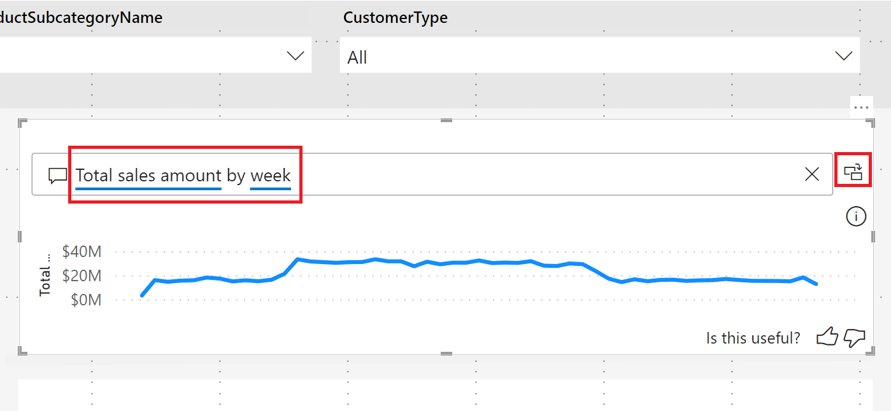

1. As opposed to creating a line chart for each **Occupation** we can utilize the **Small multiples** feature to create a series of line charts within a single visual. With our current line chart as the active selection, navigate to the the **Fields** pane and add the **Occupation** field from the **Customers** table into the **Small multiples** field in the **Visualizations** pane.

    

1. Utilizing the **Visualizations** pane's **Format your visual** section, we'll update the following configurations below for our line charts small multiple properties.

    **Note**: Utilize the Search box, to easily discover configurable settings.

    | | |
    | :- | :- |
    | 🔍 Search term | **Multiples** |
    | Small multiples > Layout > Rows | **1** |
    | Small multiples > Border > Gridlines | **Vertical only** |
    | Small multiples > Title > Position | **Bottom** |
    | Small multiples > Title > Font | **Segoe UI** |

    

1. Utilizing the **Visualizations** pane's **Add further analyses to your visual** section, we'll update the following configurations below for our line chart to infuse additional insights.

    **Note**: Utilize the Search box, to easily discover configurable settings.

    | | |
    | :- | :- |
    | 🔍 Search term | **Median** |
    | Median line > Apply settings to | select **Add line** |
    | Median line > Line > Color | **Black** |

    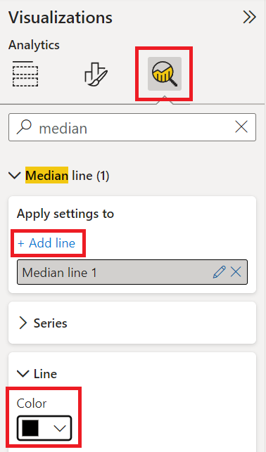

1. With our current small multiples line chart as the active selection and complete the following instructions by first selecting the ellipses (**...**) in the top right corner.
    1. With the ellipses selected, navigate to the **Sort small multiples** option and select sort by **Total Sales Amount**
    1. With the ellipses selected again, navigate to **Sort small multiples** and select the **Sort descending** option.

    

1. From the **Visualizations** pane add the **Azure map** visual below the small multiples line chart in the bottom right corner of our page, and complete the following configurations.
    1. Insert the **StateProvinceName** field from the **Customers** table either into the **Location** value in the **Visualizations** pane or drop directly on the map itself.
    1. Insert the **Total Sales Amount** measure from the **Fact Online Sales** table either into the **Size** value in the **Visualizations** pane or drop directly on the map itself.

    

<font size="6">✅ Lab check</font>

Whether it be creating visuals with natural language, splitting them into multiple versions of the same visual with small multiples or incorporating rich mapping capabilities - there's numerous methods in which 

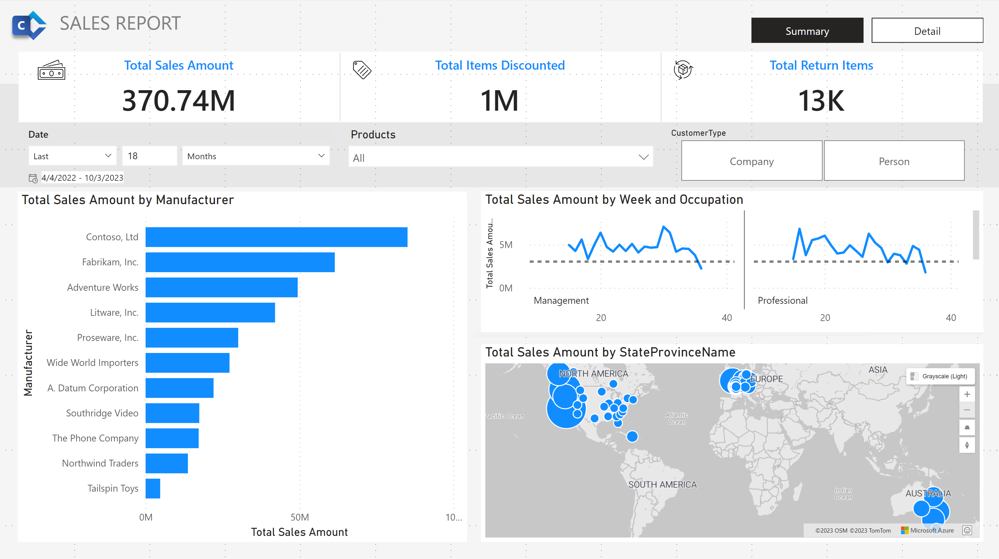

---

### Spark lines
Multiple charts.

---

1. Navigate to the **Detail** page, either by selecting the page name in the bottom left or holding **ctrl** and clicking the **Detail** button from the page navigator in the top right of the page.
    
    **Pro-tip:** for reports with a large number of pages, we can also right click the page navigation arrows (**<>**) to the left of the page tabs to display a pop-up of all page names. This technique is also applicable to Excel workbooks.

    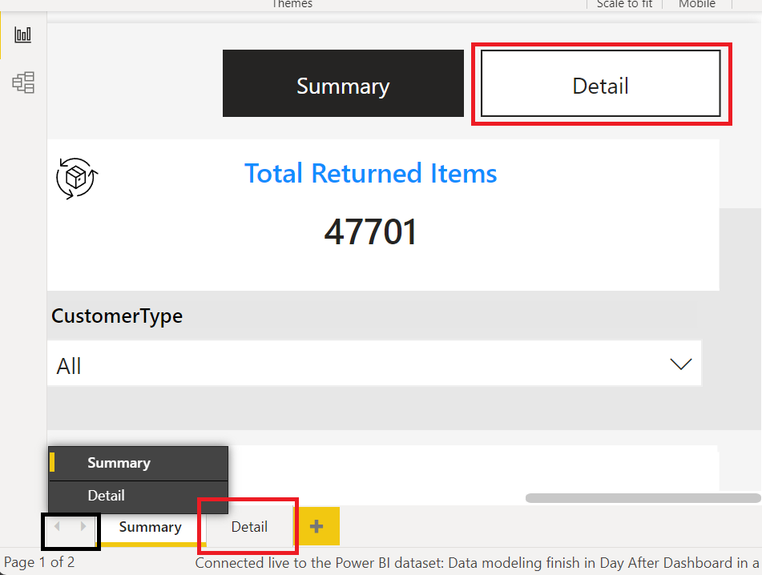

1. From the **Visualizations** pane add the **Matrix** visual to the top right rectangle in the **Detail** page and complete the following configurations.
    | Field | Table | Field/Measure |
    | :-- | :-- | :-- |
    | Rows | Products | Manufacturer |
    | Rows | Stores | StoreName |
    | Rows | Products | ProductName |
    | Values | Online Sales | Total Sales Amount |

    

1. From the **Visualizations** pane, we'll right click the **Total Sales Amount** option and select the **Add a sparkline** option.
    1. Note: You can also add a sparkline by navigating to the **Insert** tab and then selecting the **Add a sparkline** button.

    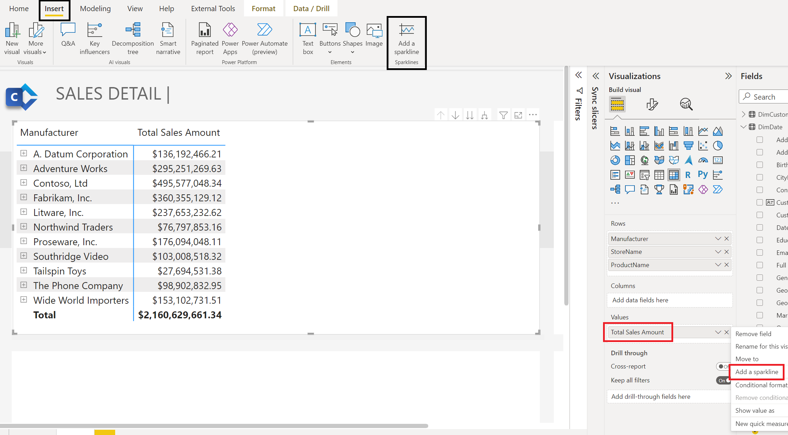

1. Within the **Add a sparkline** dialog window, select the drop down under the **X-axis** and select the **DateKey** filed from the **Calendar** table. Once complete select **Create** to continue.

    

1. From the **Visualizations** pane, we'll right click the **Total Sales Amount by DateKey** sparkline option and select the **Rename for this visual** option. For the updated title, we'll simply type the **space character** to ensure at least one character so that Power BI accepts our rename and press enter once complete.

    

1. From the **Visualizations** pane, we can verify our sparkline is still present, albeit with no visible characters and in our matrix, if the sparklines are not visible, resize the right most column to view.

    

1. From the **Fields** pane, we'll locate the **Manufacturer** field from the **Products** table and drag-and-drop this value into the **Visualizations** pane's **Add dril-through field values here** field well.

    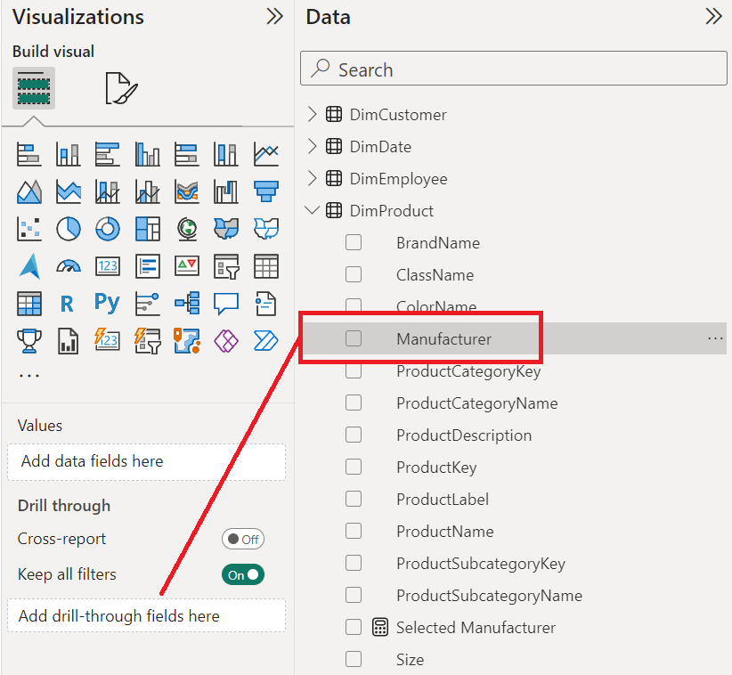

1. In the top left side of our page an automatic button has been added to return to the previous drill page. Because we already have a page navigation button, let's select this object and press **Delete** on the keyboard to remove this element.

    

1. Return to the **Summary** page, either by selecting the page name in the bottom left or holding **ctrl** and clicking the **Summary** button from the page navigator in the top right of the page. In the bottom left of the page right click the bar for **Contoso, Ltd** and navigate to the **Drill-through** option and then select the **Detail** page.

    

1. We have now returned to the **Detail** page and our matrix visual only includes the **Contoso, Ltd** manufacturer. In the bottom right of the **Visualizations** pane the **Manufacturer is Contoso, Ltd** and the current **DateKey** range from the **Date** slicer is also passed due to the **Keep all filters** toggle being enabled.

    

## Artificial Intelligence visuals

### Anomaly detection

### Smart narrative

### Q&A visual


## Tooltips


# Next steps
We hope this portion of the lab has shown how well designed reports can lead to increased usage and adoption.

- Return to the [Day After Dashboard in a Day](./README.md) homepage