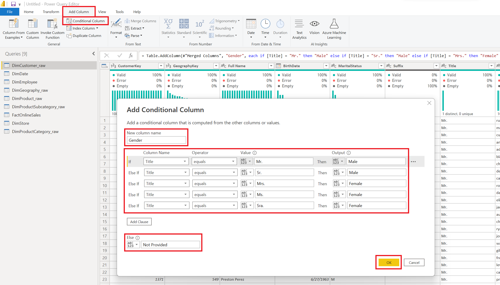

# Day After Dashboard in a Day


## Introduction
In the Day After Dashboard in a Day you will learn about various concepts and features of Power BI. This course assumes that you have a working knowledge of report authoring using Power BI Desktop and content sharing via the Power BI service.

By the end of this lab, you will have learned:
1. How to prepare and load data into a dataflow using Power Query Online.
1. How to configure different [Storage Modes](https://docs.microsoft.com/power-bi/transform-model/desktop-storage-mode) and create [Aggregations](https://docs.microsoft.com/power-bi/transform-model/aggregations-advanced) using Power BI Desktop.

    Storage modes:
    1. [DirectQuery](https://docs.microsoft.com/power-bi/connect-data/desktop-directquery-about)
    1. [Mixed](https://docs.microsoft.com/power-bi/transform-model/desktop-composite-models)
1. How to analyze the performance and optimize a Power BI dataset.
1. How to design effective reports

[Learn more about the prerequisites for the lab](./Prerequisites.md).

### Dataset
The AdventureWorks sample databases and Analysis Services models were originally published by Microsoft to show how to design a SQL Server database using SQL Server 2008.

The company, VanArsdel, manufactures expensive retail products that can be used for fun as well as work. It sells them directly to consumers nationwide as well as in several other countries.


## Data Preparation

### Iteration

**Project requirement:** New files are being dropped to a **Web page** which you have been tasked with querying and aggregating. Fortunately, all the files are of the same format, with a consistent column and file naming to make combining the files easier.

1. From the **Home** tab select the drop-down for **Get data** and then **Blank query**.


1. Within the **Advanced editor** window update the current query to the text below - creating a custom function that [combines text](https://docs.microsoft.com/powerquery-m/text-combine) and converts to [text from](https://docs.microsoft.com/powerquery-m/text-from) a value. Select **Ok** when complete.

    ```bash
    let
      fileNameUpdate = (#"File number" as number) as text =>
                Text.Combine(
                    {
                        "FactInternetSales_",
                        Text.From(#"File number"),
                        ".csv"
                    }
                )
    in
      fileNameUpdate
    ```

3. Update

```bash
let
  fileNameUpdate = (#"File number" as number) as text =>
            Text.Combine(
                {
                    "FactInternetSales_",
                    Text.From(#"File number"),
                    ".csv"
                }
            ),
  Source = [
        fileCount = 1,
        fileName = fileNameUpdate(fileCount),
        data = fxGetFile(fileName)
    ]
in
  Source
```

### Data profile


### Dataflow manifest


### Import dataflow model and enable DirectQuery with dataflows

1. Download the model.json file to a local file.

1. Select the **Import model** option.

    

1. Select the SAMPLE.json from your local drive and then 

1. Within the **Enhanced compute engine settings**, select the **On** option and then select the **Apply** button.


1. After you've received the **Success!** notification, return to the workspace and select the **Refresh now** option of the datalfow for the optimization to take effect.

    

[Learn more about DirectQuery with dataflows](https://docs.microsoft.com/power-bi/transform-model/dataflows/dataflows-premium-features#use-directquery-with-dataflows-in-power-bi)

### Query folding

1. Within **Power BI Desktop**'s **Home** ribbon select the **Get data** button. Within the **Get dialog** window select the **Power Platform** section and then **Dataflows** connector. Select **Connect** to continue to the **Dataflows** navigator window.

    

1. Within the **Navigator** window, navigate to the group Workspace where your dataflow is located and select all of the tables located within the dataflow. Select **Transform Data** when complete to enter the **Power Query Editor** window.

    

1. Navigate to the **DimCustomer** table, holding the **shift** key select the **FirstName**, **MiddleName** and **LastName** columns, right click one of the selected columns and choose the **Merge Columns** option.

    

1. Within the **Merge columns** window change the **Separator** option to **Space**, set the **New column name (optional)** option to **Full Name** and select **OK** when complete.

    

1. In the **Query settings** pane on the right, navigate to the **Merge Columns** step, right click and select the **View Native Query** option.

    

1. Navigate to the **Add Column** tab and select the **Conditional Column** option. Within the **Add Conditional Column** dialog complete the following and select **OK** when complete:
    1. New column name: **Gender**
    1. Match the following conditions to the table below.
        1. Use the **Add Clause** to add new conditions.

    |  | Column Name | Operator | Value | Output | 
    | :------- | :-------| :-------| :-------| :-------|
    | If | Title | equals | Mr. | Male |
    | If | Title | equals | Sr. | Male |
    | If | Title | equals | Ms. | Female |
    | If | Title | equals | Sra. | Female |
    | else | Unknown | | |

    

1. In the **Query settings** pane on the right, navigate to the **Add Conditional Column** step, right click and select the **View Native Query** option.

    

1. From the **Formula bar** select the **Add Step** button and paste in the following formula below.
    1. If the **Formula Bar** is not enabled navigate to the **View** tab and select the **Formula Bar** checkbox.

    

    ```bash
    = Table.AddColumn(
                #"Merged Columns",
                "Gender",
                each
                    if
                        List.Contains(
                            {
                                "Mr.",
                                "Sr."
                            },
                            [Gender]
                        )
                    then
                        "Male"
                    else if
                        List.Contains(
                            {
                                "Ms.",
                                "Sra."
                            },
                            [Gender]
                        )
                    then
                        "Female"
                    else
                        "Not Provided",
                type text
            )
    ```

## Data Modeling

1. Add a **Table** visualization using the following columns:

| Table | Column |
|:----- | :------ |
| Customer | EmailAddress|
| Internet Sales | Sales Amount |


1. Navigate to the **View** tab and select **Performance analyzer**.

    

1. Within the **Performance analyzer** pane, select **Start recording**.
    

1.	Press the Clear option, Refresh visuals and Copy query
1.	Navigate to the Model view, select the Dimension tables, navigate to Advanced and Storage mode to change to Dual


## Data Visualization
